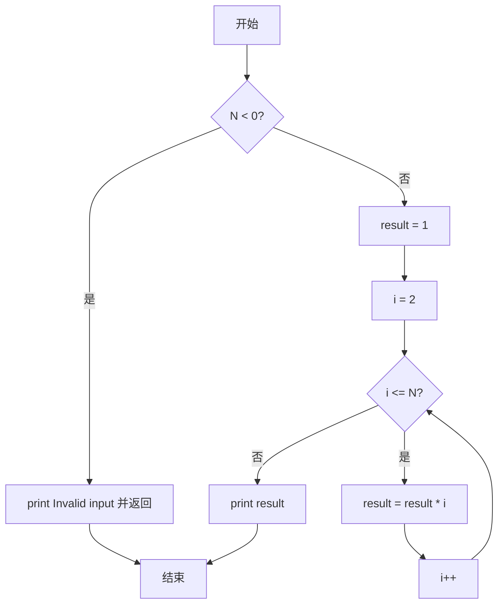
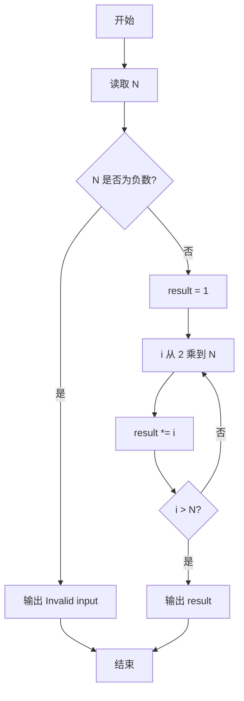

# PTA基础编程题目集 6-10阶乘计算升级版（Python3语言实现）

## 题目描述

本题要求实现一个打印非负整数阶乘的函数。

### 函数接口定义

```python
def Print_Factorial(N):
    # N 非负时在一行打印 N!，否则打印 "Invalid input"
    pass
```

其中`N`是用户传入的参数，其值不超过1000。如果`N`是非负整数，则该函数必须在一行中打印出`N`!的值，否则打印“Invalid input”。

### 裁判测试程序样例

```python
def Print_Factorial(N):
    # 你的代码将被嵌在这里
    pass

N = int(input())
Print_Factorial(N)
```

### 输入样例

```in
15
```

### 输出样例

```out
1307674368000
```

## 解题思路

这道题的核心是**利用 Python 原生大整数直接计算阶乘**：Python3 的 `int` 为任意精度，无需手动模拟大数乘法。N 最大为 1000，`1000!` 直接用循环连乘即可得到正确结果；非法输入（负数）按题意打印 `Invalid input`。

### 核心问题分析

1. **非法输入**：`N < 0` 时打印 `Invalid input` 并返回。
2. **Python 大整数**：`int` 自动扩容，直接循环 `result *= i` 即可处理 `1000!`（2568 位）。
3. **边界覆盖**：`0! = 1` 与 `1! = 1` 通过 `result` 初值 1 自然覆盖，无需特判。

### 算法原理说明

阶乘定义 `N! = 1 × 2 × ... × N`，约定 `0! = 1`。Python 大整数支持任意位数，直接初始化 `result = 1`，用 `for i in range(2, N+1): result *= i` 连乘，循环结束即得 `N!`。该方法与手动逐位模拟等价，但更简洁、更快且不易出错。

### 具体计算步骤

1. 判断 `N < 0`：成立则 `print("Invalid input")` 并 `return`。
2. 初始化 `result = 1`。
3. `for i in range(2, N+1): result *= i` 逐个连乘。
4. `print(result)` 输出一行结果。


## 完整代码

```python
# 6-10 阶乘计算升级版
# 打印非负整数 N 的阶乘，Python3 原生大整数直接计算

def Print_Factorial(N):
    if N < 0:
        print("Invalid input")
        return
    result = 1
    for i in range(2, N + 1):
        result *= i
    print(result)


N = int(input())
Print_Factorial(N)
```

## 代码流程说明

1. 判断 `N < 0`：成立则 `print("Invalid input")` 并 `return`。
2. 初始化 `result = 1`。
3. 循环 `i` 从 2 到 `N`，每轮 `result *= i` 连乘。
4. 循环结束 `print(result)` 输出结果（`0!` 与 `1!` 均为 1）。

## 代码流程图



## 解题流程图


