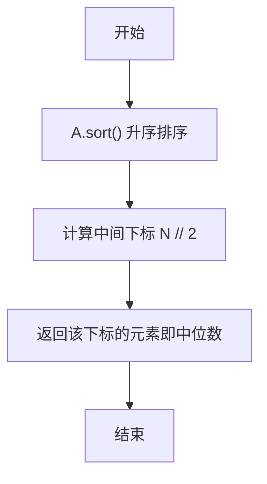
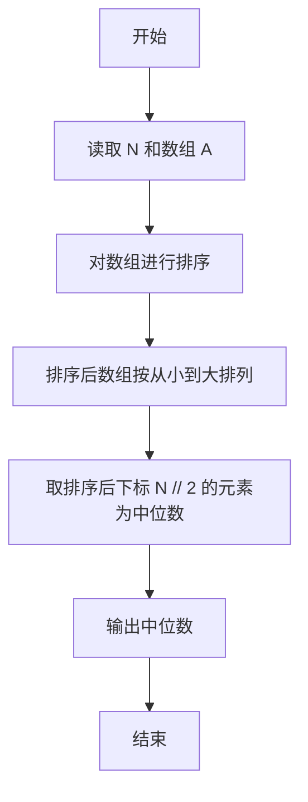

# PTA基础编程题目集 6-11求自定类型元素序列的中位数（Python3语言实现）

## 题目描述

本题要求实现一个函数，求N个集合元素A[]的中位数，即序列中第⌊(N+1)/2⌋大的元素。其中集合元素的类型为自定义的ElementType。

### 函数接口定义

```python
def Median(A, N):
    # 返回 A 中前 N 个元素的中位数
    pass
```

其中给定集合元素存放在数组A[]中，正整数N是数组元素个数。该函数须返回N个A[]元素的中位数，其值也必须是ElementType类型。

### 裁判测试程序样例

```python
def Median(A, N):
    # 你的代码将被嵌在这里
    pass

import sys
data = list(map(float, sys.stdin.read().split()))
N = int(data[0])
A = data[1:1 + N]
print("{0:.2f}".format(Median(A, N)))
```

### 输入样例

```in
3
12.3 34 -5
```

### 输出样例

```out
12.30
```

## 解题思路

这道题的核心是**排序后按下标取中位数**：中位数定义为排序后位于第 ⌊(N+1)/2⌋ 大的元素。先用列表的 sort() 方法把数组 A 从小到大排序，再根据下标公式 N // 2 直接取出中位数。

### 核心问题分析

1. **中位数定义**：排序后第 ⌊(N+1)/2⌋ 大的元素，即升序排序后位于中间位置的元素。
2. **排序方法**：sort() 为原地排序，排序完成后 A 即按升序排列。
3. **下标换算**：下标公式 N // 2 对应升序排序后的中间位置，整除取整即可。

### 算法原理说明

中位数是排序后位于正中间的元素。对数组 A 调用 sort() 原地升序排序后，元素按从小到大排列；下标 N // 2 在整除意义下正好对应序列中间位置（N 为奇数时是正中间，N 为偶数时是中间两个中靠后的一个），该下标处的元素即为中位数，直接返回即可。

### 具体计算步骤

1. 调用 A.sort() 对数组 A 进行原地升序排序。
2. 用下标公式 N // 2 计算中位数位置（整除取整）。
3. 返回 A[N // 2]，即中位数。


## 完整代码

```python
# 6-11 求自定类型元素序列的中位数
# 求 N 个集合元素 A 的中位数（第 floor((N+1)/2) 大的元素）

def Median(A, N):
    A.sort()  # 升序排序
    # 取中间下标对应的元素作为中位数
    return A[N // 2]


import sys
data = list(map(float, sys.stdin.read().split()))
N = int(data[0])
A = data[1:1 + N]
print("{0:.2f}".format(Median(A, N)))
```

## 代码流程说明

1. 调用 `A.sort()` 对数组 `A` 进行原地升序排序。
2. 用下标公式 `N // 2` 计算中位数位置（整除取整）。
3. 返回 `A[N // 2]`，即中位数。

## 代码流程图



## 解题流程图


