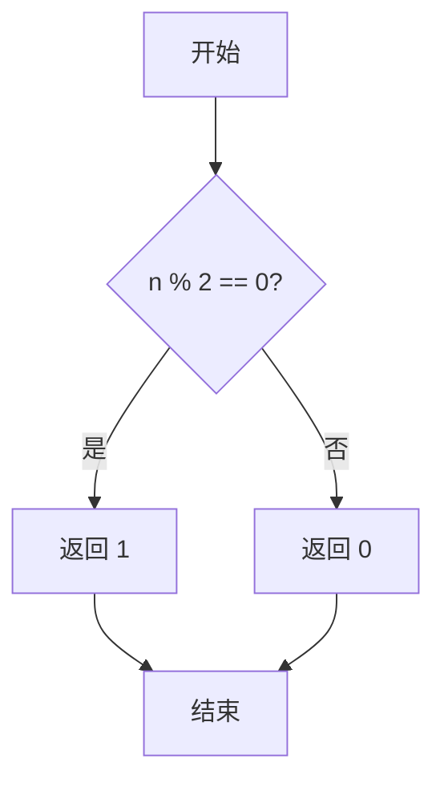
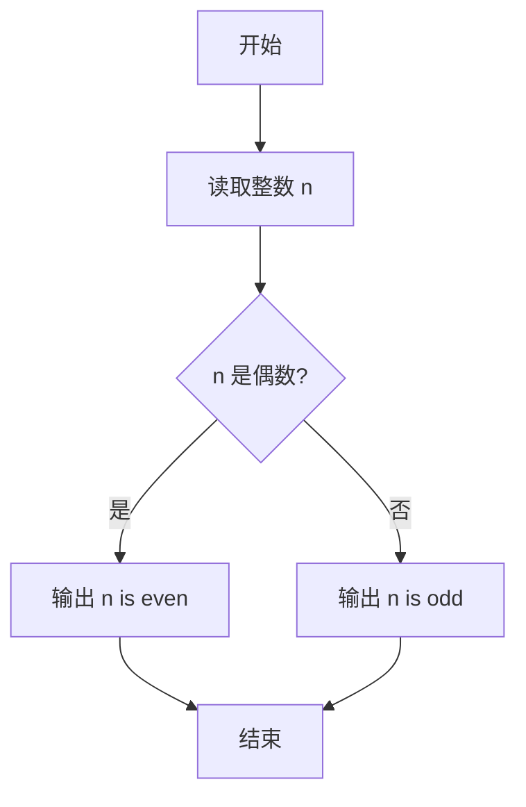

# PTA基础编程题目集 6-12判断奇偶性（Python3语言实现）

## 题目描述

本题要求实现判断给定整数奇偶性的函数。

### 函数接口定义

```python
def even(n):
    # n 为偶数时返回 1，n 为奇数时返回 0
    pass
```

其中`n`是用户传入的整型参数。当`n`为偶数时，函数返回1；`n`为奇数时返回0。注意：0是偶数。

### 裁判测试程序样例

```python
def even(n):
    # 你的代码将被嵌在这里
    pass

n = int(input())
if even(n):
    print("{} is even.".format(n))
else:
    print("{} is odd.".format(n))
```

### 输入样例1

```in
-6
```

### 输出样例1

```out
-6 is even.
```

### 输入样例2

```in
5
```

### 输出样例2

```out
5 is odd.
```

### 函数部分

```text
函数 even(n):
    若 n % 2 = 0:
        返回 1
    否则:
        返回 0
```
## 解题思路

这道题的核心是**看除以 2 的余数判断奇偶**：偶数能被 2 整除余 0，奇数余 1；Python 中 `n % 2` 对负数同样适用（-3 % 2 == 1，-4 % 2 == 0），无需单独处理符号或 0。

### 核心问题分析

1. **统一判定**：`n % 2 == 0` 即偶数（包含 0 与负偶数），返回 1。
2. **Python 取模特性**：负数取模结果为非负，直接用 `n % 2` 即可，无需 `abs`。
3. **简洁返回**：一行三元表达式完成奇偶判断。

### 算法原理说明

判断奇偶性的本质是看该数能否被 2 整除：`n % 2 == 0` 为偶数返回 1，否则奇数返回 0。Python 的取模运算已正确处理负数与 0，因此无需分支特判。

### 具体计算步骤

1. 计算 `n % 2`。
2. 若余数为 0（偶数）返回 1。
3. 否则（奇数）返回 0。


## 完整代码

```python
# 6-12 判断奇偶性
# n 为偶数返回 1，奇数返回 0，0 是偶数

def even(n):
    return 1 if n % 2 == 0 else 0


n = int(input())
if even(n):
    print("{} is even.".format(n))
else:
    print("{} is odd.".format(n))
```

## 代码流程说明

1. 计算 `n % 2`（Python 已正确处理负数与 0）。
2. 若 `n % 2 == 0`（偶数）返回 1。
3. 否则（奇数）返回 0。

## 代码流程图



## 解题流程图



### 复杂度分析

函数只进行一次取模运算，时间复杂度和额外空间复杂度均为`O(1)`。

### 常见易错点

1. 偶数应返回1，奇数应返回0，不能把布尔语义反过来。
2. 0是偶数，`0 % 2 == 0`会自然覆盖该情况。
3. 负数无需单独判断，直接使用`n % 2`即可。
4. 函数只返回标志值，具体的文字输出由裁判程序完成。

### 总结

`even`通过判断除以2的余数返回奇偶标志，逻辑短小，边界覆盖清晰。
