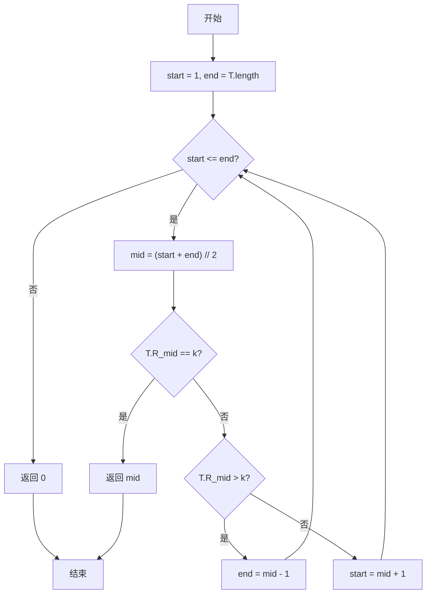
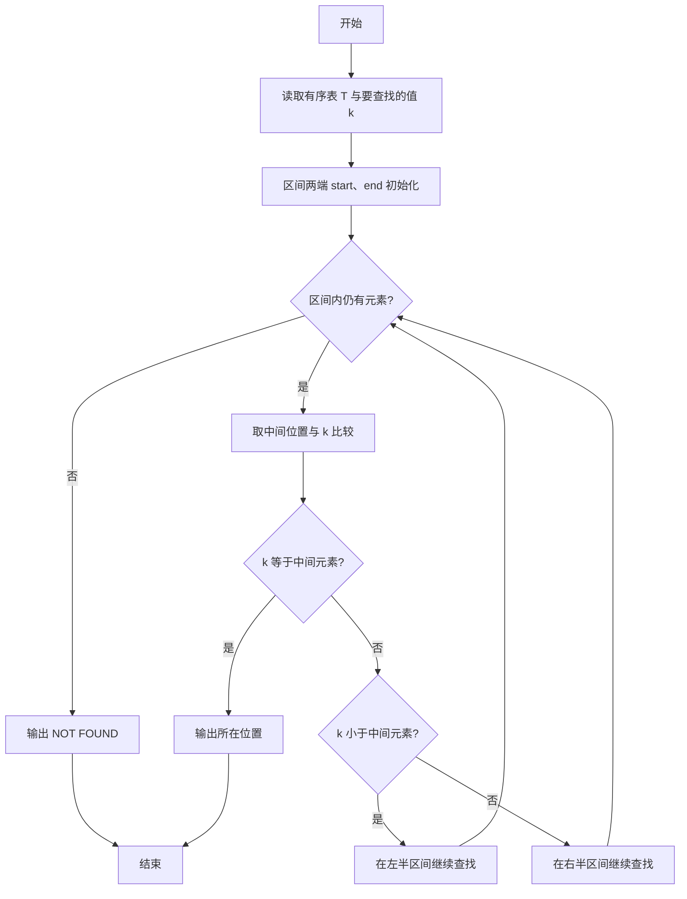

# PTA基础编程题目集 6-13折半查找（Python3语言实现）

## 题目描述

给一个严格递增数列，函数int Search_Bin(SSTable T, KeyType k)用来二分地查找k在数列中的位置。

### 函数接口定义

```python
# 有序表 T 用字典表示：{'length': 元素个数, 'R': 记录表}，R 下标从 1 开始
def Search_Bin(T, k):
    # 二分查找 k 在有序表 T 中的位置，找到返回位序，否则返回 0
    pass
```

其中T是有序表，k是查找的值。

### 裁判测试程序样例

```python
# 有序表 T 用字典表示：{'length': 元素个数, 'R': 记录表}，R 下标从 1 开始
def Search_Bin(T, k):
    # 你的代码将被嵌在这里
    pass

import sys
data = list(map(int, sys.stdin.read().split()))
length = data[0]
T = {'length': length, 'R': [0] * (length + 1)}
for i in range(1, length + 1):
    T['R'][i] = data[i]
k = data[length + 1]
pos = Search_Bin(T, k)
if pos == 0:
    print("NOT FOUND")
else:
    print(pos)
```

### 输入格式

第一行输入一个整数n，表示有序表的元素个数，接下来一行n个数字，依次为表内元素值。 然后输入一个要查找的值。

### 输出格式

输出这个值在表内的位置，如果没有找到，输出"NOT FOUND"。

### 输入样例1

```in
5
1 3 5 7 9
7
```

### 输出样例1

```out
4
```

### 输入样例2

```in
5
1 3 5 7 9
10
```

### 输出样例2

```out
NOT FOUND
```

## 解题思路

这道题的核心是**二分查找（折半查找）**：不断把查找区间折半，用 start、end 指向区间两端（记录表 R 的下标从 1 开始），取中间位置 mid = (start + end) // 2 与目标值 k 比较——相等则找到并返回位序；T['R'][mid] > k 则目标在左半区间，把 end 移到 mid - 1；否则目标在右半区间，把 start 移到 mid + 1。当 start > end 时区间为空，说明未找到，返回 0。

### 核心问题分析

1. **适用前提**：二分查找适用于有序表，本题数列严格递增，天然满足。
2. **区间折半**：每次比较中间元素与目标值，把查找区间缩小一半。
3. **区间更新**：目标在左半区间则 end = mid - 1，在右半区间则 start = mid + 1。
4. **查找失败**：start > end 时区间为空，返回 0 表示未找到。

### 算法原理说明

二分查找利用有序性每次排除一半元素：初始区间为 [start, end] = [1, T['length']]，每次取中间位置 mid = (start + end) // 2，比较 T['R'][mid] 与 k——相等则命中返回 mid；T['R'][mid] > k 说明目标只可能在左半区间，令 end = mid - 1；否则目标在右半区间，令 start = mid + 1。如此反复，区间长度每轮减半，复杂度为 O(log n)。当 start > end 时区间为空，说明 k 不在表中，返回 0。

### 具体计算步骤

1. 初始化查找区间 start = 1，end = T['length']（R 下标从 1 开始）。
2. while start <= end 循环：区间非空时继续查找。
3. 取中间位置 mid = (start + end) // 2。
4. 若 T['R'][mid] == k，直接返回 mid。
5. 若 T['R'][mid] > k，说明目标在左半区间，end = mid - 1；否则目标在右半区间，start = mid + 1。
6. 循环结束仍未找到，返回 0（按题意表示未找到）。


## 完整代码

```python
# 6-13 折半查找
# 在有序表 T 中二分查找 k，找到返回位序（1 起），否则返回 0

def Search_Bin(T, k):
    start = 1
    end = T['length']
    # 区间非空时持续二分
    while start <= end:
        mid = (start + end) // 2
        if T['R'][mid] == k:
            return mid          # 命中，返回位序
        elif T['R'][mid] > k:
            end = mid - 1       # 目标在左半区间
        else:
            start = mid + 1     # 目标在右半区间
    return 0                    # 区间耗尽仍未找到


import sys
data = list(map(int, sys.stdin.read().split()))
length = data[0]
T = {'length': length, 'R': [0] * (length + 1)}
for i in range(1, length + 1):
    T['R'][i] = data[i]
k = data[length + 1]
pos = Search_Bin(T, k)
if pos == 0:
    print("NOT FOUND")
else:
    print(pos)
```

## 代码流程说明

1. 初始化查找区间 `start = 1`，`end = T['length']`（`R` 下标从 1 开始）。
2. `while start <= end` 循环：区间非空时继续查找。
3. 取中间位置 `mid = (start + end) // 2`。
4. 若 `T['R'][mid] == k`，直接返回 `mid`。
5. 若 `T['R'][mid] > k`，说明目标在左半区间，`end = mid - 1`；否则目标在右半区间，`start = mid + 1`。
6. 循环结束仍未找到，返回 0（按题意表示未找到）。

## 代码流程图



## 解题流程图


