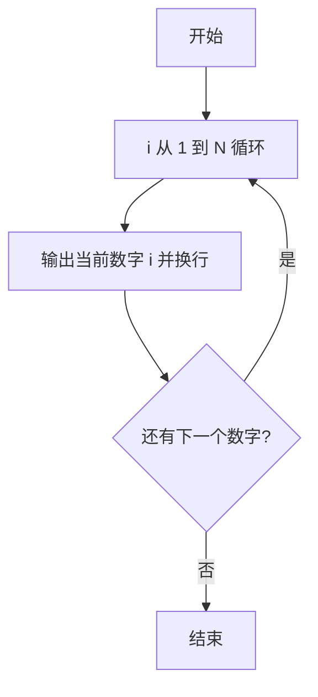
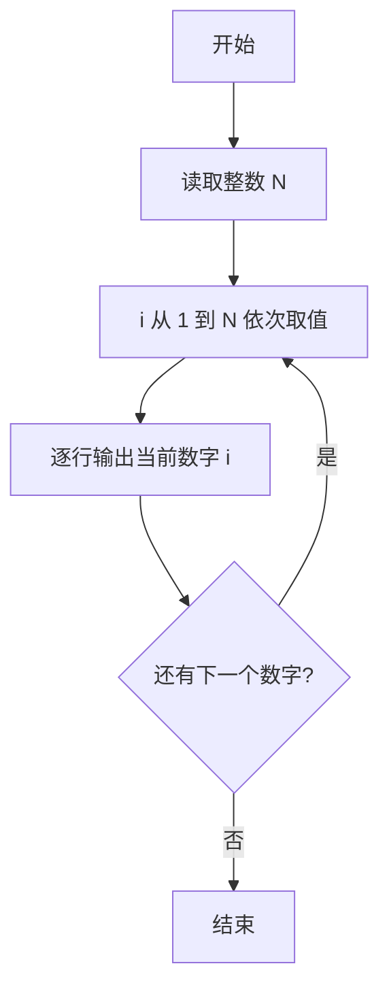

# PTA基础编程题目集 6-1简单输出整数（Python3语言实现）

## 题目描述

本题要求实现一个函数，对给定的正整数`N`，打印从1到`N`的全部正整数。

### 函数接口定义

```python
def PrintN(N):
    # 将 1 到 N 的全部正整数顺序打印出来，每个数字占 1 行
    pass
```

其中`N`是用户传入的参数。该函数必须将从1到`N`的全部正整数顺序打印出来，每个数字占1行。

### 裁判测试程序样例

```python
def PrintN(N):
    # 你的代码将被嵌在这里
    pass

N = int(input())
PrintN(N)
```

### 输入样例

```in
3
```

### 输出样例

```out
1
2
3
```

## 解题思路

这道题的核心是**顺序输出整数序列**：用 for 循环让循环变量从 1 递增到 N，每轮调用 print(i) 将当前数字输出为单独一行，循环结束即完成全部输出。

### 核心问题分析

1. **输出范围**：从 1 到 N 共 N 个正整数，需要全部顺序打印。
2. **输出格式**：每个数字占 1 行，print() 默认以换行结尾正好满足要求。

### 算法原理说明

使用 for 循环让循环变量 i 在 range(1, N + 1) 中依次取值。range(1, N + 1) 是左闭右开区间，恰好覆盖 1 到 N 的全部整数。循环体内调用 print(i) 输出当前数字，print 的默认参数 end='\n' 保证每个数字占 1 行，循环结束即完成全部输出。

### 具体计算步骤

1. 循环变量初始化：i 从 1 开始（由 range(1, N + 1) 生成）。
2. 判断 i 是否在 1 到 N 的范围内：是则进入循环体。
3. 循环体：print(i) 输出当前数字并换行。
4. 取下一个 i，回到第 2 步继续判断，直到超出范围循环结束。


## 完整代码

```python
# 6-1 简单输出整数
# 将 1 到 N 的全部正整数顺序打印，每个数字占一行

def PrintN(N):
    # 从 1 循环到 N（含），顺序打印每个整数
    for i in range(1, N + 1):
        print(i)


N = int(input())
PrintN(N)
```

## 代码流程说明

1. for 循环让 i 在 range(1, N + 1) 中依次取值。
2. 每轮循环体内调用 print(i) 输出当前数字并换行。
3. 循环结束即完成全部输出。

## 代码流程图



## 解题流程图


