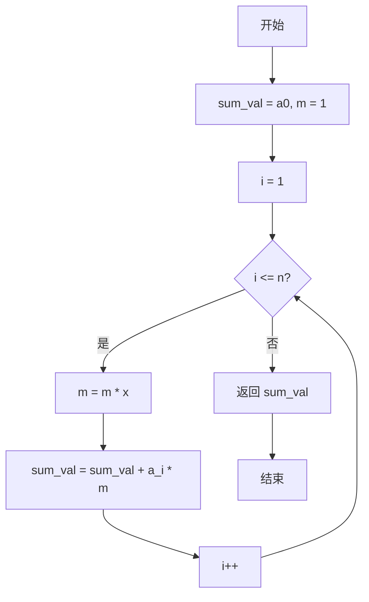
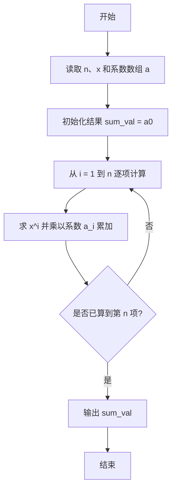

# PTA基础编程题目集 6-2多项式求值（Python3语言实现）

## 题目描述

本题要求实现一个函数，计算阶数为`n`，系数为`a[0]` ... `a[n]`的多项式*f*(*x*)=∑^n^~i=0~*(*a*[*i*]*×x^i^) 在`x`点的值。

### 函数接口定义

```python
def f(n, a, x):
    # n 为阶数，a 存储系数，x 为给定点，返回多项式 f(x) 的值
    pass
```

其中`n`是多项式的阶数，`a[]`中存储系数，`x`是给定点。函数须返回多项式`f(x)`的值。

### 裁判测试程序样例

```python
def f(n, a, x):
    # 你的代码将被嵌在这里
    pass

import sys
data = list(map(float, sys.stdin.read().split()))
n = int(data[0])
x = data[1]
a = data[2:2 + n + 1]
print("{0:.1f}".format(f(n, a, x)))
```

### 输入样例

```in
2 1.1
1 2.5 -38.7
```

### 输出样例

```out
-43.1
```

## 解题思路

这道题的核心是**逐项累乘求多项式值**：用变量 m 维护 x 的当前次幂，避免每项都重新计算幂，从而在 O(n) 时间内完成求值。

### 核心问题分析

1. **多项式结构**：f(x) = a[0] + a[1]·x + ... + a[n]·x^n，需逐项计算 a[i]·x^i 并累加。
2. **幂的计算**：若每项都从零计算 x^i，会产生大量重复乘法，效率低下。
3. **优化手段**：用变量 m 保存当前的 x^i（初始为 1 即 x^0），每轮迭代 m *= x 即可递推得到下一项次幂。

### 算法原理说明

从常数项 a[0] 出发，把 sum_val 初始化为 a[0]，m 初始化为 1（即 x^0）。循环变量 i 从 1 递增到 n，每轮先执行 m *= x 把 m 从 x^(i-1) 更新为 x^i，再累加 a[i] * m。这样每个次幂只做一次乘法，总体复杂度为 O(n)。

### 具体计算步骤

1. 初始化 sum_val = a[0]，m = 1（表示 x^0）。
2. 循环变量 i 从 1 递增到 n。
3. 每轮先 m *= x 得到 x^i，再累加 sum_val += a[i] * m。
4. 循环结束后返回 sum_val，即为多项式在 x 点的值。


## 完整代码

```python
# 6-2 多项式求值
# 计算多项式 f(x)=a0+a1*x+...+an*x^n 在给定点 x 的值

def f(n, a, x):
    # 逐项累乘：从常数项 a0 出发，依次叠加 a[i]*x^i
    sum_val = a[0]
    m = 1  # m 维护 x 的当前次幂，初始为 x^0 = 1
    for i in range(1, n + 1):
        m *= x  # 累乘得到 x^i
        sum_val += a[i] * m
    return sum_val


import sys
data = list(map(float, sys.stdin.read().split()))
n = int(data[0])
x = data[1]
a = data[2:2 + n + 1]
print("{0:.1f}".format(f(n, a, x)))
```

## 代码流程说明

1. 用 `sum_val = a[0]` 保存常数项，`m = 1` 表示 `x^0`。
2. 循环变量 `i` 从 1 递增到 `n`。
3. 每轮先 `m *= x` 得到 `x^i`，再累加 `sum_val += a[i] * m`。
4. 循环结束后返回 `sum_val`，即为多项式在 `x` 点的值。

## 代码流程图



## 解题流程图


