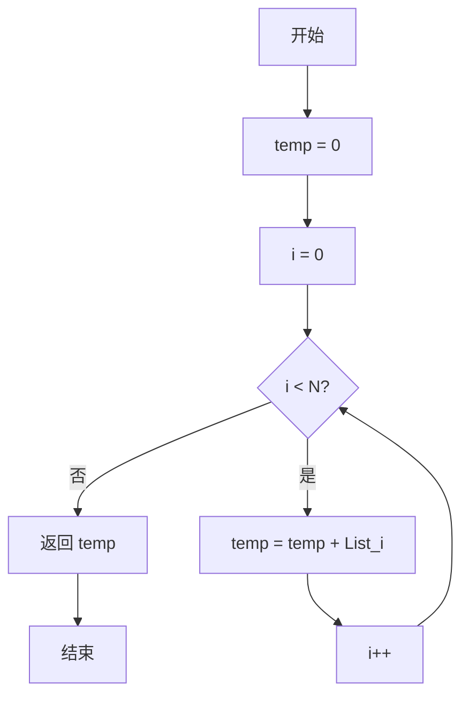
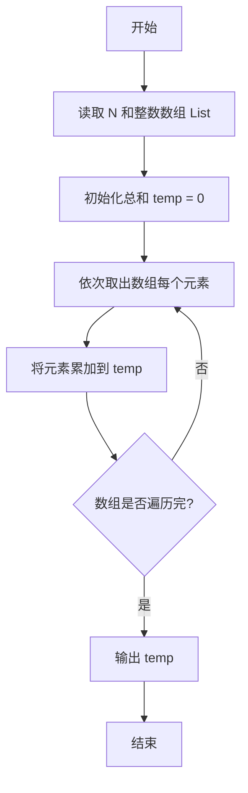

# PTA基础编程题目集 6-3简单求和（Python3语言实现）

## 题目描述

本题要求实现一个函数，求给定的`N`个整数的和。

### 函数接口定义

```python
def Sum(List, N):
    # 返回 List 中前 N 个元素的和
    pass
```

其中给定整数存放在数组`List[]`中，正整数`N`是数组元素个数。该函数须返回`N`个`List[]`元素的和。

### 裁判测试程序样例

```python
def Sum(List, N):
    # 你的代码将被嵌在这里
    pass

import sys
data = list(map(int, sys.stdin.read().split()))
N = data[0]
List = data[1:1 + N]
print(Sum(List, N))
```

### 输入样例

```in
3
12 34 -5
```

### 输出样例

```out
41
```

### 函数部分

```text
函数 Sum(List, N):
    total ← 0
    对 i 从0到N-1:
        total ← total + List[i]
    返回 total
```
## 解题思路

这道题的核心是**累加器求和**：用变量 temp 保存累加结果（初始为 0），遍历数组 List 的每个元素，依次把元素值累加到 temp 中，遍历结束后 temp 就是所有 N 个整数的和。

### 核心问题分析

1. **结果变量**：需要一个变量保存累加结果，初始化为 0（零元不影响求和）。
2. **遍历范围**：数组下标从 0 到 N - 1，覆盖全部 N 个元素。
3. **累加操作**：每轮把当前元素加入总和，循环结束后返回。

### 算法原理说明

累加求和是迭代算法的典型应用：先令 temp = 0，再用 for 循环让循环变量 i 从 0 递增到 N - 1，循环体内执行 temp += List[i] 把当前元素累加到结果中。经过 N 轮累加后，temp 恰好等于数组全部元素之和，直接返回即可。

### 具体计算步骤

1. 初始化 temp = 0。
2. 循环变量 i 从 0 递增到 N - 1，覆盖数组的全部下标。
3. 每轮执行 temp += List[i]，把当前元素加入总和。
4. 循环结束后返回 temp。


## 完整代码

```python
# 6-3 简单求和
# 求给定 N 个整数的和

def Sum(List, N):
    # 累加器从 0 开始
    temp = 0
    # 逐个元素相加
    for i in range(N):
        temp += List[i]
    return temp


import sys
data = list(map(int, sys.stdin.read().split()))
N = data[0]
List = data[1:1 + N]
print(Sum(List, N))
```

## 代码流程说明

1. 初始化 `temp = 0`。
2. 循环变量 `i` 从 0 递增到 `N - 1`，覆盖数组的全部下标。
3. 每轮执行 `temp += List[i]`，把当前元素加入总和。
4. 循环结束后返回 `temp`。

## 代码流程图



### 复杂度分析

函数访问前N个数组元素各一次，时间复杂度为`O(N)`，只使用累加变量，额外空间复杂度为`O(1)`。

### 常见易错点

1. 累加初值应为0，不能使用未初始化的变量。
2. 只遍历下标0到N-1，不能漏掉最后一个元素。
3. 应严格按照参数N处理前N个元素，不要擅自改变输入数组。
4. 负数和零可以直接参与加法，不需要额外分支。

### 总结

`Sum`使用一个累加器遍历数组并求和，算法简单稳定，重点是覆盖完整的前N个元素。

## 解题流程图


