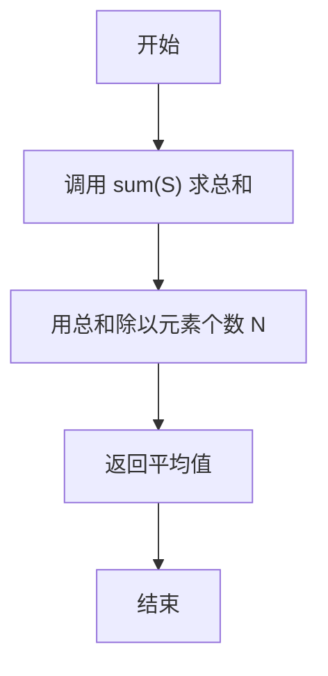
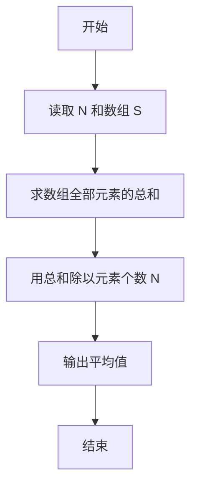

# PTA基础编程题目集 6-4求自定类型元素的平均（Python3语言实现）

## 题目描述

本题要求实现一个函数，求`N`个集合元素`S[]`的平均值，其中集合元素的类型为自定义的`ElementType`。

### 函数接口定义

```python
def Average(S, N):
    # 返回 S 中前 N 个元素的平均值
    pass
```

其中给定集合元素存放在数组`S[]`中，正整数`N`是数组元素个数。该函数须返回`N`个`S[]`元素的平均值，其值也必须是`ElementType`类型。

### 裁判测试程序样例

```python
def Average(S, N):
    # 你的代码将被嵌在这里
    pass

import sys
data = list(map(float, sys.stdin.read().split()))
N = int(data[0])
S = data[1:1 + N]
print("{0:.2f}".format(Average(S, N)))
```

### 输入样例

```in
3
12.3 34 -5
```

### 输出样例

```out
13.77
```

## 解题思路

这道题的核心是**平均值 = 元素总和 ÷ 元素个数**：先用内置函数 sum(S) 求出数组全部 N 个元素的总和，再用总和除以元素个数 N 得到平均值。

### 核心问题分析

1. **求总和**：S 中元素已是浮点数，内置函数 sum(S) 可一次求出全部元素总和，结果为浮点数。
2. **求平均值**：用总和除以元素个数 N，即得平均值。
3. **类型要求**：sum 的结果自动为浮点数，相除所得即为小数，符合 ElementType 类型要求。

### 算法原理说明

平均值定义为总和与个数的商。Python 的内置函数 sum() 会按顺序累加可迭代对象中的全部元素，调用 sum(S) 即可得到数组 S 中 N 个元素的总和；随后用除法将总和除以元素个数 N，商即为平均值，直接返回该结果即可。

### 具体计算步骤

1. 调用内置函数 sum(S) 计算数组 S 中全部 N 个元素的总和。
2. 用总和除以元素个数 N。
3. 返回相除结果，即平均值。


## 完整代码

```python
# 6-4 求自定类型元素的平均
# 求 N 个集合元素 S 的平均值，严格取前 N 个元素

def Average(S, N):
    # 严格取前 N 个元素，避免传入数组过长时误算；兼容 N==0
    if N == 0:
        return 0
    return sum(S[:N]) / N


import sys
data = list(map(float, sys.stdin.read().split()))
N = int(data[0])
S = data[1:1 + N]
print("{0:.2f}".format(Average(S, N)))
```

## 代码流程说明

1. 调用内置函数 `sum(S)` 计算数组 `S` 中全部 `N` 个元素的总和。
2. 用总和除以元素个数 `N`。
3. 返回相除结果，即平均值。

## 代码流程图



## 解题流程图


