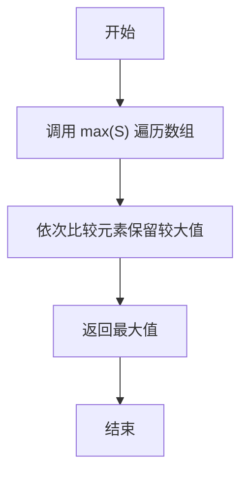
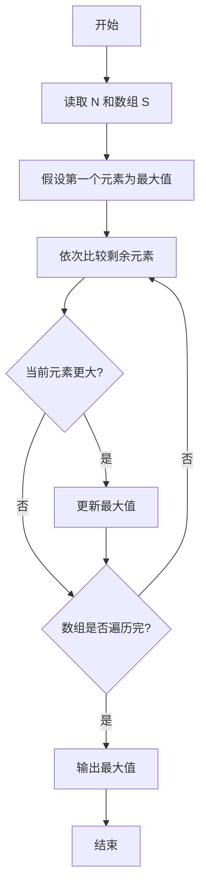

# PTA基础编程题目集 6-5求自定类型元素的最大值（Python3语言实现）

## 题目描述

本题要求实现一个函数，求`N`个集合元素`S[]`中的最大值，其中集合元素的类型为自定义的`ElementType`。

### 函数接口定义

```python
def Max(S, N):
    # 返回 S 中前 N 个元素的最大值
    pass
```

其中给定集合元素存放在数组`S[]`中，正整数`N`是数组元素个数。该函数须返回`N`个`S[]`元素中的最大值，其值也必须是`ElementType`类型。

### 裁判测试程序样例

```python
def Max(S, N):
    # 你的代码将被嵌在这里
    pass

import sys
data = list(map(float, sys.stdin.read().split()))
N = int(data[0])
S = data[1:1 + N]
print("{0:.2f}".format(Max(S, N)))
```

### 输入样例

```in
3
12.3 34 -5
```

### 输出样例

```out
34.00
```

### 函数部分

```text
函数 Max(S, N):
    currentMax ← S 的第一个元素
    依次检查前 N 个元素
        若当前元素更大，则更新 currentMax
    返回 currentMax
```
## 解题思路

这道题的核心是**"打擂台"求最大值**：先把第一个元素当作当前最大值，再依次与剩余元素比较，凡是更大的元素就更新最大值；Python 内置函数 max(S) 正是依次遍历数组并保留较大值，调用一次即可得到整个数组 S 的最大值。

### 核心问题分析

1. **初始最大值**：假设第一个元素为当前最大值，作为比较基准。
2. **逐一遍历**：依次与剩余元素比较，较大的值成为新的当前最大值。
3. **内置函数**：max(S) 内部就是依次遍历并保留较大值，调用一次直接得到最大值。

### 算法原理说明

求最大值采用打擂台思路：设当前最大值为第一个元素，然后从第二个元素起依次比较，每遇到更大的元素就更新当前最大值，遍历结束后当前最大值即为整个数组的最大值。Python 内置函数 max() 正是这一过程的封装，传入数组 S 即可一次性返回全部元素中的最大值。

### 具体计算步骤

1. 调用内置函数 max(S) 遍历数组 S 的全部元素。
2. max 依次比较各元素，保留当前最大值。
3. 返回最终的最大值。


## 完整代码

```python
# 6-5 求自定类型元素的最大值
# 求 N 个集合元素 S 中的最大值，严格取前 N 个元素

def Max(S, N):
    # 严格取前 N 个元素，避免传入数组过长时误算
    return max(S[:N])


import sys
data = list(map(float, sys.stdin.read().split()))
N = int(data[0])
S = data[1:1 + N]
print("{0:.2f}".format(Max(S, N)))
```

## 代码流程说明

1. 调用内置函数 `max(S)` 遍历数组 `S` 的全部元素。
2. `max` 依次比较各元素，保留当前最大值。
3. 返回最终的最大值。

## 代码流程图



## 解题流程图



### 复杂度分析

函数需要检查前N个元素，时间复杂度为`O(N)`；除当前最大值外不需要额外数据，空间复杂度为`O(1)`。

### 常见易错点

1. 当前最大值应使用参与比较的第一个元素初始化，不能随意初始化为0，否则全为负数时会出错。
2. 应只取前N个元素，不能把题目范围外的元素一并比较。
3. 题目保证N为正数，因此可以安全地从`S[:N]`中取最大值。
4. 函数应返回最大值，而不是在函数内部输出。

### 总结

`Max`通过逐个比较保留当前最大值，遍历结束后即可得到前N个自定类型元素中的最大值。
