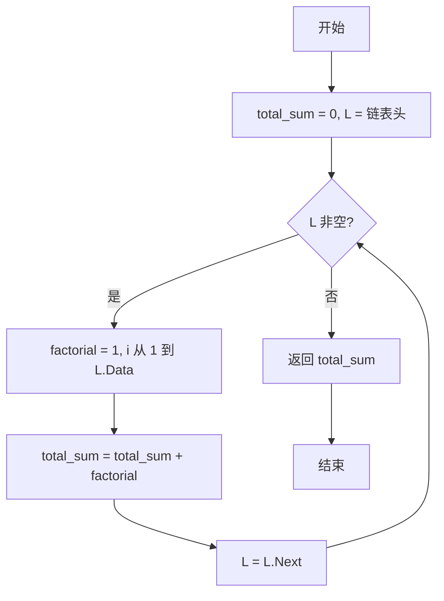
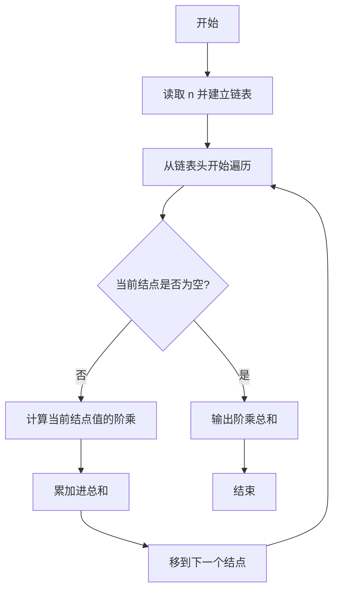

# PTA基础编程题目集 6-6求单链表结点的阶乘和（Python3语言实现）

## 题目描述

本题要求实现一个函数，求单链表`L`结点的阶乘和。这里默认所有结点的值非负，且题目保证结果在`int`范围内。

### 函数接口定义

```python
# 链表结点：Data 存储数据，Next 指向下一个结点
class Node:
    def __init__(self, data):
        self.Data = data
        self.Next = None

def FactorialSum(L):
    # 求单链表 L 各结点值的阶乘和
    pass
```

其中单链表`List`的定义如下：

```python
# 链表结点用 Node 类表示：Data 存储数据，Next 指向下一个结点
# 链表类型 List 即链表头结点
```

### 裁判测试程序样例

```python
class Node:
    def __init__(self, data):
        self.Data = data
        self.Next = None

def FactorialSum(L):
    # 你的代码将被嵌在这里
    pass

N = int(input())
data = list(map(int, input().split()))
L = None
for num in data:  # 头插法建立链表
    p = Node(num)
    p.Next = L
    L = p
print(FactorialSum(L))
```

### 输入样例

```in
3
5 3 6
```

### 输出样例

```out
846
```

### 函数部分

```text
函数 FactorialSum(L):
    total ← 0
    当 L 不为空时:
        valueFactorial ← 1 到 L.Data 的连乘结果
        total ← total + valueFactorial
        L ← L.Next
    返回 total
```
## 解题思路

这道题的核心是**遍历链表求各结点值阶乘之和**：用指针 L 从链表头开始遍历，只要结点不为空，就对当前结点的 Data 值计算阶乘并累加到 total_sum，然后让 L = L.Next 指向下一个结点，直到链表遍历完毕返回总和。

### 核心问题分析

1. **链表遍历**：用 while 循环以结点非空为条件，从头结点开始逐个访问。
2. **单点阶乘**：对每个结点的 Data 值，从 1 连乘到 Data 得到其阶乘。
3. **结果累加**：把每个结点的阶乘累加到 total_sum，指针后移继续遍历。

### 算法原理说明

阶乘 n! = 1 × 2 × ... × n。函数用 total_sum 保存累加结果，从链表头开始 while L 循环遍历：每轮对当前结点 Data 用内层 for 循环（range(1, L.Data + 1)）连乘求阶乘，累加进 total_sum，再执行 L = L.Next 移动指针。链表遍历完后 total_sum 即为全部结点值的阶乘和。

### 具体计算步骤

1. 初始化 total_sum = 0，L 指向链表头结点。
2. while L 循环遍历链表：结点非空则进入循环体。
3. 对当前结点值计算阶乘：factorial 从 1 开始，for i in range(1, L.Data + 1) 循环乘以 1 到 L.Data 的每个整数。
4. 将阶乘累加到 total_sum，指针后移 L = L.Next。
5. 链表遍历完后返回 total_sum。


## 完整代码

```python
# 6-6 求单链表结点的阶乘和
# 遍历链表，求各结点 Data 值的阶乘之和

class Node:
    """单链表结点：Data 存储数据，Next 指向下一个结点。"""

    def __init__(self, data):
        self.Data = data
        self.Next = None


def FactorialSum(L):
    total_sum = 0
    # 遍历整个链表
    while L:
        factorial = 1
        # 计算当前结点 Data 的阶乘：1 * 2 * ... * Data
        for i in range(1, L.Data + 1):
            factorial *= i
        total_sum += factorial  # 累加到总和
        L = L.Next  # 指针后移
    return total_sum


import sys
data = sys.stdin.read().strip().split()
if data:
    N = int(data[0])
    nums = list(map(int, data[1:1+N])) if len(data) >= 1+N else []
    L = None
    for num in nums:
        p = Node(num)
        p.Next = L
        L = p
    print(FactorialSum(L))
```

## 代码流程说明

1. 初始化 `total_sum = 0`，`L` 指向链表头结点。
2. `while L` 循环遍历链表：结点非空则进入循环体。
3. 对当前结点值计算阶乘：`factorial` 从 1 开始，`for i in range(1, L.Data + 1)` 循环乘以 1 到 `L.Data` 的每个整数。
4. 将阶乘累加到 `total_sum`，指针后移 `L = L.Next`。
5. 链表遍历完后返回 `total_sum`。

## 代码流程图



## 解题流程图



### 复杂度分析

设链表有N个结点，第i个结点的数据为dᵢ。遍历链表需要`O(N)`，计算所有阶乘还需要`O(∑dᵢ)`的乘法次数，因此总时间复杂度为`O(N + ∑dᵢ)`；除阶乘临时变量和总和外不创建新结构，额外空间复杂度为`O(1)`。

### 常见易错点

1. 每处理完一个结点都要执行`L = L.Next`，否则会陷入死循环。
2. 阶乘累乘初值应为1，这样结点值为0时可正确得到`0! = 1`。
3. 需要遍历到`L is None`才结束，不能只处理头结点。
4. 链表由头插法建立时，实际遍历顺序与输入顺序相反，但阶乘和对顺序不敏感。

### 总结

`FactorialSum`沿`Next`指针遍历链表，对每个结点计算阶乘并累加，体现了链表遍历与局部计算结合的函数题思路。
