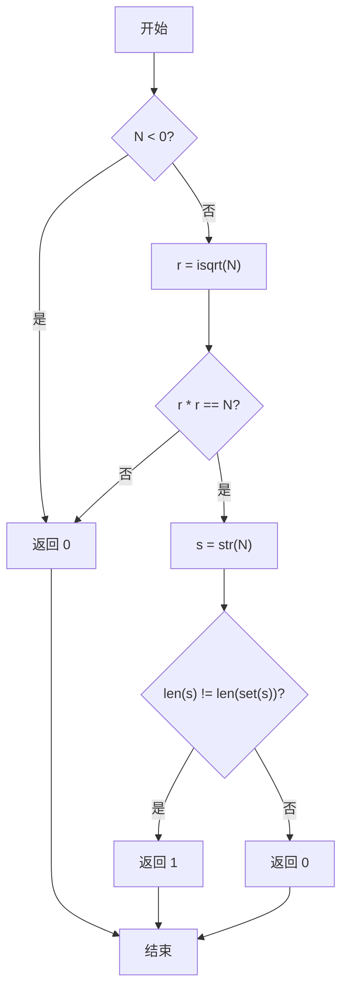
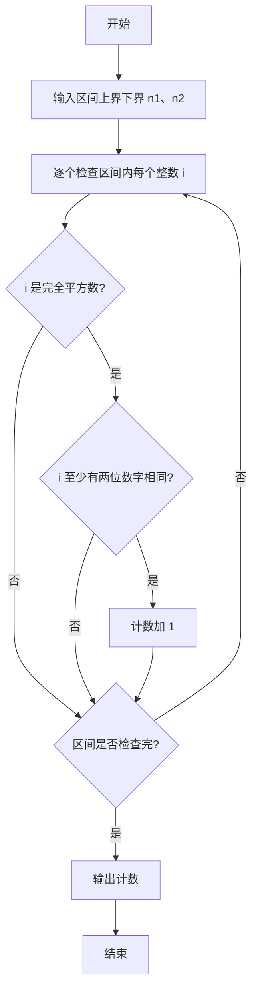

# PTA基础编程题目集 6-7统计某类完全平方数（Python3语言实现）

## 题目描述

本题要求实现一个函数，判断任一给定整数`N`是否满足条件：它是完全平方数，又至少有两位数字相同，如144、676等。

### 函数接口定义

```python
def IsTheNumber(N):
    # N 是完全平方数且至少两位数字相同返回 1，否则返回 0
    pass
```

其中`N`是用户传入的参数。如果`N`满足条件，则该函数必须返回1，否则返回0。

### 裁判测试程序样例

```python
def IsTheNumber(N):
    # 你的代码将被嵌在这里
    pass

n1, n2 = map(int, input().split())
cnt = 0
for i in range(n1, n2 + 1):
    if IsTheNumber(i):
        cnt += 1
print("cnt = {}".format(cnt))
```

### 输入样例

```in
105 500
```

### 输出样例

```out
cnt = 6
```

### 函数部分

```text
函数 IsTheNumber(N):
    若 N < 0 或 N 不是完全平方数:
        返回 0
    若 N 的十进制表示存在重复数字:
        返回 1
    否则:
        返回 0
```
## 解题思路

这道题的核心是**双重条件判断**：题目要求同时满足两个条件——①完全平方数；②至少有两位数字相同。思路分两步：先用 `math.isqrt(N)` 精确整数开方判断完全平方数（避免浮点误差，负数直接返回 0）；若是完全平方数，再将 N 转为字符串用 `set` 去重，比较长度判断是否有重复数字。

### 核心问题分析

1. **完全平方数验证**：用 `math.isqrt(N)` 得整数根 `r`，`r * r == N` 成立即为完全平方数；负数直接返回 0。
2. **相同数字检测**：`s=str(N)`，`len(s)!=len(set(s))` 即有重复数字。
3. **浮点误差规避**：`isqrt` 为精确整数开方，优于 `int(N**0.5)`，可正确处理大数。

### 算法原理说明

先判断 `N<0` 直接返回 0。接着 `r=math.isqrt(N)`，若 `r*r!=N` 说明不是完全平方数，返回 0。若是完全平方数，将 N 转为字符串 `s=str(N)`，用 `set(s)` 去重后比较长度：`len(s)!=len(set(s))` 说明至少两位数字相同，返回 1，否则返回 0。该方法与逐位拆解+双重循环等价，但更简洁可靠。

### 具体计算步骤

1. 判断 `N<0`：成立则返回 0。
2. 计算 `r=math.isqrt(N)`，判断 `r*r!=N`：成立则返回 0。
3. 将 N 转为字符串 `s=str(N)`。
4. 比较 `len(s)` 与 `len(set(s))`：不等则返回 1，否则返回 0。


## 完整代码

```python
# 6-7 统计某类完全平方数
# 判断 N 是否为完全平方数且至少有两位数字相同

import math

def IsTheNumber(N):
    # 负数一定不是完全平方数
    if N < 0:
        return 0
    # 精确整数开方，避免浮点误差
    r = math.isqrt(N)
    if r * r != N:
        return 0
    # 至少有两位数字相同：字符串去重后长度变小即有重复
    s = str(N)
    return 1 if len(s) != len(set(s)) else 0


n1, n2 = map(int, input().split())
cnt = 0
for i in range(n1, n2 + 1):
    if IsTheNumber(i):
        cnt += 1
print("cnt = {}".format(cnt))
```

## 代码流程说明

1. 若 `N < 0` 直接返回 0（负数不是完全平方数，避免复数开方异常）。
2. 用 `math.isqrt(N)` 精确整数开方得 `r`，判断 `r * r != N` 则不是完全平方数，返回 0。
3. 将 `N` 转为字符串 `s = str(N)`，比较 `len(s)` 与 `len(set(s))`：不等说明有重复数字，返回 1，否则返回 0。

## 代码流程图



## 解题流程图



### 复杂度分析

判断完全平方数使用整数开方，判断数字重复需要扫描数字的十进制表示。设N有d位，函数时间复杂度为`O(d)`，额外空间复杂度为`O(d)`（用于字符串和集合）。

### 常见易错点

1. 不能只判断完全平方数，还必须检查十进制表示中是否有重复数字。
2. 负数不是完全平方数，应在调用`isqrt`前排除。
3. 使用`isqrt`比浮点平方根再取整更可靠，可避免大整数边界误差。
4. N为0时应按数字字符串“0”判断，不能把空表示当作没有数字。

### 总结

`IsTheNumber`先验证平方数条件，再检测数字重复，两个条件同时满足时返回1，否则返回0。
