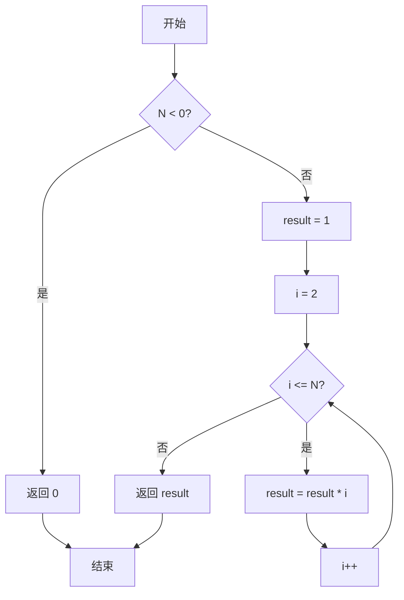
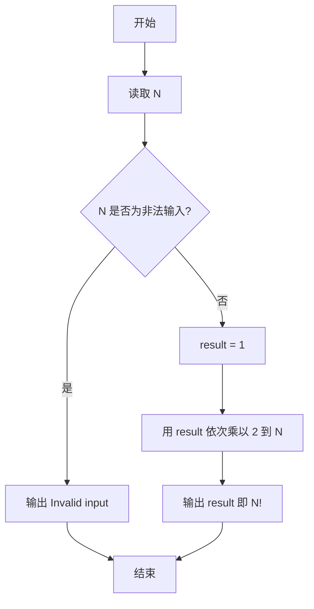

# PTA基础编程题目集 6-8简单阶乘计算（Python3语言实现）

## 题目描述

本题要求实现一个计算非负整数阶乘的简单函数。

### 函数接口定义

```python
def Factorial(N):
    # N 为非负整数时返回其阶乘，否则返回 0
    pass
```

其中`N`是用户传入的参数，其值不超过12。如果`N`是非负整数，则该函数必须返回`N`的阶乘，否则返回0。

### 裁判测试程序样例

```python
def Factorial(N):
    # 你的代码将被嵌在这里
    pass

N = int(input())
NF = Factorial(N)
if NF != 0:
    print("{}! = {}".format(N, NF))
else:
    print("Invalid input")
```

### 输入样例

```in
5
```

### 输出样例

```out
5! = 120
```

### 函数部分

```text
函数 Factorial(N):
    若 N < 0:
        返回 0
    result ← 1
    对 i 从2到N:
        result ← result × i
    返回 result
```
## 解题思路

这道题的核心是**连乘求阶乘并处理非法输入**：阶乘 N! = 1 × 2 × ... × N，且 0! = 1。先判断 N < 0 的非法输入直接返回 0；否则用变量 result 从 1 开始，依次乘以 2 到 N 的每个整数，最终得到 N 的阶乘。

### 核心问题分析

1. **非法输入**：N < 0 时阶乘无意义，按题目约定返回 0。
2. **边界情况**：0! = 1 且 1! = 1，result 初始化为 1 即可自然覆盖。
3. **连乘过程**：从 2 连乘到 N，每乘一个整数都让 result 扩大，最终得到 N!。

### 算法原理说明

阶乘的定义是 N! = 1 × 2 × ... × N，其中规定 0! = 1。算法先用 if 判断 N < 0 的非法输入直接返回 0；否则把 result 初始化为 1（对应 0! 和 1!），再用 for 循环让 i 从 2 递增到 N，每轮执行 result *= i，把当前整数乘进结果。循环结束后 result 即为 N 的阶乘。

### 具体计算步骤

1. 判断 N < 0：成立则返回 0（题目约定非法输入返回 0）。
2. 初始化 result = 1，对应 0! 和 1! 的情况。
3. 循环变量 i 从 2 递增到 N，每轮执行 result *= i。
4. 循环结束后返回 result，即为 N!。


## 完整代码

```python
# 6-8 简单阶乘计算
# 计算非负整数 N 的阶乘，非法输入返回 0

def Factorial(N):
    # 负数阶乘无意义
    if N < 0:
        return 0
    result = 1
    # 连乘 2..N
    for i in range(2, N + 1):
        result *= i
    return result


N = int(input())
NF = Factorial(N)
if NF != 0:
    print("{}! = {}".format(N, NF))
else:
    print("Invalid input")
```

## 代码流程说明

1. 判断 `N < 0`：成立则返回 0（题目约定非法输入返回 0）。
2. 初始化 `result = 1`，对应 `0!` 和 `1!` 的情况。
3. 循环变量 `i` 从 2 递增到 `N`，每轮执行 `result *= i`。
4. 循环结束后返回 `result`，即为 `N!`。

## 代码流程图



## 解题流程图



### 复杂度分析

循环从2执行到N，时间复杂度为`O(N)`；除结果和循环变量外不需要额外结构，额外空间复杂度为`O(1)`，不计Python大整数本身占用的位数。

### 常见易错点

1. 负数必须返回题目约定的0，不能直接进入阶乘循环。
2. `result`应初始化为1，以正确覆盖`0! = 1`和`1! = 1`。
3. 循环应从2开始，乘到N为止。
4. 函数返回0时，裁判程序会将其解释为非法输入并输出相应提示。

### 总结

`Factorial`用一次连乘计算非负整数阶乘，并通过初始值1自然处理0和1这两个边界。
