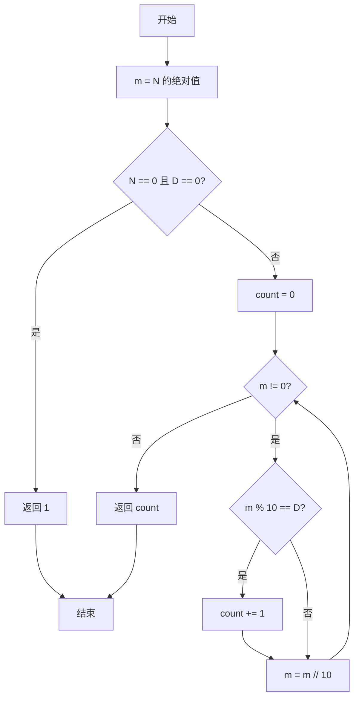
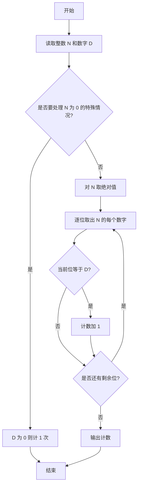

# PTA基础编程题目集 6-9统计个位数字（Python3语言实现）

## 题目描述

本题要求实现一个函数，可统计任一整数中某个位数出现的次数。例如-21252中，2出现了3次，则该函数应该返回3。

### 函数接口定义

```python
def Count_Digit(N, D):
    # 返回整数 N 中数字 D 出现的次数
    pass
```

其中`N`和`D`都是用户传入的参数。`N`的值不超过`int`的范围；`D`是[0, 9]区间内的个位数。函数须返回`N`中`D`出现的次数。

### 裁判测试程序样例

```python
def Count_Digit(N, D):
    # 你的代码将被嵌在这里
    pass

N, D = map(int, input().split())
print(Count_Digit(N, D))
```

### 输入样例

```in
-21252 2
```

### 输出样例

```out
3
```

### 函数部分

```text
函数 Count_Digit(N, D):
    m ← abs(N)
    若 N = 0 且 D = 0:
        返回 1
    count ← 0
    当 m 不为0时:
        若 m 的个位等于 D:
            count ← count + 1
        m ← m 整除10
    返回 count
```
## 解题思路

这道题的核心是**逐位取位统计**：统计数字 D 在整数 N 中出现的次数，每次用 m % 10 取出当前最低位与 D 比较，再用 m //= 10 去掉该位，直到 m 变为 0。需要注意两个特殊情况：负数先取绝对值再处理；N = 0 时循环不会执行，需单独判断 D == 0 时返回 1。

### 核心问题分析

1. **负数处理**：取绝对值 m = abs(N)，把符号去掉再逐位统计。
2. **零的特殊情况**：N = 0 且 D = 0 时，0 这个整数本身就含有一个数字 0，需单独返回 1。
3. **逐位取位**：m % 10 得到最低位，m //= 10 去掉该位，循环直到 m 为 0。

### 算法原理说明

对整数逐位统计依赖取模与整除运算：m % 10 取出当前最低位，与目标数字 D 比较，相等则计数加 1；随后 m //= 10 去掉已统计的最低位，进入下一轮。while m != 0 循环保证每一位都被检查。由于 while 循环对 m = 0 不会执行，因此 N = 0 且 D = 0 的情况要先用 if 单独处理并返回 1；负数则先用 abs 取绝对值转为正数再统计。

### 具体计算步骤

1. 用 m = abs(N) 取绝对值存入 m，用于处理负数。
2. 处理特例：N == 0 and D == 0 时返回 1（0 这个整数本身就含有一个数字 0）。
3. 初始化计数 count = 0。
4. while m != 0 循环：m % 10 得到最低位，与 D 比较相等则 count += 1。
5. m //= 10 去掉已检查的最低位，继续循环。
6. 循环结束返回 count。


## 完整代码

```python
# 6-9 统计个位数字
# 统计整数 N 中数字 D 出现的次数

def Count_Digit(N, D):
    m = abs(N)  # 忽略符号

    # 特殊情形：0 这个整数本身就含有一个数字 0
    if N == 0 and D == 0:
        return 1

    count = 0
    # 逐位拆解并统计数字 D 出现次数
    while m != 0:
        if m % 10 == D:
            count += 1
        m //= 10  # 去掉已统计的最低位
    return count


N, D = map(int, input().split())
print(Count_Digit(N, D))
```

## 代码流程说明

1. 用 `m = abs(N)` 取绝对值存入 `m`，用于处理负数。
2. 处理特例：`N == 0 and D == 0` 时返回 1（0 这个整数本身就含有一个数字 0）。
3. 初始化计数 `count = 0`。
4. `while m != 0` 循环：`m % 10` 得到最低位，与 `D` 比较相等则 `count += 1`。
5. `m //= 10` 去掉已检查的最低位，继续循环。
6. 循环结束返回 `count`。

## 代码流程图



## 解题流程图



### 复杂度分析

设`N`的绝对值有d位，逐位取模和整除需要`O(d)`时间，额外空间复杂度为`O(1)`。

### 常见易错点

1. 负数应先取绝对值，负号不是需要统计的数字。
2. `N = 0`时循环不会进入，必须单独处理目标数字为0的情况。
3. 每次统计后都要执行`m //= 10`，否则会重复检查同一位。
4. 目标数字D限定在0到9之间，应按单个数字而不是字符串片段比较。

### 总结

`Count_Digit`通过“取个位、去个位”的循环逐位统计目标数字，并用特判覆盖整数0的表示方式。
