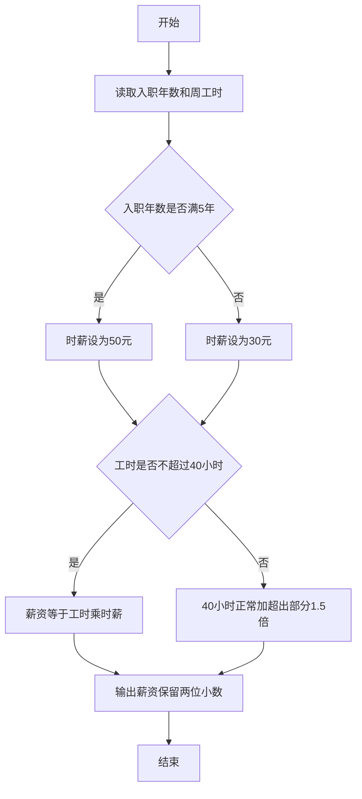
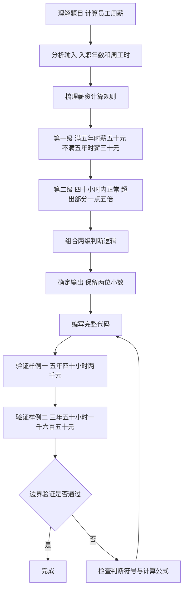

# 7-10 计算工资（Python3语言实现）

## 前言

本题（7-10 计算工资）的主要考点是：准确理解题意、规范处理输入输出格式，并正确处理边界与精度。下面先给出题目描述与格式要求，再通过清晰的思路与可直接运行的python3代码进行讲解。

## 题目描述

某公司员工的工资计算方法如下：一周内工作时间不超过40小时，按正常工作时间计酬；超出40小时的工作时间部分，按正常工作时间报酬的1.5倍计酬。员工按进公司时间分为新职工和老职工，进公司不少于5年的员工为老职工，5年以下的为新职工。新职工的正常工资为30元/小时，老职工的正常工资为50元/小时。请按该计酬方式计算员工的工资。

## 输入格式

输入在一行中给出2个正整数，分别为某员工入职年数和周工作时间，其间以空格分隔。

## 输出格式

在一行输出该员工的周薪，精确到小数点后2位。

## 输入样例1

```in
5 40
```

## 输入样例2

```in
3 50
```

## 输出样例1

```out
2000.00
```

## 输出样例2

```out
1650.00
```

## 解题思路

### 1. 核心问题分析

本题属于两级条件判断 + 分段计算的组合问题。需要先根据入职年数确定小时工资率（新/老职工），再根据周工时是否超过40小时选择不同的薪资计算公式（正常工时或正常+加班1.5倍），最后将结果按保留2位小数输出。

### 2. 算法原理说明

1. **第一级判断（确定工资率rate）：
   - 入职年数 `years >= 5` → 老职工 → `rate = 50.0` 元/小时
   - 否则 → 新职工 → `rate = 30.0` 元/小时
2. **第二级判断（分段计算薪资salary）：
   - 工时 `hours <= 40` → 全部按正常计酬：`salary = hours × rate`
   - 工时 `hours > 40` → 前40小时正常 + 超出部分按1.5倍：`salary = 40×rate + (hours-40)×rate×1.5`
3. **格式化输出**：使用 `f"{salary:.2f}"` 保证输出精确到小数点后2位。

### 3. 具体计算步骤

1. 读入两个正整数：入职年数years、周工时hours。
2. 判断years是否≥5，设置对应rate（50或30）。
3. 判断hours是否≤40，按对应公式计算salary。
4. 输出salary，保留2位小数。

## 完整代码

```python
# 7-10 计算工资
# 读取入职年数和周工时
years, hours = map(int, input().split())

# 第一级判断：根据入职年数确定小时工资率
if years >= 5:
    rate = 50.0  # 老职工
else:
    rate = 30.0  # 新职工

# 第二级判断：根据工时分段计算薪资
if hours <= 40:
    salary = hours * rate
else:
    salary = 40 * rate + (hours - 40) * rate * 1.5

# 输出薪资，保留2位小数
print(f"{salary:.2f}")
```

## 代码流程说明

### 1. 读取输入
- 使用 `input()` 读取一行文本，通过 `split()` 分割后用 `map(int, ...)` 转换为整数，分别赋值给 years 和 hours

### 2. 第一级判断（确定工资率）
- `years >= 5` 为真 → 老职工，`rate = 50.0`
- 否则 → 新职工，`rate = 30.0`

### 3. 第二级判断（计算薪资）
- `hours <= 40` 为真 → 无加班，`salary = hours * rate`
- 否则 → 有加班，`salary = 40 * rate + (hours - 40) * rate * 1.5`

### 4. 格式化输出
- 使用 `print(f"{salary:.2f}")` 以固定2位小数格式输出薪资

## 代码流程图



## 解题流程图



## 代码解析

```python
# 7-10 计算工资
# 读取入职年数和周工时
years, hours = map(int, input().split())

# 第一级判断：根据入职年数确定小时工资率
if years >= 5:
    rate = 50.0  # 老职工
else:
    rate = 30.0  # 新职工

# 第二级判断：根据工时分段计算薪资
if hours <= 40:
    salary = hours * rate
else:
    salary = 40 * rate + (hours - 40) * rate * 1.5

# 输出薪资，保留2位小数
print(f"{salary:.2f}")
```

读取输入

## 复杂度分析

设输入规模为 $n$（对数值类题目为参与运算的数据量，对字符串/序列类题目为长度）。

- **时间复杂度**：$O(n)$ 或 $O(n \log n)$，主要来自一次线性遍历与常数次数学运算，无嵌套高复杂度循环。
- **空间复杂度**：$O(n)$，用于存储输入、中间结果与输出字符串；若仅使用若干标量变量则为 $O(1)$。

## 常见易错点

### 1. 输入/输出格式不符
错误：多余空格、遗漏换行、大小写或精度不符。后果：判题系统判为格式错误。正确：严格按题目要求的格式输出，数值用合适精度。

### 2. 边界条件遗漏
错误：未处理 0、最小值、单字符或空输入等边界。后果：特例 WA。正确：先列出所有边界样例，在编码前单独分支处理。

### 3. 整数溢出与类型
错误：使用过小的整数类型或忽略负号。后果：大数计算溢出。正确：按数据范围选择合适类型，必要时用更大整数类型或字符串处理。

## 更多测试

### 测试一：常规边界

**输入：**

```text
（可取题目边界附近的值，如最小值或最大值）
```

**输出：**

```text
（依据题意推导的正确结果）
```

### 测试二：特殊用例

**输入：**

```text
（可取易错点，如 0、单一元素、全同值等）
```

**输出：**

```text
（对应正确结果）
```

## 总结

本题的核心在于理清「计算工资」的输入输出关系与边界处理：先按格式读取输入，再依据规则逐步计算或遍历，最后按规范输出。该思路可迁移到同类格式化输入输出与模拟计算的题目。

