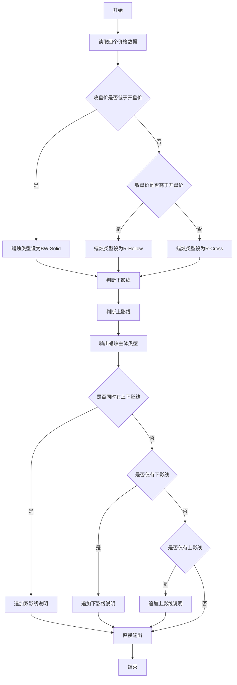
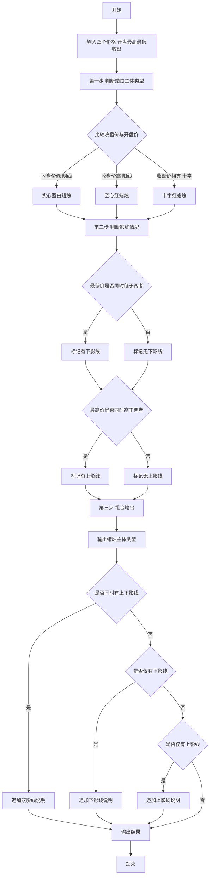

# 7-13 日K蜡烛图（Python3语言实现）

## 前言

本题（7-13 日K蜡烛图）的主要考点是：准确理解题意、规范处理输入输出格式，并正确处理边界与精度。下面先给出题目描述与格式要求，再通过清晰的思路与可直接运行的python3代码进行讲解。

## 题目描述

股票价格涨跌趋势，常用蜡烛图技术中的K线图来表示，分为按日的日K线、按周的周K线、按月的月K线等。以日K线为例，每天股票价格从开盘到收盘走完一天，对应一根蜡烛小图，要表示四个价格：开盘价格Open（早上刚刚开始开盘买卖成交的第1笔价格）、收盘价格Close（下午收盘时最后一笔成交的价格）、中间的最高价High和最低价Low。

如果Close&lt;Open，表示为“BW-Solid”（即“实心蓝白蜡烛”）；如果Close&gt;Open，表示为“R-Hollow”（即“空心红蜡烛”）；如果Open等于Close，则为“R-Cross”（即“十字红蜡烛”）。如果Low比Open和Close低，称为“Lower Shadow”（即“有下影线”），如果High比Open和Close高，称为“Upper Shadow”（即“有上影线”）。请编程序，根据给定的四个价格组合，判断当日的蜡烛是一根什么样的蜡烛。

## 输入格式

输入在一行中给出4个正实数，分别对应Open、High、Low、Close，其间以空格分隔。

## 输出格式

在一行中输出日K蜡烛的类型。如果有上、下影线，则在类型后加上with 影线类型。如果两种影线都有，则输出with Lower Shadow and Upper Shadow。

## 输入样例1

```in
5.110 5.250 5.100 5.105
```

## 输入样例2

```in
5.110 5.110 5.110 5.110
```

## 输入样例3

```in
5.110 5.125 5.112 5.126
```

## 输出样例1

```out
BW-Solid with Lower Shadow and Upper Shadow
```

## 输出样例2

```out
R-Cross
```

## 输出样例3

```out
R-Hollow
```

## 解题思路

### 核心问题分析
本题是一个典型的**多条件组合判断**问题。核心任务是根据4个价格数据（开盘价Open、最高价High、最低价Low、收盘价Close）判断日K蜡烛图的类型，判断分为两个独立维度：
1. **蜡烛主体类型**（3种）：根据Close与Open的大小关系确定
   - Close < Open → BW-Solid（阴线，实心蓝白）
   - Close > Open → R-Hollow（阳线，空心红）
   - Close = Open → R-Cross（十字星）
2. **影线情况**（4种组合）：根据High、Low与Open、Close的比较确定
   - 无上影、无下影
   - 有下影（Lower Shadow）：Low同时小于Open和Close
   - 有上影（Upper Shadow）：High同时大于Open和Close
   - 双影线：既有上影又有下影

### 算法原理说明
采用**两步判断法**分别确定蜡烛类型和影线情况，再组合输出：
1. 第一步：比较Close与Open，确定蜡烛主体类型
2. 第二步：分别判断High、Low与实体边界（Open和Close的极值）的关系
3. 第三步：按格式要求拼接蜡烛类型和影线信息输出

### 具体计算步骤
1. 输入四个价格：Open、High、Low、Close
2. 判断蜡烛主体类型：
   - 若 Close < Open → 类型为 "BW-Solid"
   - 若 Close > Open → 类型为 "R-Hollow"
   - 若 Close = Open → 类型为 "R-Cross"
3. 判断下影线标志 hasLower：
   - Low < Open 且 Low < Close → 有下影线，否则无
4. 判断上影线标志 hasUpper：
   - High > Open 且 High > Close → 有上影线，否则无
5. 组合输出：
   - 先输出蜡烛类型
   - 若 hasLower 且 hasUpper → 追加 " with Lower Shadow and Upper Shadow"
   - 若仅 hasLower → 追加 " with Lower Shadow"
   - 若仅 hasUpper → 追加 " with Upper Shadow"
   - 都无则不追加

### 1. 验证样例：

- 样例1：Open=5.110, High=5.250, Low=5.100, Close=5.105
  - Close(5.105) < Open(5.110) → BW-Solid ✓
  - Low(5.100) < 5.110 且 < 5.105 → 有下影 ✓
  - High(5.250) > 5.110 且 > 5.105 → 有上影 ✓
  - 输出：BW-Solid with Lower Shadow and Upper Shadow ✓

- 样例2：全部都是5.110
  - Close = Open → R-Cross ✓
  - Low不小于实体，High不大于实体 → 无影线 ✓
  - 输出：R-Cross ✓

- 样例3：Open=5.110, High=5.125, Low=5.112, Close=5.126
  - Close(5.126) > Open(5.110) → R-Hollow ✓
  - Low(5.112)不小于5.110 → 无下影 ✓
  - High(5.125)不大于5.126 → 无上影 ✓
  - 输出：R-Hollow ✓

## 完整代码

```python
# 7-13 日K蜡烛图
# 读取四个价格
Open, High, Low, Close = map(float, input().split())

# 第一步：判断蜡烛主体类型
if Close < Open:
    typ = "BW-Solid"       # 阴线
elif Close > Open:
    typ = "R-Hollow"       # 阳线
else:
    typ = "R-Cross"        # 十字星

# 第二步：判断影线情况
hasLower = (Low < Open and Low < Close)   # 下影线
hasUpper = (High > Open and High > Close)  # 上影线

# 第三步：组合输出结果
result = typ
if hasLower and hasUpper:
    result += " with Lower Shadow and Upper Shadow"
elif hasLower:
    result += " with Lower Shadow"
elif hasUpper:
    result += " with Upper Shadow"

print(result)
```

## 代码流程说明

### 1. 读取输入
- 使用 `input().split()` 按空格分割输入行，通过 `map(float, ...)` 将四个字符串转换为浮点数，分别赋值给 Open、High、Low、Close

### 2. 判断蜡烛主体类型
- `if Close < Open`：收盘价低于开盘价（阴线），类型设为 "BW-Solid"
- `elif Close > Open`：收盘价高于开盘价（阳线），类型设为 "R-Hollow"
- `else`：收盘价等于开盘价（十字星），类型设为 "R-Cross"

### 3. 判断影线标志
- `hasLower = (Low < Open and Low < Close)`：最低价同时低于开盘价和收盘价则有下影线
- `hasUpper = (High > Open and High > Close)`：最高价同时高于开盘价和收盘价则有上影线

### 4. 组合输出结果
- 先输出蜡烛主体类型
- 若同时有上下影线，追加 " with Lower Shadow and Upper Shadow"
- 若仅有下影线，追加 " with Lower Shadow"
- 若仅有上影线，追加 " with Upper Shadow"
- 都无则直接输出类型

## 代码流程图



## 解题流程图



## 代码解析

```python
# 7-13 日K蜡烛图
# 读取四个价格
Open, High, Low, Close = map(float, input().split())

# 第一步：判断蜡烛主体类型
if Close < Open:
    typ = "BW-Solid"       # 阴线
elif Close > Open:
    typ = "R-Hollow"       # 阳线
else:
    typ = "R-Cross"        # 十字星

# 第二步：判断影线情况
hasLower = (Low < Open and Low < Close)   # 下影线
hasUpper = (High > Open and High > Close)  # 上影线

# 第三步：组合输出结果
result = typ
if hasLower and hasUpper:
    result += " with Lower Shadow and Upper Shadow"
elif hasLower:
    result += " with Lower Shadow"
elif hasUpper:
    result += " with Upper Shadow"

print(result)
```

读入Open、High、Low、Close四个浮点数，先比较收盘价和开盘价确定主体，再用两个布尔条件判断上下影线并拼接后缀。

## 复杂度分析

程序只比较四个固定的价格并输出对应结果，时间复杂度为 O(1)，额外空间复杂度为 O(1)。

## 常见易错点

### 1. 输入/输出格式不符
错误：多余空格、遗漏换行、大小写或精度不符。后果：判题系统判为格式错误。正确：严格按题目要求的格式输出，数值用合适精度。

### 2. 边界条件遗漏
错误：未处理 0、最小值、单字符或空输入等边界。后果：特例 WA。正确：先列出所有边界样例，在编码前单独分支处理。

### 3. 整数溢出与类型
错误：使用过小的整数类型或忽略负号。后果：大数计算溢出。正确：按数据范围选择合适类型，必要时用更大整数类型或字符串处理。

## 更多测试

### 测试一：只有上影线

**输入：**

```text
5 5.2 5 5.1
```

**输出：**

```text
R-Hollow with Upper Shadow
```

收盘价高于开盘价构成R-Hollow，最低价没有低于实体，最高价高于两者。

### 测试二：十字星带下影线

**输入：**

```text
5 5 4 5
```

**输出：**

```text
R-Cross with Lower Shadow
```
## 总结

本题的核心在于理清「日K蜡烛图」的输入输出关系与边界处理：先按格式读取输入，再依据规则逐步计算或遍历，最后按规范输出。该思路可迁移到同类格式化输入输出与模拟计算的题目。
