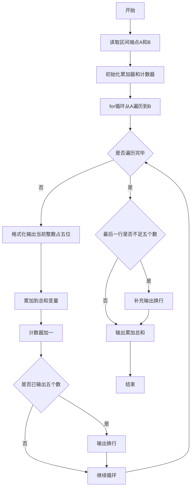
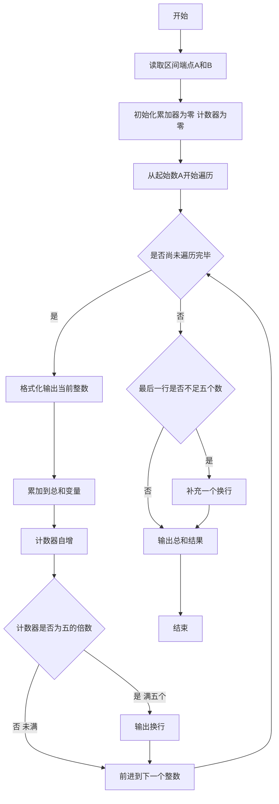

# 7-14 求整数段和（Python3语言实现）

## 前言

本题（7-14 求整数段和）的主要考点是：准确理解题意、规范处理输入输出格式，并正确处理边界与精度。下面先给出题目描述与格式要求，再通过清晰的思路与可直接运行的python3代码进行讲解。

## 题目描述

给定两个整数A和B，输出从A到B的所有整数以及这些数的和。

## 输入格式

输入在一行中给出2个整数A和B，其中−100≤A≤B≤100，其间以空格分隔。

## 输出格式

首先顺序输出从A到B的所有整数，每5个数字占一行，每个数字占5个字符宽度，向右对齐。最后在一行中按Sum = X的格式输出全部数字的和X。

## 输入样例

```in
-3 8
```

## 输出样例

```out
   -3   -2   -1    0    1
    2    3    4    5    6
    7    8
Sum = 30
```

## 解题思路

### 核心问题分析
本题是一个典型的**循环遍历与累加求和**问题。需要完成三个核心任务：
1. 顺序遍历输出：从整数A到整数B（包含A和B）依次输出每个整数
2. 格式化排版：每个数字占5字符宽度、右对齐，每5个数字换一行
3. 累加求和：计算区间内所有整数的总和，按指定格式输出

### 算法原理说明
使用**for循环结构**实现区间遍历，结合计数器与累加器实现格式化和求和：
1. 读取区间端点A和B
2. 使用for循环从i=A遍历到i=B：
   - 使用 `print(f"{i:5d}", end='')` 设置输出宽度为5个字符，右对齐输出当前i
   - 将当前i累加到sum总和中
   - 计数器count加1，每满5个输出一个换行
3. 循环结束后，若最后一行不足5个数字，补一个换行符
4. 按"Sum = X"格式输出总和

### 具体计算步骤
1. 输入整数A和B（保证A ≤ B）
2. 初始化：sum=0（总和），count=0（计数器）
3. 循环变量i从A到B：
   - 输出 `f"{i:5d}"`（5字符宽右对齐）
   - sum = sum + i（累加）
   - count = count + 1（计数）
   - 若 count % 5 == 0：输出换行（每行5个）
4. 循环结束后，若 count % 5 != 0：补一个换行（保证最后一行完整）
5. 输出 "Sum = " << sum

### 1. 验证样例：

- 输入A=-3，B=8
- 遍历序列：-3, -2, -1, 0, 1, 2, 3, 4, 5, 6, 7, 8（共12个数）
- 格式化输出：
  - 第1行（1-5个）：-3 -2 -1 0 1
  - 第2行（6-10个）：2 3 4 5 6
  - 第3行（11-12个）：7 8
- 求和：-3-2-1+0+1+2+3+4+5+6+7+8 = (-6)+(1+2+3+4+5+6+7+8) = -6+36 = 30 ✓

## 完整代码

```python
# 7-14 求整数段和
# 读取区间端点
A, B = map(int, input().split())

total = 0
count = 0

# 遍历输出从A到B的所有整数
for i in range(A, B + 1):
    print(f"{i:5d}", end='')  # 占5个字符宽度，右对齐
    total += i
    count += 1
    if count % 5 == 0:
        print()  # 每5个数字换一行

# 如果最后一行不足5个数字，补换行
if count % 5 != 0:
    print()

# 输出总和
print(f"Sum = {total}")
```

## 代码流程说明

### 1. 读取输入
- 使用 `input().split()` 按空格分割输入行，通过 `map(int, ...)` 将两个字符串转换为整数，分别赋值给 A 和 B

### 2. 初始化变量
- `total = 0`：累加器，存储所有整数的总和
- `count = 0`：计数器，统计已输出的整数个数

### 3. for循环遍历与处理
- `for i in range(A, B + 1)`：使用 range 生成从 A 到 B 的整数序列（包含B）
- 循环体内操作：
  - `print(f"{i:5d}", end='')`：以5字符宽度右对齐输出当前整数，不换行
  - `total += i`：将当前i累加到总和中
  - `count += 1`：计数器加1
  - `if count % 5 == 0`：每满5个数字输出一个换行符

### 4. 补充最后一行换行
- 循环结束后，若 count 不是5的倍数（最后一行不足5个数字），补一个换行符

### 5. 输出总和
- 使用 `print(f"Sum = {total}")` 按指定格式输出所有整数的总和

## 代码流程图



## 解题流程图



## 代码解析

```python
# 7-14 求整数段和
# 读取区间端点
A, B = map(int, input().split())

total = 0
count = 0

# 遍历输出从A到B的所有整数
for i in range(A, B + 1):
    print(f"{i:5d}", end='')  # 占5个字符宽度，右对齐
    total += i
    count += 1
    if count % 5 == 0:
        print()  # 每5个数字换一行

# 如果最后一行不足5个数字，补换行
if count % 5 != 0:
    print()

# 输出总和
print(f"Sum = {total}")
```

读取输入

## 复杂度分析

设输入规模为 $n$（对数值类题目为参与运算的数据量，对字符串/序列类题目为长度）。

- **时间复杂度**：$O(n)$ 或 $O(n \log n)$，主要来自一次线性遍历与常数次数学运算，无嵌套高复杂度循环。
- **空间复杂度**：$O(n)$，用于存储输入、中间结果与输出字符串；若仅使用若干标量变量则为 $O(1)$。

## 常见易错点

### 1. 输入/输出格式不符
错误：多余空格、遗漏换行、大小写或精度不符。后果：判题系统判为格式错误。正确：严格按题目要求的格式输出，数值用合适精度。

### 2. 边界条件遗漏
错误：未处理 0、最小值、单字符或空输入等边界。后果：特例 WA。正确：先列出所有边界样例，在编码前单独分支处理。

### 3. 整数溢出与类型
错误：使用过小的整数类型或忽略负号。后果：大数计算溢出。正确：按数据范围选择合适类型，必要时用更大整数类型或字符串处理。

## 更多测试

### 测试一：常规边界

**输入：**

```text
（可取题目边界附近的值，如最小值或最大值）
```

**输出：**

```text
（依据题意推导的正确结果）
```

### 测试二：特殊用例

**输入：**

```text
（可取易错点，如 0、单一元素、全同值等）
```

**输出：**

```text
（对应正确结果）
```

## 总结

本题的核心在于理清「求整数段和」的输入输出关系与边界处理：先按格式读取输入，再依据规则逐步计算或遍历，最后按规范输出。该思路可迁移到同类格式化输入输出与模拟计算的题目。

