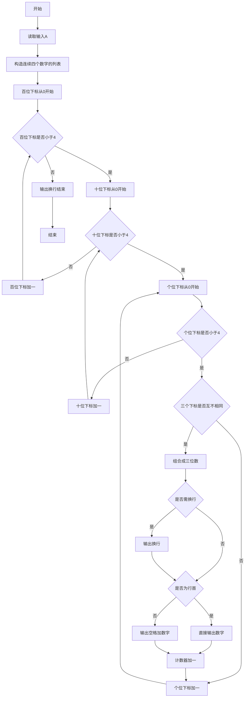
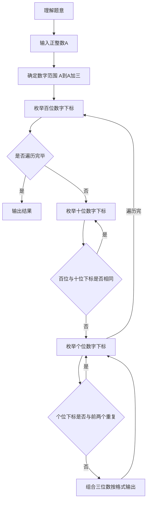

# 7-16 求符合给定条件的整数集（Python3语言实现）

## 前言

本题（7-16 求符合给定条件的整数集）的主要考点是：准确理解题意、规范处理输入输出格式，并正确处理边界与精度。下面先给出题目描述与格式要求，再通过清晰的思路与可直接运行的python3代码进行讲解。

## 题目描述

给定不超过6的正整数A，考虑从A开始的连续4个数字。请输出所有由它们组成的无重复数字的3位数。

## 输入格式

输入在一行中给出A。

## 输出格式

输出满足条件的的3位数，要求从小到大，每行6个整数。整数间以空格分隔，但行末不能有多余空格。

## 输入样例

```in
2
```

## 输出样例

```out
234 235 243 245 253 254
324 325 342 345 352 354
423 425 432 435 452 453
523 524 532 534 542 543
```

## 解题思路

- **核心问题分析**：从A开始的4个连续数字中选取3个不重复的数字组成三位数，按升序输出，每行6个。
- **算法原理说明**：使用三重循环分别枚举百位、十位、个位的所有可能下标组合，通过判断三个下标互不相同来确保数字不重复。由于数组本身按升序存储，三重循环按i→j→k的顺序遍历，自然生成升序排列的结果。
- **具体计算步骤**：
  1. 读取正整数A，构造包含{A, A+1, A+2, A+3}的列表
  2. 外层循环遍历百位下标i（0~3）
  3. 中层循环遍历十位下标j（0~3）
  4. 内层循环遍历个位下标k（0~3）
  5. 若i、j、k互不相同，则组合成三位数nums[i]×100 + nums[j]×10 + nums[k]
  6. 使用计数器控制格式：每6个数换行，行首不加空格，其余数字前加空格分隔

## 完整代码

```python
# 7-16 求符合给定条件的整数集
# 读取输入
A = int(input())

# 构造从A开始的连续4个数字
nums = [A, A+1, A+2, A+3]

count = 0

# 三重循环枚举百位、十位、个位
for i in range(4):
    for j in range(4):
        if i == j:
            continue
        for k in range(4):
            if k == i or k == j:
                continue
            # 组合成三位数
            num = nums[i] * 100 + nums[j] * 10 + nums[k]
            # 每行6个整数，行首不加空格，其余加空格分隔
            if count > 0 and count % 6 == 0:
                print()
            if count % 6 == 0:
                print(num, end='')
            else:
                print(f" {num}", end='')
            count += 1

# 最后输出换行
print()
```

## 代码流程说明

### 1. 读取输入
- 使用 `input()` 读取正整数A，通过 `int()` 转换为整数

### 2. 构造数字列表
- `nums = [A, A+1, A+2, A+3]`：构造包含从A开始的4个连续数字的列表

### 3. 三重循环枚举组合
- 外层 `for i in range(4)`：遍历百位下标
- 中层 `for j in range(4)`：遍历十位下标，若 `i == j` 则跳过（确保不重复）
- 内层 `for k in range(4)`：遍历个位下标，若 `k == i or k == j` 则跳过（确保不重复）
- 组合三位数：`num = nums[i] * 100 + nums[j] * 10 + nums[k]`

### 4. 格式化输出
- 使用计数器 count 控制每行输出6个整数
- 当 count 是6的倍数且非首个时，先换行
- 每行第一个数直接输出，其余数前加空格分隔
- 使用 `end=''` 确保不自动换行

### 5. 输出结束
- 所有三位数输出完毕后，输出一个换行符

## 代码流程图



## 解题流程图



## 代码解析

```python
# 7-16 求符合给定条件的整数集
# 读取输入
A = int(input())

# 构造从A开始的连续4个数字
nums = [A, A+1, A+2, A+3]

count = 0

# 三重循环枚举百位、十位、个位
for i in range(4):
    for j in range(4):
        if i == j:
            continue
        for k in range(4):
            if k == i or k == j:
                continue
            # 组合成三位数
            num = nums[i] * 100 + nums[j] * 10 + nums[k]
            # 每行6个整数，行首不加空格，其余加空格分隔
            if count > 0 and count % 6 == 0:
                print()
            if count % 6 == 0:
                print(num, end='')
            else:
                print(f" {num}", end='')
            count += 1

# 最后输出换行
print()
```

读入A并构造A到A+3的四个数字，三重循环通过下标不重复条件枚举三位数，同时用计数器控制每行6个且行首无空格。

## 复杂度分析

题目中的候选数字固定为 1、2、3、4，三层循环最多执行 4³ 次，因此在题目约束下时间复杂度为 O(1)，额外空间复杂度为 O(1)。

## 常见易错点

### 1. 输入/输出格式不符
错误：多余空格、遗漏换行、大小写或精度不符。后果：判题系统判为格式错误。正确：严格按题目要求的格式输出，数值用合适精度。

### 2. 边界条件遗漏
错误：未处理 0、最小值、单字符或空输入等边界。后果：特例 WA。正确：先列出所有边界样例，在编码前单独分支处理。

### 3. 整数溢出与类型
错误：使用过小的整数类型或忽略负号。后果：大数计算溢出。正确：按数据范围选择合适类型，必要时用更大整数类型或字符串处理。

## 更多测试

### 测试一：最小允许A

**输入：**

```text
1
```

**输出：**

```text
123 124 132 134 142 143
213 214 231 234 241 243
312 314 321 324 341 342
412 413 421 423 431 432
```

四个数字为1、2、3、4，三重循环会生成24个不重复的三位数，每行6个。

### 测试二：最大允许A

**输入：**

```text
6
```

**输出：**

```text
678 679 687 689 697 698
768 769 786 789 796 798
867 869 876 879 896 897
967 968 976 978 986 987
```
## 总结

本题的核心在于理清「求符合给定条件的整数集」的输入输出关系与边界处理：先按格式读取输入，再依据规则逐步计算或遍历，最后按规范输出。该思路可迁移到同类格式化输入输出与模拟计算的题目。
