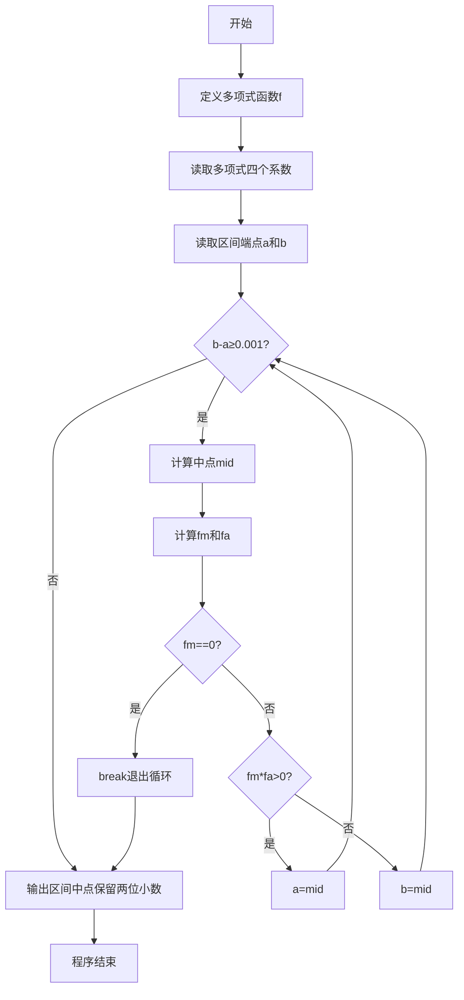
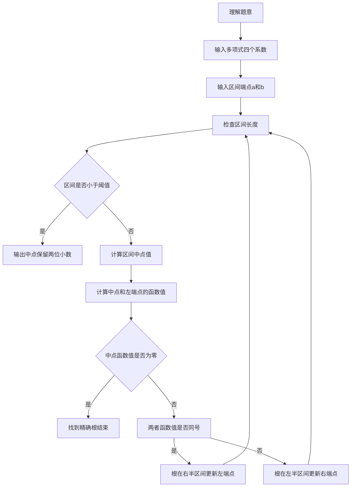

# 7-18 二分法求多项式单根（Python3语言实现）

## 前言

本题（7-18 二分法求多项式单根）的主要考点是：准确理解题意、规范处理输入输出格式，并正确处理边界与精度。下面先给出题目描述与格式要求，再通过清晰的思路与可直接运行的python3代码进行讲解。

## 题目描述

二分法求函数根的原理为：如果连续函数f(x)在区间[a,b]的两个端点取值异号，即f(a)f(b)<0，则它在这个区间内至少存在1个根r，即f(r)=0。

二分法的步骤为：

检查区间长度，如果小于给定阈值，则停止，输出区间中点(a+b)/2；否则
如果f(a)f(b)<0，则计算中点的值f((a+b)/2)；
如果f((a+b)/2)正好为0，则(a+b)/2就是要求的根；否则
如果f((a+b)/2)与f(a)同号，则说明根在区间[(a+b)/2,b]，令a=(a+b)/2，重复循环；
如果f((a+b)/2)与f(b)同号，则说明根在区间[a,(a+b)/2]，令b=(a+b)/2，重复循环。

本题目要求编写程序，计算给定3阶多项式f(x)=a₃x³ + a₂x² + a₁x + a₀在给定区间[a,b]内的根。

## 输入格式

输入在第1行中顺序给出多项式的4个系数a₃、a₂、a₁、a₀，在第2行中顺序给出区间端点a和b。题目保证多项式在给定区间内存在唯一单根。

## 输出格式

在一行中输出该多项式在该区间内的根，精确到小数点后2位。

## 输入样例

```in
3 -1 -3 1
-0.5 0.5
```

## 输出样例

```out
0.33
```

## 解题思路

- **核心问题分析**：利用二分法在给定区间[a,b]内求三阶多项式的根，要求精度达到小数点后2位。核心是通过不断缩小区间范围逼近真实根。
- **算法原理说明**：二分法基于连续函数零点存在定理：若f(a)与f(b)异号，则区间内必有根。每次取区间中点mid，计算f(mid)，根据f(mid)与f(a)的符号关系判断根所在的子区间，将区间缩小一半。重复此过程直到区间长度小于阈值（0.001），此时中点即为根的近似值。
- **具体计算步骤**：
  1. 读取多项式系数a₃,a₂,a₁,a₀和区间端点a,b
  2. 当b-a≥0.001时循环：
     - 计算中点mid=(a+b)/2
     - 计算f(mid)和f(a)
     - 若f(mid)==0，mid即为根，结束
     - 若f(mid)与f(a)同号（fm*fa>0），根在右半区间，令a=mid
     - 否则根在左半区间，令b=mid
  3. 循环结束后输出区间中点(a+b)/2，保留2位小数

## 完整代码

```python
def f(a3, a2, a1, a0, x):
    return a3 * x**3 + a2 * x**2 + a1 * x + a0

a3, a2, a1, a0 = map(float, input().split())
a, b = map(float, input().split())

while b - a >= 0.001:
    mid = (a + b) / 2
    fm = f(a3, a2, a1, a0, mid)
    fa = f(a3, a2, a1, a0, a)
    if fm == 0:
        break
    elif fm * fa > 0:
        a = mid
    else:
        b = mid

print(f"{(a + b) / 2:.2f}")
```

## 代码流程说明

1. **定义多项式函数f**（第1-2行）：使用`def`定义函数，接收4个系数和x值，返回三阶多项式a₃x³+a₂x²+a₁x+a₀的计算结果，使用`**`运算符表示乘方。
2. **变量声明与输入**（第4-5行）：使用`map(float, input().split())`分别读取多项式系数和区间端点。
3. **二分法迭代循环**（第7-14行）：
   - `while b - a >= 0.001`：当区间长度≥阈值时继续迭代
   - 计算中点mid=(a+b)/2
   - 调用f函数计算中点函数值fm和左端点函数值fa
   - 若fm==0：找到精确根，break退出
   - 若fm*fa>0：中点与左端点同号，根在右半区间，a=mid
   - 否则：根在左半区间，b=mid
4. **输出结果**（第16行）：使用f-string格式化输出根的近似值，保留2位小数。

## 代码流程图



## 解题流程图



## 代码解析

```python
def f(a3, a2, a1, a0, x):
    return a3 * x**3 + a2 * x**2 + a1 * x + a0

a3, a2, a1, a0 = map(float, input().split())
a, b = map(float, input().split())

while b - a >= 0.001:
    mid = (a + b) / 2
    fm = f(a3, a2, a1, a0, mid)
    fa = f(a3, a2, a1, a0, a)
    if fm == 0:
        break
    elif fm * fa > 0:
        a = mid
    else:
        b = mid

print(f"{(a + b) / 2:.2f}")
```

函数`f()`封装三阶多项式求值，主程序在区间长度达到阈值时取中点，并根据中点与左端点的函数值符号关系保留含根的一半区间。

## 复杂度分析

设多项式次数为 d，二分迭代次数为 K。每次计算多项式值需要 O(d)，因此时间复杂度为 O(dK)，其中 K 与初始区间长度和精度要求有关；额外空间复杂度为 O(1)。

## 常见易错点

### 1. 输入/输出格式不符
错误：多余空格、遗漏换行、大小写或精度不符。后果：判题系统判为格式错误。正确：严格按题目要求的格式输出，数值用合适精度。

### 2. 边界条件遗漏
错误：未处理 0、最小值、单字符或空输入等边界。后果：特例 WA。正确：先列出所有边界样例，在编码前单独分支处理。

### 3. 整数溢出与类型
错误：使用过小的整数类型或忽略负号。后果：大数计算溢出。正确：按数据范围选择合适类型，必要时用更大整数类型或字符串处理。

## 更多测试

### 测试一：线性形式的三阶多项式

**输入：**

```text
1 0 0 -1
0 2
```

**输出：**

```text
1.00
```

此时多项式为x³−1，区间内的唯一根为1。

### 测试二：根位于端点

**输入：**

```text
1 0 0 -1
1 2
```

**输出：**

```text
1.00
```

区间左端点就是根，二分缩小后仍应输出1.00。
## 总结

本题的核心在于理清「二分法求多项式单根」的输入输出关系与边界处理：先按格式读取输入，再依据规则逐步计算或遍历，最后按规范输出。该思路可迁移到同类格式化输入输出与模拟计算的题目。
