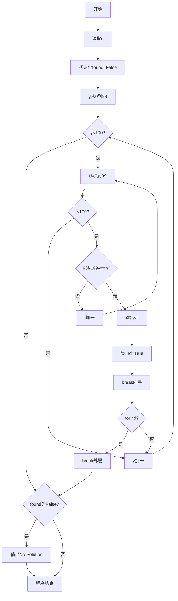

# 7-19 支票面额（Python3语言实现）

## 前言

本题（7-19 支票面额）的主要考点是：准确理解题意、规范处理输入输出格式，并正确处理边界与精度。下面先给出题目描述与格式要求，再通过清晰的思路与可直接运行的python3代码进行讲解。

## 题目描述

一个采购员去银行兑换一张y元f分的支票，结果出纳员错给了f元y分。采购员用去了n分之后才发觉有错，于是清点了余额尚有2y元2f分，问该支票面额是多少？

## 输入格式

输入在一行中给出小于100的正整数n。

## 输出格式

在一行中按格式y.f输出该支票的原始面额。如果无解，则输出No Solution。

## 输入样例1

```in
23
```

## 输入样例2

```in
22
```

## 输出样例1

```out
25.51
```

## 输出样例2

```out
No Solution
```

## 解题思路

- **核心问题分析**：根据题意建立数学方程，求解原始支票面额y（元）和f（分）。关键在于将金额单位统一为分后，根据错兑、用去、剩余的关系建立不定方程。
- **算法原理说明**：将所有金额转换为分单位：原始支票为100y+f分，错兑后为100f+y分，用去n分后剩余200y+2f分。根据题意列方程：100f+y-n = 200y+2f，化简得98f-199y = n。由于y和f均为0~99的整数（元与分的范围），使用双重循环枚举所有可能的y和f，验证是否满足方程即可。
- **具体计算步骤**：
  1. 读取用去的分数n
  2. 外层循环枚举y从0到99（元数）
  3. 内层循环枚举f从0到99（分数）
  4. 验证方程98f-199y==n是否成立
  5. 若成立则输出y.f，标记找到解，退出循环
  6. 枚举结束未找到解则输出No Solution

## 完整代码

```python
n = int(input())
found = False
for y in range(100):
    for f in range(100):
        if 98 * f - 199 * y == n:
            print(f"{y}.{f:02d}")
            found = True
            break
    if found:
        break
if not found:
    print("No Solution")
```

## 代码流程说明

1. **变量声明与输入**（第1-2行）：使用`int(input())`读取用去的分数n，初始化found为False标记未找到解。
2. **双重循环枚举求解**（第4-10行）：
   - 外层`for y in range(100)`：枚举元数y（0-99）
   - 内层`for f in range(100)`：枚举分数f（0-99）
   - 条件判断`98*f - 199*y == n`：验证是否满足不定方程
   - 若满足：使用f-string输出y.f格式结果，found置True，break跳出内层循环
   - 外层判断if found，若找到则break跳出外层循环
3. **无解处理**（第11-12行）：若found仍为False则输出No Solution。

## 代码流程图



## 解题流程图


## 代码解析

```python
n = int(input())
found = False
for y in range(100):
    for f in range(100):
        if 98 * f - 199 * y == n:
            print(f"{y}.{f:02d}")
            found = True
            break
    if found:
        break
if not found:
    print("No Solution")
```

读取用去的分数n并设置`found`标志；随后枚举0到99范围内的元数和分数，找到满足不定方程的组合后立即停止搜索。

## 复杂度分析

题目约束下元数和分数都只枚举 0 到 99，共 100×100 次判断，因此时间复杂度为 O(1)，额外空间复杂度为 O(1)。若将上界推广为 M，则时间复杂度为 O(M²)。

## 常见易错点

### 1. 输入/输出格式不符
错误：多余空格、遗漏换行、大小写或精度不符。后果：判题系统判为格式错误。正确：严格按题目要求的格式输出，数值用合适精度。

### 2. 边界条件遗漏
错误：未处理 0、最小值、单字符或空输入等边界。后果：特例 WA。正确：先列出所有边界样例，在编码前单独分支处理。

### 3. 整数溢出与类型
错误：使用过小的整数类型或忽略负号。后果：大数计算溢出。正确：按数据范围选择合适类型，必要时用更大整数类型或字符串处理。

## 更多测试

### 测试一：存在解

**输入：**

```text
23
```

**输出：**

```text
25.51
```

枚举元数和分数后，方程98f−199y=23成立于y=25、f=51。

### 测试二：无解

**输入：**

```text
22
```

**输出：**

```text
No Solution
```
## 总结

本题的核心在于理清「支票面额」的输入输出关系与边界处理：先按格式读取输入，再依据规则逐步计算或遍历，最后按规范输出。该思路可迁移到同类格式化输入输出与模拟计算的题目。
