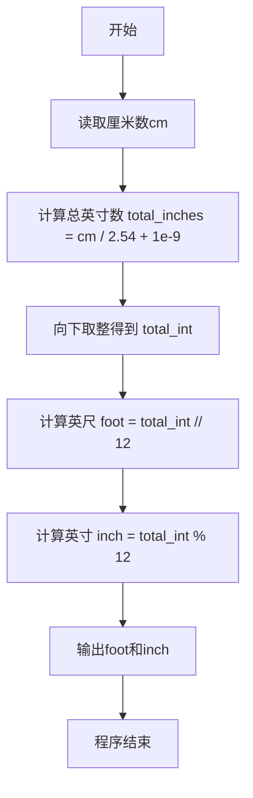
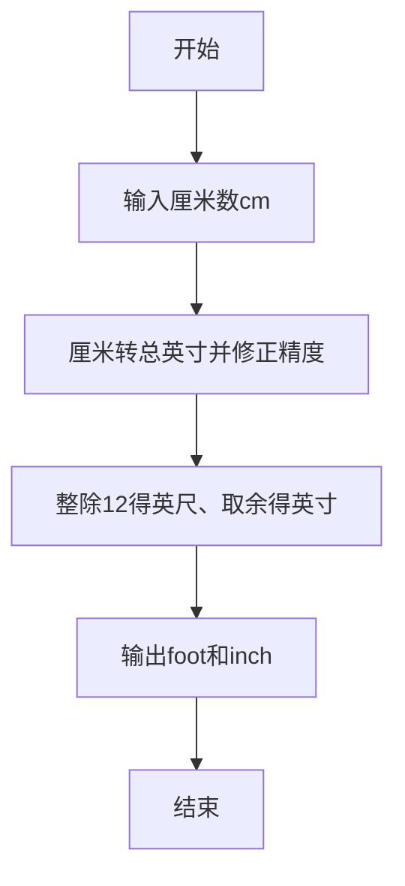

# 7-1 厘米换算英尺英寸（Python3语言实现）

## 前言

本题（7-1 厘米换算英尺英寸）的主要考点是：准确理解题意、规范处理输入输出格式，并正确处理边界与精度。下面先给出题目描述与格式要求，再通过清晰的思路与可直接运行的python3代码进行讲解。

## 题目描述

如果已知英制长度的英尺*f**oo**t*和英寸*in**c**h*的值，那么对应的米是(*f**oo**t*+*in**c**h*/12)×0.3048。现在，如果用户输入的是厘米数，那么对应英制长度的英尺和英寸是多少呢？别忘了1英尺等于12英寸。

## 输入格式

输入在一行中给出1个正整数，单位是厘米。

## 输出格式

在一行中输出这个厘米数对应英制长度的英尺和英寸的整数值，中间用空格分开。英寸的值应小于12。

## 输入样例

```in
170
```

## 输出样例

```out
5 6
```

## 解题思路

这道题的核心是**厘米与英制长度单位（英尺、英寸）的换算**。

### 换算公式推导

已知条件：
- 1 英寸 = 2.54 厘米
- 1 英尺 = 12 英寸

因此，给定厘米数 cm，先将厘米转换为总英寸数：

总英寸数 = cm / 2.54

为了规避浮点运算的精度误差，计算时加上微小的偏移量 1e-9，再通过 int() 向下取整得到整数总英寸数 total_int。由于 1 英尺等于 12 英寸：

- 英尺数 foot = total_int // 12
- 剩余英寸数 inch = total_int % 12

因为英寸取自总英寸数对 12 取余的结果，其值必然小于 12，天然满足题目要求。

### 计算步骤

1. 读取输入的厘米数 cm
2. 计算 total_inches = cm / 2.54 + 1e-9（总英寸数，含浮点精度修正）
3. 向下取整得到 total_int = int(total_inches)
4. 计算 foot = total_int // 12、inch = total_int % 12
5. 按「foot inch」格式输出结果

## 完整代码

```python
def main(): # 定义主函数
    cm = int(input().strip()) # 从标准输入读取一行，去除首尾空白后转为整数，存储厘米数
    # 计算总英寸数（浮点值），添加微小偏移量避免浮点精度问题
    total_inches = cm / 2.54 + 1e-9 # 厘米除以2.54得到总英寸，加1e-9避免浮点精度问题
    # 向下取整得到整数总英寸数
    total_int = int(total_inches) # 将浮点数总英寸转为整数（Python的int()向零取整）
    # 分解为英尺和英寸
    foot = total_int // 12 # 计算英尺数：总英寸数整除12
    inch = total_int % 12 # 计算剩余英寸数：总英寸数对12取余
    print(f"{foot} {inch}") # 使用f-string格式化输出英尺和英寸，中间用空格分隔

if __name__ == "__main__": # 判断是否作为主程序运行
    main() # 调用主函数
```

## 代码流程说明

### 1. 读取输入
- 使用 `input()` 读取用户输入的厘米数，去除首尾空白后转换为整数 cm

### 2. 计算总英寸数
- `total_inches = cm / 2.54 + 1e-9`：将厘米数除以 2.54 得到总英寸数，加 1e-9 规避浮点精度误差
- 使用 `int(total_inches)` 向下取整得到整数总英寸数 total_int

### 3. 分解英尺与英寸
- `foot = total_int // 12`：整除 12 得到英尺数
- `inch = total_int % 12`：对 12 取余得到剩余英寸数，其值小于 12

### 4. 输出结果
- 使用 `print()` 按 `foot inch` 格式输出英尺和英寸，中间用空格分隔

## 代码流程图



## 解题流程图



## 代码解析

```python
def main(): # 定义主函数
    cm = int(input().strip()) # 从标准输入读取一行，去除首尾空白后转为整数，存储厘米数
    # 计算总英寸数（浮点值），添加微小偏移量避免浮点精度问题
    total_inches = cm / 2.54 + 1e-9 # 厘米除以2.54得到总英寸，加1e-9避免浮点精度问题
    # 向下取整得到整数总英寸数
    total_int = int(total_inches) # 将浮点数总英寸转为整数（Python的int()向零取整）
    # 分解为英尺和英寸
    foot = total_int // 12 # 计算英尺数：总英寸数整除12
    inch = total_int % 12 # 计算剩余英寸数：总英寸数对12取余
    print(f"{foot} {inch}") # 使用f-string格式化输出英尺和英寸，中间用空格分隔

if __name__ == "__main__": # 判断是否作为主程序运行
    main() # 调用主函数
```

使用`input().strip()`读取厘米数并转换为整数；随后将厘米换算为总英寸，取整后用整除和取余分别得到英尺与剩余英寸。

## 复杂度分析

程序只进行一次单位换算和常数次取整、格式化操作，时间复杂度为 O(1)，额外空间复杂度为 O(1)。

## 常见易错点

### 1. 输入/输出格式不符
错误：多余空格、遗漏换行、大小写或精度不符。后果：判题系统判为格式错误。正确：严格按题目要求的格式输出，数值用合适精度。

### 2. 边界条件遗漏
错误：未处理 0、最小值、单字符或空输入等边界。后果：特例 WA。正确：先列出所有边界样例，在编码前单独分支处理。

### 3. 整数溢出与类型
错误：使用过小的整数类型或忽略负号。后果：大数计算溢出。正确：按数据范围选择合适类型，必要时用更大整数类型或字符串处理。

## 更多测试

### 测试一：整数英寸边界

**输入：**

```text
254
```

**输出：**

```text
8 4
```

254厘米正好等于100英寸，分解后为8英尺4英寸。

### 测试二：不足一英尺

**输入：**

```text
12
```

**输出：**

```text
0 4
```

12厘米换算后的整数英寸数为4，因此英尺数为0。
## 总结

本题的核心在于理清「厘米换算英尺英寸」的输入输出关系与边界处理：先按格式读取输入，再依据规则逐步计算或遍历，最后按规范输出。该思路可迁移到同类格式化输入输出与模拟计算的题目。
