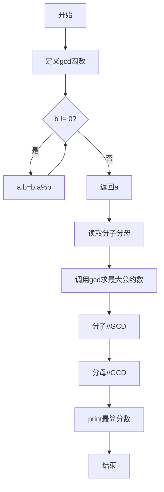
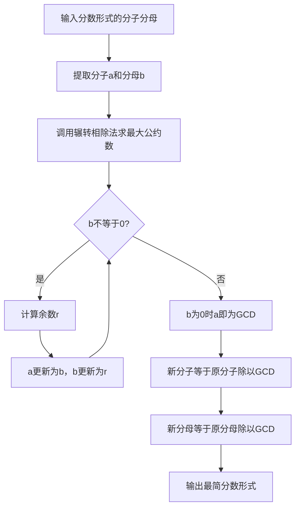

# 7-24 约分最简分式（Python3语言实现）

## 前言

本题（7-24 约分最简分式）的主要考点是：准确理解题意、规范处理输入输出格式，并正确处理边界与精度。下面先给出题目描述与格式要求，再通过清晰的思路与可直接运行的python3代码进行讲解。

## 题目描述

分数可以表示为分子/分母的形式。编写一个程序，要求用户输入一个分数，然后将其约分为最简分式。最简分式是指分子和分母不具有可以约分的成分了。如6/12可以被约分为1/2。当分子大于分母时，不需要表达为整数又分数的形式，即11/8还是11/8；而当分子分母相等时，仍然表达为1/1的分数形式。

## 输入格式

输入在一行中给出一个分数，分子和分母中间以斜杠/分隔，如：12/34表示34分之12。分子和分母都是正整数（不包含0，如果不清楚正整数的定义的话）。

提示：

对于C语言，在scanf的格式字符串中加入/，让scanf来处理这个斜杠。
对于Python语言，用a,b=map(int, input().split('/'))这样的代码来处理这个斜杠。

## 输出格式

在一行中输出这个分数对应的最简分式，格式与输入的相同，即采用分子/分母的形式表示分数。如
5/6表示6分之5。

## 输入样例

```in
66/120
```

## 输出样例

```out
11/20
```

## 解题思路

### 1. 核心问题分析

将给定分数约分为最简分式，即分子和分母同时除以它们的最大公约数(GCD)。约分后分子与分母互质。

### 2. 算法原理

使用欧几里得算法（辗转相除法）求两个数的最大公约数。算法核心：gcd(a, b) = gcd(b, a mod b)，反复迭代直到余数为0，此时的除数即为最大公约数。然后分子分母同除以该GCD即得最简分式。

### 3. 具体计算步骤

1. 以"分子/分母"格式读取输入的两个整数
2. 调用gcd函数计算分子和分母的最大公约数
3. 简化分子 = 原分子 ÷ 最大公约数
4. 简化分母 = 原分母 ÷ 最大公约数
5. 按"分子/分母"格式输出结果

## 完整代码

```python
def gcd(a, b):
    while b != 0:
        a, b = b, a % b
    return a

numerator, denominator = map(int, input().split('/'))
common_divisor = gcd(numerator, denominator)
simplified_num = numerator // common_divisor
simplified_den = denominator // common_divisor
print(f"{simplified_num}/{simplified_den}")
```

## 代码流程说明

1. **gcd函数定义**（第1-4行）：使用辗转相除法循环计算最大公约数。当b≠0时，通过`a, b = b, a % b`辗转更新；b=0时返回a即为最大公约数。
2. **输入读取**（第6行）：使用`input().split('/')`按斜杠分割读取分子分母，通过`map(int, ...)`转换为整数。
3. **计算最大公约数**（第7行）：调用gcd(numerator, denominator)。
4. **约分计算**（第8-9行）：使用`//`整数除法分别计算简化后的分子和分母。
5. **格式化输出**（第10行）：使用f-string按"分子/分母"格式输出最简分式。

## 代码流程图



## 解题流程图



## 代码解析

```python
def gcd(a, b):
    while b != 0:
        a, b = b, a % b
    return a

numerator, denominator = map(int, input().split('/'))
common_divisor = gcd(numerator, denominator)
simplified_num = numerator // common_divisor
simplified_den = denominator // common_divisor
print(f"{simplified_num}/{simplified_den}")
```

自定义`gcd()`使用辗转相除法求最大公约数；输入分子分母后同时除以该公约数，并按`分子/分母`格式输出。

## 复杂度分析

辗转相除法的时间复杂度为 O(log min(|a|, |b|))，只使用少量临时变量，额外空间复杂度为 O(1)。

## 常见易错点

### 1. 输入/输出格式不符
错误：多余空格、遗漏换行、大小写或精度不符。后果：判题系统判为格式错误。正确：严格按题目要求的格式输出，数值用合适精度。

### 2. 边界条件遗漏
错误：未处理 0、最小值、单字符或空输入等边界。后果：特例 WA。正确：先列出所有边界样例，在编码前单独分支处理。

### 3. 整数溢出与类型
错误：使用过小的整数类型或忽略负号。后果：大数计算溢出。正确：按数据范围选择合适类型，必要时用更大整数类型或字符串处理。

## 更多测试

### 测试一：最大公约数不为1

**输入：**

```text
6/12
```

**输出：**

```text
1/2
```

分子分母同时除以最大公约数6。

### 测试二：本身已经最简

**输入：**

```text
11/8
```

**输出：**

```text
11/8
```
## 总结

本题的核心在于理清「约分最简分式」的输入输出关系与边界处理：先按格式读取输入，再依据规则逐步计算或遍历，最后按规范输出。该思路可迁移到同类格式化输入输出与模拟计算的题目。
