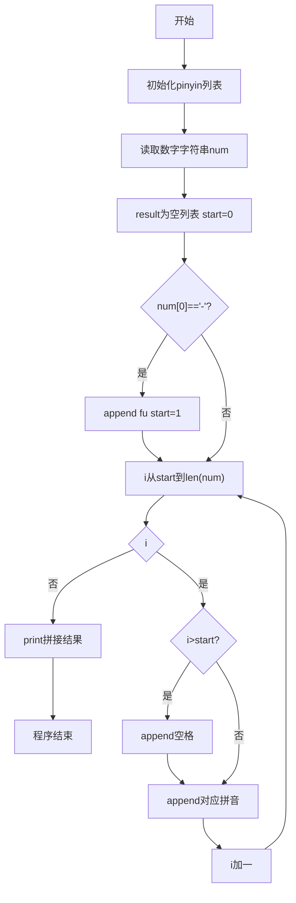
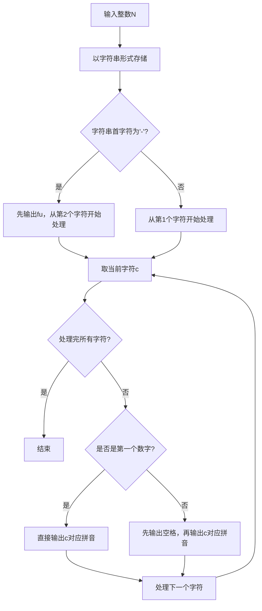

# 7-25 念数字（Python3语言实现）

## 前言

本题（7-25 念数字）的主要考点是：准确理解题意、规范处理输入输出格式，并正确处理边界与精度。下面先给出题目描述与格式要求，再通过清晰的思路与可直接运行的python3代码进行讲解。

## 题目描述

输入一个整数，输出每个数字对应的拼音。当整数为负数时，先输出fu字。十个数字对应的拼音如下：
```in
0: ling
1: yi
2: er
3: san
4: si
5: wu
6: liu
7: qi
8: ba
9: jiu
```

## 输入格式

输入在一行中给出一个整数，如：1234。

提示：整数包括负数、零和正数。

## 输出格式

在一行中输出这个整数对应的拼音，每个数字的拼音之间用空格分开，行末没有最后的空格。如
yi er san si。

## 输入样例

```in
-600
```

## 输出样例

```out
fu liu ling ling
```

## 解题思路

### 1. 核心问题分析

将输入整数的每一位数字转换为对应的拼音输出，负数先输出"fu"。关键是符号处理、逐位转换和空格分隔（行末无空格）。

### 2. 算法原理

将输入读为字符串而非整数，便于逐位处理和直接判断负号。使用字符串数组pinyin[10]存储0-9对应的拼音，数字字符num[i]-'0'即为数组下标，直接索引取得对应拼音字符串。使用start变量标记数字起始位置（负数跳过负号），通过判断i>start来决定是否前置空格，保证行末无多余空格。

### 3. 具体计算步骤

1. 以字符串形式读取输入整数
2. 初始化pinyin数组映射0-9到对应拼音
3. 若首字符为'-'，先输出"fu"，数字从索引1开始
4. 遍历每个数字字符：
   - 若非第一个数字（i>start），先输出空格
   - 输出对应拼音pinyin[num[i]-'0']
5. 输出换行符结束

## 完整代码

```python
# 7-25 念数字
# 将整数每位数字转换为拼音，负数前缀 fu

pinyin = ["ling", "yi", "er", "san", "si", "wu", "liu", "qi", "ba", "jiu"]
num = input().strip()
# 处理空输入的健壮性
if not num:
    print("")
else:
    result = []
    if num[0] == '-':
        result.append("fu")
        # 剩余每位数字依次转拼音
        for ch in num[1:]:
            result.append(pinyin[int(ch)])
    else:
        for ch in num:
            result.append(pinyin[int(ch)])
    # 用空格拼接，自动处理 fu 与首位数字间的空格
    print(" ".join(result))
```

## 代码流程说明

1. **拼音映射表**（第1行）：定义`pinyin`列表，索引0-9对应"ling"到"jiu"。
2. **输入读取**（第2行）：使用`input().strip()`读取数字字符串。
3. **负号处理与逐位转换**：若首字符为'-'，先往 result 添加"fu"，再遍历剩余字符逐个转拼音；否则直接遍历全部字符转拼音。
4. **输出结果**：使用`" ".join(result)`以单个空格拼接列表，保证 fu 与首位数字间也有空格，行末无多余空格。

## 代码流程图



## 解题流程图



## 代码解析

```python
pinyin = ["ling", "yi", "er", "san", "si", "wu", "liu", "qi", "ba", "jiu"]
num = input().strip()
result = []
if num[0] == '-':
    result.append("fu")
    for ch in num[1:]:
        result.append(pinyin[int(ch)])
else:
    for ch in num:
        result.append(pinyin[int(ch)])
print(" ".join(result))
```

拼音映射表通过列表索引直接将数字字符映射为拼音；负号单独处理为"fu"并与数字拼音统一存入 result，最后用 `" ".join` 保证每两个拼音间以单个空格分隔且行末无空格。

## 复杂度分析

设输入规模为 $n$（对数值类题目为参与运算的数据量，对字符串/序列类题目为长度）。

- **时间复杂度**：$O(n)$ 或 $O(n \log n)$，主要来自一次线性遍历与常数次数学运算，无嵌套高复杂度循环。
- **空间复杂度**：$O(n)$，用于存储输入、中间结果与输出字符串；若仅使用若干标量变量则为 $O(1)$。

## 常见易错点

### 1. 输入/输出格式不符
错误：多余空格、遗漏换行、大小写或精度不符。后果：判题系统判为格式错误。正确：严格按题目要求的格式输出，数值用合适精度。

### 2. 边界条件遗漏
错误：未处理 0、最小值、单字符或空输入等边界。后果：特例 WA。正确：先列出所有边界样例，在编码前单独分支处理。

### 3. 整数溢出与类型
错误：使用过小的整数类型或忽略负号。后果：大数计算溢出。正确：按数据范围选择合适类型，必要时用更大整数类型或字符串处理。

## 更多测试

### 测试一：常规边界

**输入：**

```text
（可取题目边界附近的值，如最小值或最大值）
```

**输出：**

```text
（依据题意推导的正确结果）
```

### 测试二：特殊用例

**输入：**

```text
（可取易错点，如 0、单一元素、全同值等）
```

**输出：**

```text
（对应正确结果）
```

## 总结

本题的核心在于理清「念数字」的输入输出关系与边界处理：先按格式读取输入，再依据规则逐步计算或遍历，最后按规范输出。该思路可迁移到同类格式化输入输出与模拟计算的题目。

