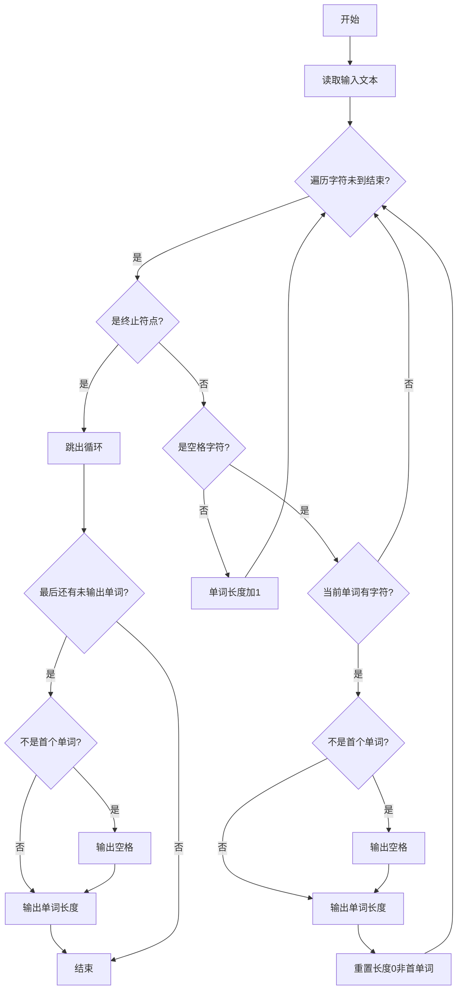
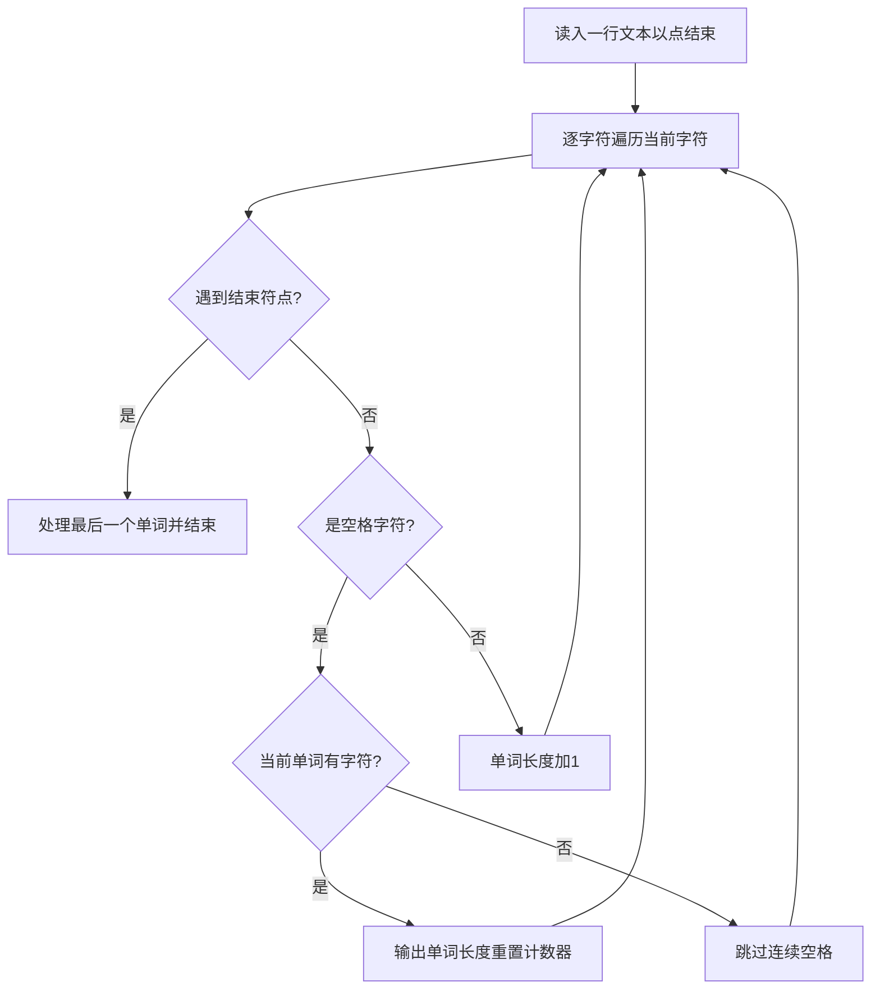

# 7-26 单词长度（Python3语言实现）

## 前言

本题（7-26 单词长度）的主要考点是：准确理解题意、规范处理输入输出格式，并正确处理边界与精度。下面先给出题目描述与格式要求，再通过清晰的思路与可直接运行的python3代码进行讲解。

## 题目描述

你的程序要读入一行文本，其中以空格分隔为若干个单词，以.结束。你要输出每个单词的长度。这里的单词与语言无关，可以包括各种符号，比如it's算一个单词，长度为4。注意，行中可能出现连续的空格；最后的.不计算在内。

## 输入格式

输入在一行中给出一行文本，以.结束

提示：用scanf("%c",...);来读入一个字符，直到读到.为止。

## 输出格式

在一行中输出这行文本对应的单词的长度，每个长度之间以空格隔开，行末没有最后的空格。

## 输入样例

```in
It's great to see you here.
```

## 输出样例

```out
4 5 2 3 3 4
```

## 解题思路

**核心问题分析**：本题需要逐字符读取输入文本，识别空格分隔的单词并统计每个单词的长度，遇到'.'时结束处理。难点在于处理连续空格（不能输出多余的0长度）和行末无多余空格的格式要求。

**算法原理说明**：采用逐字符遍历法，使用一个计数器`word_len`记录当前单词的长度，遇到空格时若已有字符计数（`word_len>0`）则输出该长度并重置计数器，遇到'.'时结束循环并处理最后一个单词。使用`first`标记控制空格输出，确保行末无多余空格。

### 1. 具体计算步骤

1. 初始化`word_len=0`（当前单词长度）、`first=True`（第一个单词标记）
2. 使用`input()`读取整行文本，遍历每个字符，直到读到'.'为止
3. 若读取到空格：检查当前单词长度是否大于0，若是则输出长度并重置计数器
4. 若读取到非空格非'.'字符：单词长度加1
5. 循环结束后，检查是否有最后一个单词未输出（以'.'结尾前的单词）

## 完整代码

```python
line = input()
result = []
word_len = 0
for c in line:
    if c == '.':
        break
    if c == ' ':
        if word_len > 0:
            result.append(str(word_len))
            word_len = 0
    else:
        word_len += 1
if word_len > 0:
    result.append(str(word_len))
print(' '.join(result))
```

## 代码流程说明

1. **变量初始化**：读取输入文本，`word_len=0`作为单词长度计数器，`first=True`标记是否为第一个输出的单词（用于控制空格分隔）
2. **遍历字符**：使用`for`循环逐个遍历文本中的字符
3. **终止条件**：遇到'.'时跳出循环
4. **空格处理分支**：遇到空格时，若`word_len>0`说明当前有完整单词，先判断是否需要输出分隔空格，再输出单词长度，重置`word_len=0`并将`first`置False
5. **非空格字符处理**：遇到非空格字符时，`word_len`累加当前单词长度
6. **最后一个单词处理**：循环结束后，若`word_len>0`说明还有以'.'结尾前的单词未输出，进行同样处理后输出

## 代码流程图



## 解题流程图



## 代码解析

```python
line = input()
result = []
word_len = 0
for c in line:
    if c == '.':
        break
    if c == ' ':
        if word_len > 0:
            result.append(str(word_len))
            word_len = 0
    else:
        word_len += 1
if word_len > 0:
    result.append(str(word_len))
print(' '.join(result))
```

将当前单词长度初始化为0，并准备结果列表；扫描字符时遇到空格就提交已有长度，遇到句号则停止，最后补上末尾单词。

## 复杂度分析

设输入行长度为 L。程序最多扫描每个字符一次，时间复杂度为 O(L)；结果列表保存每个单词长度，空间复杂度为 O(L)。

## 常见易错点

### 1. 输入/输出格式不符
错误：多余空格、遗漏换行、大小写或精度不符。后果：判题系统判为格式错误。正确：严格按题目要求的格式输出，数值用合适精度。

### 2. 边界条件遗漏
错误：未处理 0、最小值、单字符或空输入等边界。后果：特例 WA。正确：先列出所有边界样例，在编码前单独分支处理。

### 3. 整数溢出与类型
错误：使用过小的整数类型或忽略负号。后果：大数计算溢出。正确：按数据范围选择合适类型，必要时用更大整数类型或字符串处理。

## 更多测试

### 测试一：句号后停止

**输入：**

```text
a bb.
```

**输出：**

```text
1 2
```

遇到句号立即结束扫描，不处理句号后面的字符。

### 测试二：多个空格

**输入：**

```text
hello   world.
```

**输出：**

```text
5 5
```

连续空格不会产生长度为0的单词。
## 总结

本题的核心在于理清「单词长度」的输入输出关系与边界处理：先按格式读取输入，再依据规则逐步计算或遍历，最后按规范输出。该思路可迁移到同类格式化输入输出与模拟计算的题目。
