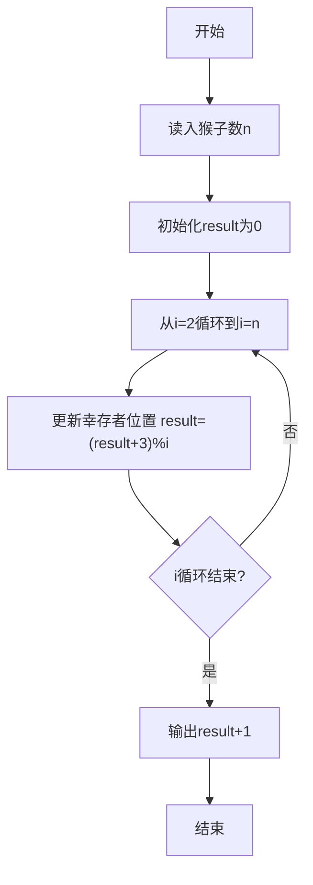
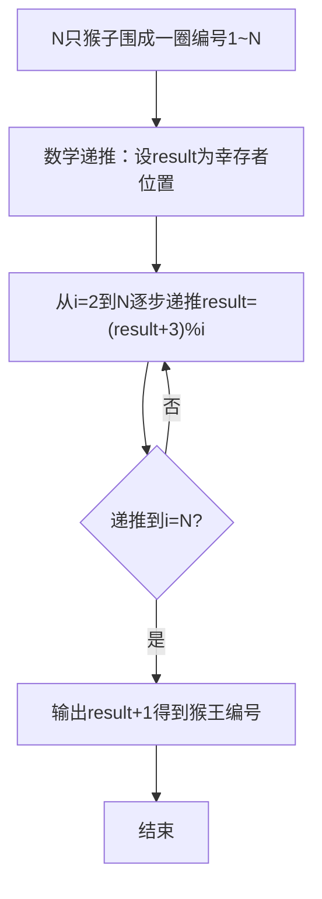

# 7-28 猴子选大王（Python3语言实现）

## 前言

本题（7-28 猴子选大王）的主要考点是：准确理解题意、规范处理输入输出格式，并正确处理边界与精度。下面先给出题目描述与格式要求，再通过清晰的思路与可直接运行的python3代码进行讲解。

## 题目描述

一群猴子要选新猴王。新猴王的选择方法是：让N只候选猴子围成一圈，从某位置起顺序编号为1~N号。从第1号开始报数，每轮从1报到3，凡报到3的猴子即退出圈子，接着又从紧邻的下一只猴子开始同样的报数。如此不断循环，最后剩下的一只猴子就选为猴王。请问是原来第几号猴子当选猴王？

## 输入格式

输入在一行中给一个正整数N（≤1000）。

## 输出格式

在一行中输出当选猴王的编号。

## 输入样例

```in
11
```

## 输出样例

```out
7
```

## 解题思路

**核心问题分析**：本题是经典的约瑟夫环问题，N只猴子围成一圈依次报数1~3，报到3的退出，求最后剩下的猴子编号。若用列表逐一模拟淘汰，过程繁琐；本题采用数学递推法，可在 O(N) 时间内直接求出幸存者位置。

**算法原理说明**：设 result 表示"从 0 开始编号、共 i 个元素"的环中最后幸存者的位置。从 i=2 递推到 i=N，每一步用 result = (result + 3) % i 更新：每轮报到 3 的猴子退出后，从下一只猴子开始重新编号，幸存者在新环中的位置按报数间隔 3 前移。递推结束后 result 就是幸存者在 0 基编号中的位置。

### 1. 具体计算步骤

1. 读入猴子总数 N，初始化 result=0（只有 1 只猴子时幸存位置为 0）
2. 从 i=2 到 i=N 逐步递推：result = (result + 3) % i
3. 输出 result + 1，将 0 基位置转换为 1 基编号（即原第几号猴子当选猴王）

## 完整代码

```python
# 7-28 猴子选大王
# N只猴子围成一圈，报到3的退出，利用数学递推求最后剩下的猴子编号

n = int(input())

result = 0
for i in range(2, n + 1):
    result = (result + 3) % i
print(result + 1)
```

## 代码流程说明

1. **初始化**：读入猴子总数n，初始化 result=0，表示只有 1 只猴子时幸存者的位置
2. **递推循环**：for i 从 2 到 n，每一步用 result=(result+3)%i 更新幸存者位置
3. **输出**：打印 result+1，将 0 基位置转换为 1 基编号

## 代码流程图



## 解题流程图



## 代码解析

```python
# 7-28 猴子选大王
# N只猴子围成一圈，报到3的退出，利用数学递推求最后剩下的猴子编号

n = int(input())

result = 0
for i in range(2, n + 1):
    result = (result + 3) % i
print(result + 1)
```

初始化

## 复杂度分析

设输入规模为 $n$（对数值类题目为参与运算的数据量，对字符串/序列类题目为长度）。

- **时间复杂度**：$O(n)$ 或 $O(n \log n)$，主要来自一次线性遍历与常数次数学运算，无嵌套高复杂度循环。
- **空间复杂度**：$O(n)$，用于存储输入、中间结果与输出字符串；若仅使用若干标量变量则为 $O(1)$。

## 常见易错点

### 1. 输入/输出格式不符
错误：多余空格、遗漏换行、大小写或精度不符。后果：判题系统判为格式错误。正确：严格按题目要求的格式输出，数值用合适精度。

### 2. 边界条件遗漏
错误：未处理 0、最小值、单字符或空输入等边界。后果：特例 WA。正确：先列出所有边界样例，在编码前单独分支处理。

### 3. 整数溢出与类型
错误：使用过小的整数类型或忽略负号。后果：大数计算溢出。正确：按数据范围选择合适类型，必要时用更大整数类型或字符串处理。

## 更多测试

### 测试一：常规边界

**输入：**

```text
（可取题目边界附近的值，如最小值或最大值）
```

**输出：**

```text
（依据题意推导的正确结果）
```

### 测试二：特殊用例

**输入：**

```text
（可取易错点，如 0、单一元素、全同值等）
```

**输出：**

```text
（对应正确结果）
```

## 总结

本题的核心在于理清「猴子选大王」的输入输出关系与边界处理：先按格式读取输入，再依据规则逐步计算或遍历，最后按规范输出。该思路可迁移到同类格式化输入输出与模拟计算的题目。

