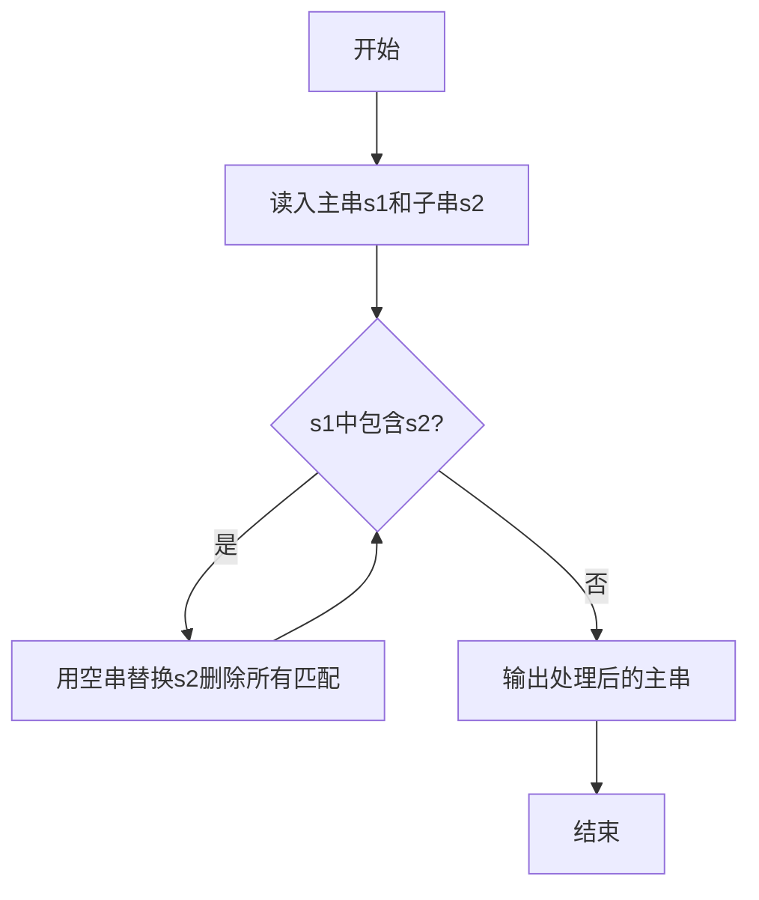
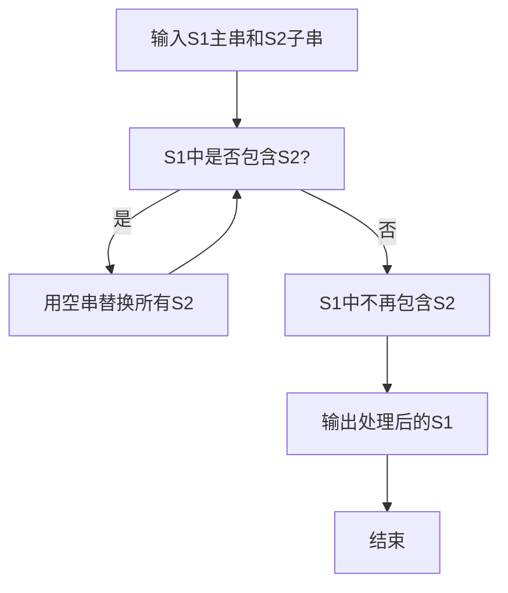

# 7-29 删除字符串中的子串（Python3语言实现）

## 前言

本题（7-29 删除字符串中的子串）的主要考点是：准确理解题意、规范处理输入输出格式，并正确处理边界与精度。下面先给出题目描述与格式要求，再通过清晰的思路与可直接运行的python3代码进行讲解。

## 题目描述

输入2个字符串S1和S2，要求删除字符串S1中出现的所有子串S2，即结果字符串中不能包含S2。

## 输入格式

输入在2行中分别给出不超过80个字符长度的、以回车结束的2个非空字符串，对应S1和S2。

## 输出格式

在一行中输出删除字符串S1中出现的所有子串S2后的结果字符串。

## 输入样例

```in
Tomcat is a male ccatat
cat
```

## 输出样例

```out
Tom is a male 
```

## 解题思路

**核心问题分析**：需要从主串S1中删除所有出现的子串S2，难点在于删除子串后新拼接的字符串可能重新产生S2子串（如样例中删除"cat"后，剩余字符拼接可能再次形成"cat"），因此需要循环查找删除直到S1中不再包含S2。

**算法原理说明**：Python3 的字符串 `replace()` 方法可以用空字符串替换所有匹配的子串。利用 `replace(s2, '')` 可以一次删除所有S2出现的位置。但由于删除后可能产生新的S2（如 "ccat" 删除第一个 "cat" 后变成 "cat"），需要循环调用直到字符串不再包含S2。

### 1. 具体计算步骤

1. 使用`input()`读入S1和S2
2. 使用`while s2 in s1`循环，每次用`s1.replace(s2, '')`删除所有S2
3. 当S1中不再包含S2时退出循环
4. 输出处理后的S1

## 完整代码

```python
# 7-29 删除字符串中的子串
# 从S1中删除所有出现的S2子串

s1 = input()
s2 = input()

while s2 in s1:
    s1 = s1.replace(s2, '')

print(s1)
```

## 代码流程说明

1. **读入字符串**：使用`input()`按行读取s1和s2（保留空格）
2. **循环查找删除**：`while s2 in s1`判断s1中是否还包含s2
3. **替换删除**：`s1.replace(s2, '')`将s1中所有s2替换为空字符串
4. **输出结果**：当s1中不再包含s2时退出循环，输出处理后的s1

## 代码流程图



## 解题流程图



## 代码解析

```python
# 7-29 删除字符串中的子串
# 从S1中删除所有出现的S2子串

s1 = input()
s2 = input()

while s2 in s1:
    s1 = s1.replace(s2, '')

print(s1)
```

读入字符串

## 复杂度分析

设输入规模为 $n$（对数值类题目为参与运算的数据量，对字符串/序列类题目为长度）。

- **时间复杂度**：$O(n)$ 或 $O(n \log n)$，主要来自一次线性遍历与常数次数学运算，无嵌套高复杂度循环。
- **空间复杂度**：$O(n)$，用于存储输入、中间结果与输出字符串；若仅使用若干标量变量则为 $O(1)$。

## 常见易错点

### 1. 输入/输出格式不符
错误：多余空格、遗漏换行、大小写或精度不符。后果：判题系统判为格式错误。正确：严格按题目要求的格式输出，数值用合适精度。

### 2. 边界条件遗漏
错误：未处理 0、最小值、单字符或空输入等边界。后果：特例 WA。正确：先列出所有边界样例，在编码前单独分支处理。

### 3. 整数溢出与类型
错误：使用过小的整数类型或忽略负号。后果：大数计算溢出。正确：按数据范围选择合适类型，必要时用更大整数类型或字符串处理。

## 更多测试

### 测试一：常规边界

**输入：**

```text
（可取题目边界附近的值，如最小值或最大值）
```

**输出：**

```text
（依据题意推导的正确结果）
```

### 测试二：特殊用例

**输入：**

```text
（可取易错点，如 0、单一元素、全同值等）
```

**输出：**

```text
（对应正确结果）
```

## 总结

本题的核心在于理清「删除字符串中的子串」的输入输出关系与边界处理：先按格式读取输入，再依据规则逐步计算或遍历，最后按规范输出。该思路可迁移到同类格式化输入输出与模拟计算的题目。

