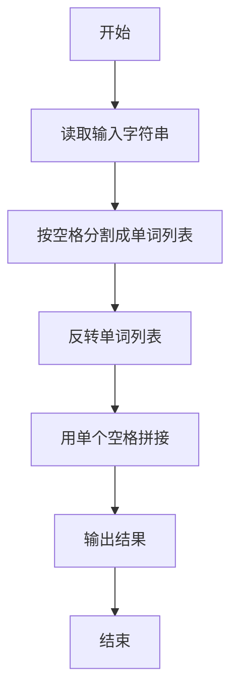
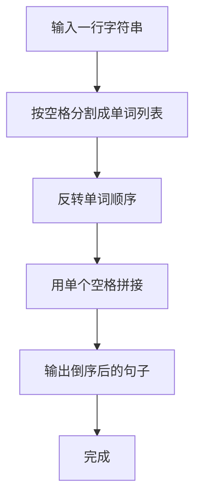

# 7-32 说反话-加强版（Python3语言实现）

## 前言

本题（7-32 说反话-加强版）的主要考点是：准确理解题意、规范处理输入输出格式，并正确处理边界与精度。下面先给出题目描述与格式要求，再通过清晰的思路与可直接运行的python3代码进行讲解。

## 题目描述

给定一句英语，要求你编写程序，将句中所有单词的顺序颠倒输出。

## 输入格式

测试输入包含一个测试用例，在一行内给出总长度不超过500 000的字符串。字符串由若干单词和若干空格组成，其中单词是由英文字母（大小写有区分）组成的字符串，单词之间用若干个空格分开。

## 输出格式

每个测试用例的输出占一行，输出倒序后的句子，并且保证单词间只有1个空格。

## 输入样例

```in
Hello World   Here I Come
```

## 输出样例

```out
Come I Here World Hello
```

## 解题思路

### 核心问题分析
本题要求将句子中的单词顺序颠倒输出，需要处理两个关键点：一是单词之间可能有多个连续空格，二是输出时单词间只能有一个空格。例如输入"Hello World   Here I Come"，5个单词的位置分别在0、6、12、17、19，倒序输出即从最后一个单词开始向前输出。

### 算法原理说明
Python3 的字符串 `split()` 方法默认按任意空白字符分割，可以自动处理多个连续空格。`split()` 返回一个单词列表，然后通过 `reversed()` 或 `[::-1]` 反转列表，最后用 `' '.join()` 拼接回字符串。这种方法简洁高效，时间复杂度O(n)。

### 具体计算步骤
1. 读取整行字符串
2. 使用`split()`按空格分割，自动处理连续空格
3. 反转单词列表
4. 使用`' '.join()`拼接为以单个空格分隔的字符串
5. 输出结果

## 完整代码

```python
# 7-32 说反话-加强版
# 将句子中的单词顺序颠倒输出，单词间用一个空格分隔

s = input()
words = s.split()
result = ' '.join(reversed(words))
print(result)
```

## 代码流程说明

1. **读取输入**：使用`input()`读取整行字符串
2. **分割单词**：`s.split()`按任意空白字符分割字符串，自动处理多个连续空格，返回单词列表
3. **反转列表**：`reversed(words)`返回反转后的迭代器，或使用`words[::-1]`
4. **拼接输出**：`' '.join()`用单个空格连接所有单词
5. **输出结果**：打印最终倒序后的句子

## 代码流程图



## 解题流程图



## 代码解析

```python
# 7-32 说反话-加强版
# 将句子中的单词顺序颠倒输出，单词间用一个空格分隔

s = input()
words = s.split()
result = ' '.join(reversed(words))
print(result)
```

读取整行句子并用默认`split()`去除连续空格，反转单词列表后用单个空格`join()`，从而满足输出规范。

## 复杂度分析

设输入行长度为 L。split、逆序和 join 都需要遍历单词或字符，总体时间复杂度为 O(L)，单词列表和输出字符串需要 O(L) 空间。

## 常见易错点

### 1. 输入/输出格式不符
错误：多余空格、遗漏换行、大小写或精度不符。后果：判题系统判为格式错误。正确：严格按题目要求的格式输出，数值用合适精度。

### 2. 边界条件遗漏
错误：未处理 0、最小值、单字符或空输入等边界。后果：特例 WA。正确：先列出所有边界样例，在编码前单独分支处理。

### 3. 整数溢出与类型
错误：使用过小的整数类型或忽略负号。后果：大数计算溢出。正确：按数据范围选择合适类型，必要时用更大整数类型或字符串处理。

## 更多测试

### 测试一：连续空格

**输入：**

```text
one  two three
```

**输出：**

```text
three two one
```

split()会合并连续空格，join()再用一个空格连接单词。

### 测试二：单个单词

**输入：**

```text
Hello
```

**输出：**

```text
Hello
```
## 总结

本题的核心在于理清「说反话-加强版」的输入输出关系与边界处理：先按格式读取输入，再依据规则逐步计算或遍历，最后按规范输出。该思路可迁移到同类格式化输入输出与模拟计算的题目。
