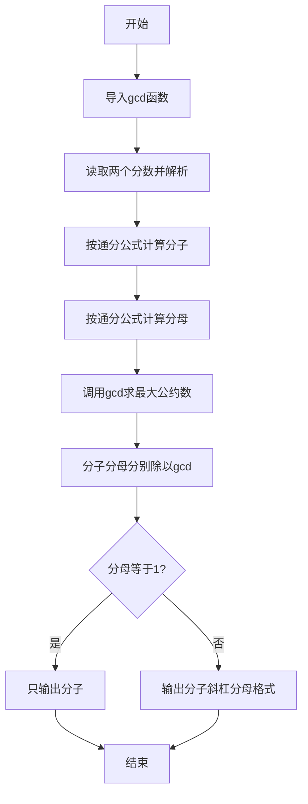
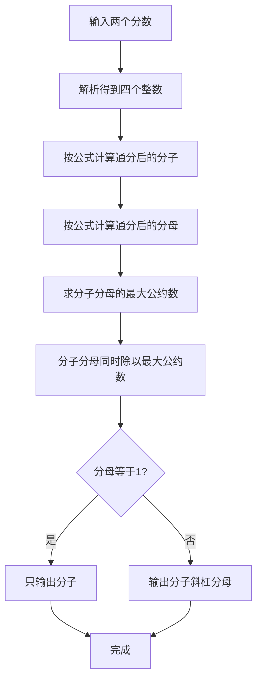

# 7-33 有理数加法（Python3语言实现）

## 前言

本题（7-33 有理数加法）的主要考点是：准确理解题意、规范处理输入输出格式，并正确处理边界与精度。下面先给出题目描述与格式要求，再通过清晰的思路与可直接运行的python3代码进行讲解。

## 题目描述

本题要求编写程序，计算两个有理数的和。

## 输入格式

输入在一行中按照a1/b1 a2/b2的格式给出两个分数形式的有理数，其中分子和分母全是整形范围内的正整数。

## 输出格式

在一行中按照a/b的格式输出两个有理数的和。注意必须是该有理数的最简分数形式，若分母为1，则只输出分子。

## 输入样例

```in
1/3 1/6
```

```in
4/3 2/3
```

## 输出样例

```out
1/2
```

```out
2
```

## 解题思路

### 核心问题分析
本题需要计算两个分数的和并输出最简形式。核心难点在于：一是正确解析带斜杠的输入格式（如"1/3 1/6"），二是分数相加后的约分处理。例如1/3 + 1/6 = 6/18 + 3/18 = 9/18，约分后为1/2。

### 算法原理说明
1. **分数加法公式**：a1/b1 + a2/b2 = (a1×b2 + a2×b1) / (b1×b2)
2. **约分算法**：使用辗转相除法（欧几里得算法）求分子和分母的最大公约数（GCD），然后分子分母同时除以GCD得到最简分数。
3. **辗转相除法原理**：gcd(a, b) = gcd(b, a mod b)，当b=0时a即为最大公约数。Python3 中可使用 `math.gcd()` 或自定义实现。
- 时间复杂度O(log(min(a,b)))：由辗转相除法的复杂度决定
- 空间复杂度O(1)：仅需几个整数变量

### 具体计算步骤
1. 按"a1/b1 a2/b2"格式读取两个分数的分子和分母
2. 计算通分后的分子：numerator = a1×b2 + a2×b1
3. 计算通分后的分母：denominator = b1×b2
4. 求分子和分母的最大公约数g = gcd(numerator, denominator)
5. 约分：numerator //= g，denominator //= g
6. 若分母为1，只输出分子；否则输出"分子/分母"格式

## 完整代码

```python
# 7-33 有理数加法
# 计算两个分数的和，并输出最简形式

from math import gcd

parts = input().split()
a1, b1 = map(int, parts[0].split('/'))
a2, b2 = map(int, parts[1].split('/'))

numerator = a1 * b2 + a2 * b1
denominator = b1 * b2

g = gcd(numerator, denominator)
numerator //= g
denominator //= g

if denominator == 1:
    print(numerator)
else:
    print(f"{numerator}/{denominator}")
```

## 代码流程说明

1. **导入gcd函数**：从`math`模块导入`gcd`函数用于求最大公约数
2. **读取输入**：使用`input()`读取整行，按空格分割得到两个分数字符串，再按斜杠分割得到分子分母
3. **计算和**：按分数加法公式`(a1×b2 + a2×b1) / (b1×b2)`计算分子和分母
4. **求GCD**：调用`math.gcd()`求分子分母的最大公约数
5. **约分**：分子分母分别除以最大公约数（使用`//`整数除法）
6. **输出结果**：判断分母是否为1，选择输出格式

## 代码流程图



## 解题流程图



## 代码解析

```python
# 7-33 有理数加法
# 计算两个分数的和，并输出最简形式

from math import gcd

parts = input().split()
a1, b1 = map(int, parts[0].split('/'))
a2, b2 = map(int, parts[1].split('/'))

numerator = a1 * b2 + a2 * b1
denominator = b1 * b2

g = gcd(numerator, denominator)
numerator //= g
denominator //= g

if denominator == 1:
    print(numerator)
else:
    print(f"{numerator}/{denominator}")
```

从`math`导入最大公约数函数，解析两个分数后先通分相加，再用GCD约分；分母为1时只输出整数分子。

## 复杂度分析

题目只输入两个有理数，解析、通分、求最大公约数和输出均为常数次操作，因此在题目数据范围内时间复杂度和额外空间复杂度均为 O(1)。

## 常见易错点

### 1. 输入/输出格式不符
错误：多余空格、遗漏换行、大小写或精度不符。后果：判题系统判为格式错误。正确：严格按题目要求的格式输出，数值用合适精度。

### 2. 边界条件遗漏
错误：未处理 0、最小值、单字符或空输入等边界。后果：特例 WA。正确：先列出所有边界样例，在编码前单独分支处理。

### 3. 整数溢出与类型
错误：使用过小的整数类型或忽略负号。后果：大数计算溢出。正确：按数据范围选择合适类型，必要时用更大整数类型或字符串处理。

## 更多测试

### 测试一：结果为整数

**输入：**

```text
2/3 1/3
```

**输出：**

```text
1
```

约分后分母为1，只输出分子。

### 测试二：需要约分

**输入：**

```text
1/2 1/4
```

**输出：**

```text
3/4
```
## 总结

本题的核心在于理清「有理数加法」的输入输出关系与边界处理：先按格式读取输入，再依据规则逐步计算或遍历，最后按规范输出。该思路可迁移到同类格式化输入输出与模拟计算的题目。
