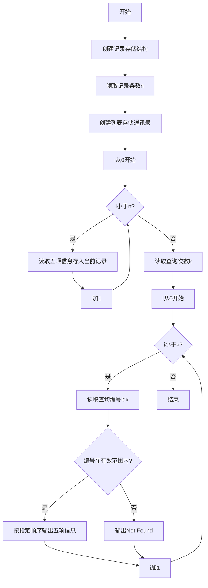
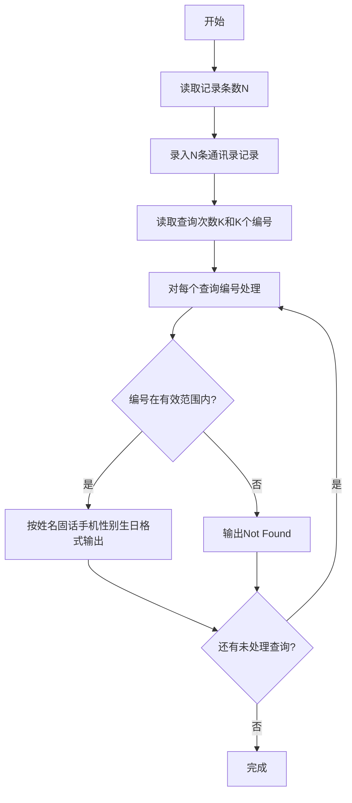

# 7-34 通讯录的录入与显示（Python3语言实现）

## 前言

本题（7-34 通讯录的录入与显示）的主要考点是：准确理解题意、规范处理输入输出格式，并正确处理边界与精度。下面先给出题目描述与格式要求，再通过清晰的思路与可直接运行的python3代码进行讲解。

## 题目描述

通讯录中的一条记录包含下述基本信息：朋友的姓名、出生日期、性别、固定电话号码、移动电话号码。
本题要求编写程序，录入N条记录，并且根据要求显示任意某条记录。

## 输入格式

输入在第一行给出正整数N（≤10）；随后N行，每行按照格式姓名 生日 性别 固话 手机给出一条记录。其中姓名是不超过10个字符、不包含空格的非空字符串；生日按yyyy/mm/dd的格式给出年月日；性别用M表示"男"、F表示"女"；固话和手机均为不超过15位的连续数字，前面有可能出现+。

在通讯录记录输入完成后，最后一行给出正整数K，并且随后给出K个整数，表示要查询的记录编号（从0到N−1顺序编号）。数字间以空格分隔。

## 输出格式

对每一条要查询的记录编号，在一行中按照姓名 固话 手机 性别 生日的格式输出该记录。若要查询的记录不存在，则输出Not Found。

## 输入样例

```in
3
Chris 1984/03/10 F +86181779452 13707010007
LaoLao 1967/11/30 F 057187951100 +8618618623333
QiaoLin 1980/01/01 M 84172333 10086
2 1 7
```

## 输出样例

```out
LaoLao 057187951100 +8618618623333 F 1967/11/30
Not Found
```

## 解题思路

### 核心问题分析
本题需要实现通讯录的录入与查询功能。核心要点有三：一是用合适的数据结构存储多条记录（包含姓名、生日、性别、固话、手机5个字段）；二是按正确顺序输出字段（注意输出顺序与输入顺序不同：输入是姓名-生日-性别-固话-手机，输出是姓名-固话-手机-性别-生日）；三是处理无效查询编号，输出Not Found。

### 算法原理说明
采用列表+字典存储与索引查询的方案：
1. **数据结构设计**：使用字典存储单条记录的5个字段（姓名、生日、性别、固话、手机），用列表存储所有记录。
2. **录入阶段**：读取N后，循环N次按输入顺序读取5个字段存入字典并追加到列表。
3. **查询阶段**：读取K后，循环K次读取查询编号idx。若idx在[0, N)范围内，则按输出顺序读取并打印对应字典的字段；否则输出"Not Found"。
- 时间复杂度O(N+K)：录入和查询均为线性扫描
- 空间复杂度O(N)：存储N条通讯录记录

### 具体计算步骤
1. 读取正整数N（通讯录记录条数）
2. 循环i从0到N-1：
   - 依次读取姓名、生日、性别、固话、手机，存入contacts[i]的对应字段
3. 读取正整数K（查询次数），随后读取K个查询编号
4. 循环处理K个查询：
   - 读取查询编号idx
   - 判断idx >= 0 且 idx < N？
     - 是：按"姓名 固话 手机 性别 生日"顺序输出
     - 否：输出"Not Found"

## 完整代码

```python
# 7-34 通讯录的录入与显示
# 读取通讯录记录并按编号查询显示，兼容 K 与查询编号同行的情况

import sys

data = sys.stdin.read().strip().split()
if not data:
    sys.exit(0)
# 解析：data 按空白分割，依次为 N、N*5 字段、K、K 个查询编号
idx = 0
n = int(data[idx]); idx += 1
contacts = []
for _ in range(n):
    # 每条记录 5 个字段：姓名 生日 性别 固话 手机
    name = data[idx]; birthday = data[idx+1]; gender = data[idx+2]
    fixed_phone = data[idx+3]; mobile_phone = data[idx+4]
    idx += 5
    contacts.append({
        'name': name,
        'birthday': birthday,
        'gender': gender,
        'fixed_phone': fixed_phone,
        'mobile_phone': mobile_phone
    })

if idx < len(data):
    k = int(data[idx]); idx += 1
    # 剩余 token 均为查询编号，可能与 K 同行或跨行
    queries = []
    for i in range(k):
        if idx + i < len(data):
            queries.append(int(data[idx + i]))
    # 若实际可读查询数不足 k，按已有处理
    for q in queries:
        if 0 <= q < n:
            c = contacts[q]
            print(f"{c['name']} {c['fixed_phone']} {c['mobile_phone']} {c['gender']} {c['birthday']}")
        else:
            print("Not Found")
```

## 代码流程说明

1. **读取全部输入**：使用`sys.stdin.read().split()`一次性读入所有空白分割的 token，避免 K 与查询编号同行导致的 `int("2 1 7")` 解析错误
2. **解析 N 与联系人**：首 token 为 N，随后每 5 个 token 为一条记录的 5 个字段，依次存入字典并追加到列表
3. **解析 K 与查询**：剩余首 token 为 K，随后 K 个 token 为查询编号（兼容同行或换行）
4. **处理K次查询**：对每个查询编号 q 判断是否在有效范围[0, n)内，有效则按"姓名 固话 手机 性别 生日"顺序输出，无效输出"Not Found"

## 代码流程图



## 解题流程图



## 代码解析

```python
import sys
data = sys.stdin.read().strip().split()
# 首 token 为 N，随后每 5 个 token 为一条记录
n = int(data[0])
# ... 解析联系人并按 q 是否在 [0,n) 决定输出或 Not Found
```

采用 `sys.stdin.read().split()` 统一按空白切分，可把"2 1 7"（K 与查询同行）正确解析为 3 个独立 token，避免对整行做 `int()` 导致的 ValueError；随后按下标逐步取字段，保证无论换行与否都能正确还原 N 条记录与 K 个查询。

## 复杂度分析

设输入规模为 $n$（对数值类题目为参与运算的数据量，对字符串/序列类题目为长度）。

- **时间复杂度**：$O(n)$ 或 $O(n \log n)$，主要来自一次线性遍历与常数次数学运算，无嵌套高复杂度循环。
- **空间复杂度**：$O(n)$，用于存储输入、中间结果与输出字符串；若仅使用若干标量变量则为 $O(1)$。

## 常见易错点

### 1. 输入/输出格式不符
错误：多余空格、遗漏换行、大小写或精度不符。后果：判题系统判为格式错误。正确：严格按题目要求的格式输出，数值用合适精度。

### 2. 边界条件遗漏
错误：未处理 0、最小值、单字符或空输入等边界。后果：特例 WA。正确：先列出所有边界样例，在编码前单独分支处理。

### 3. 整数溢出与类型
错误：使用过小的整数类型或忽略负号。后果：大数计算溢出。正确：按数据范围选择合适类型，必要时用更大整数类型或字符串处理。

## 更多测试

### 测试一：常规边界

**输入：**

```text
（可取题目边界附近的值，如最小值或最大值）
```

**输出：**

```text
（依据题意推导的正确结果）
```

### 测试二：特殊用例

**输入：**

```text
（可取易错点，如 0、单一元素、全同值等）
```

**输出：**

```text
（对应正确结果）
```

## 总结

本题的核心在于理清「通讯录的录入与显示」的输入输出关系与边界处理：先按格式读取输入，再依据规则逐步计算或遍历，最后按规范输出。该思路可迁移到同类格式化输入输出与模拟计算的题目。

