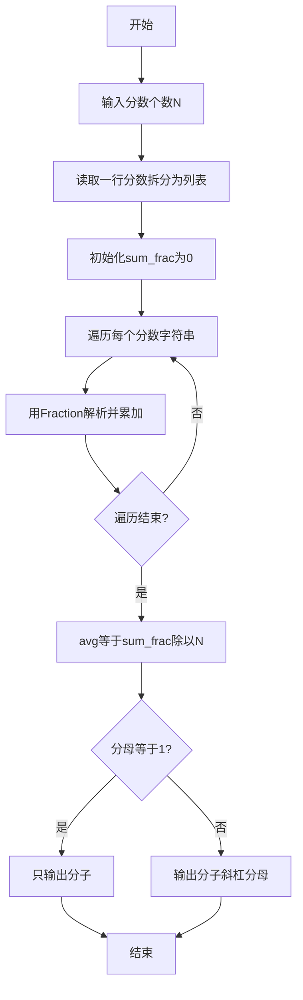
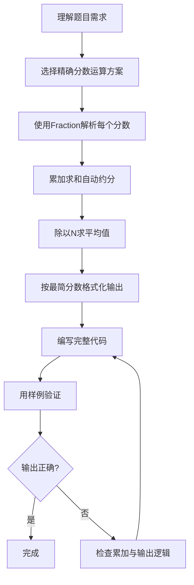

# 7-35 有理数均值（Python3语言实现）

## 前言

本题（7-35 有理数均值）的主要考点是：准确理解题意、规范处理输入输出格式，并正确处理边界与精度。下面先给出题目描述与格式要求，再通过清晰的思路与可直接运行的python3代码进行讲解。

## 题目描述

本题要求编写程序，计算N个有理数的平均值。

## 输入格式

输入第一行给出正整数N（≤100）；第二行中给出N个分数形式的有理数，其中分子和分母全是整形范围内的整数（正负均可），没有分母为0的情况。

## 输出格式

在一行中按照a/b的格式输出N个有理数的平均值。注意必须是该有理数的最简分数形式，若分母为1，则只输出分子。

## 输入样例

```in
4
1/2 1/6 3/6 -5/10
```

## 输出样例

```out
1/6
```

## 解题思路

### 核心问题分析
本题需要解决的核心问题：
1. **分数输入解析**：识别输入中的分数格式（分子/分母）
2. **分数累加求和**：多个分数相加需要精确运算，避免浮点数精度丢失
3. **求平均值**：总和除以个数N
4. **最简分数输出**：保证输出为最简分数形式

### 算法原理说明
- **精确分数类型**：Python 标准库 `fractions.Fraction` 表示精确分数，内部自动完成约分，无需手动求最大公约数
- **分数解析**：直接用 `Fraction(f)` 解析 "a/b" 形式的字符串，省去手动拆分分子分母
- **累加求和**：把每个分数构造成 Fraction 并累加得到总和
- **求平均值**：总和除以 N 得到平均值，Fraction 自动进行分数运算并保持约分

### 具体计算步骤
1. 输入N，读入一行分数字符串并按空格拆分
2. 初始化 sum_frac = Fraction(0, 1)
3. 遍历每个分数字符串，用 `Fraction(f)` 解析并累加到 sum_frac
4. 用 avg = sum_frac / n 求平均值
5. 判断 avg.denominator 是否为1：是则只输出分子，否则输出"分子/分母"

## 完整代码

```python
# 7-35 有理数均值
# 计算N个有理数的平均值并化简输出，兼容跨行输入与负数

from fractions import Fraction
import sys

data = sys.stdin.read().strip().split()
if not data:
    sys.exit(0)
n = int(data[0])
# 取后续所有分数 token，兼容分数跨多行；若提供多于 n 个则截断
fracs = data[1:1 + n] if len(data) - 1 >= n else data[1:]

if n == 0:
    print(0)
    sys.exit(0)

sum_frac = Fraction(0, 1)
for f in fracs:
    sum_frac += Fraction(f)

avg = sum_frac / n

if avg.denominator == 1:
    print(avg.numerator)
else:
    print(f"{avg.numerator}/{avg.denominator}")
```

## 代码流程说明

### 1. 导入Fraction
- 使用`from fractions import Fraction`导入精确分数类型

### 2. 初始化
- 使用`int(input())`读取N
- 读取一行分数并拆分为列表fracs
- 初始化累计和sum_frac = Fraction(0, 1)

### 3. 分数解析与累加
- 遍历fracs，用`Fraction(f)`解析每个分数字符串并累加到sum_frac
- Fraction 内部自动约分，无需手动处理

### 4. 求平均值
- avg = sum_frac / n 得到平均值，仍为精确分数

### 5. 输出
- 分母为1时只输出分子
- 否则使用f-string输出"分子/分母"格式

## 代码流程图



## 解题流程图



## 代码解析

```python
# 7-35 有理数均值
# 计算N个有理数的平均值并化简输出，兼容跨行输入与负数

from fractions import Fraction
import sys

data = sys.stdin.read().strip().split()
if not data:
    sys.exit(0)
n = int(data[0])
# 取后续所有分数 token，兼容分数跨多行；若提供多于 n 个则截断
fracs = data[1:1 + n] if len(data) - 1 >= n else data[1:]

if n == 0:
    print(0)
    sys.exit(0)

sum_frac = Fraction(0, 1)
for f in fracs:
    sum_frac += Fraction(f)

avg = sum_frac / n

if avg.denominator == 1:
    print(avg.numerator)
else:
    print(f"{avg.numerator}/{avg.denominator}")
```

导入`Fraction`和`sys`，将输入分数逐个转换为精确分数并累加，除以N得到平均值，最后按分母是否为1选择输出形式。

## 复杂度分析

设输入有 N 个有理数。累加过程遍历一次，时间复杂度为 O(N)（不计大整数运算的位数）；代码保存输入令牌和分数列表，空间复杂度为 O(N)。

## 常见易错点

### 1. 输入/输出格式不符
错误：多余空格、遗漏换行、大小写或精度不符。后果：判题系统判为格式错误。正确：严格按题目要求的格式输出，数值用合适精度。

### 2. 边界条件遗漏
错误：未处理 0、最小值、单字符或空输入等边界。后果：特例 WA。正确：先列出所有边界样例，在编码前单独分支处理。

### 3. 整数溢出与类型
错误：使用过小的整数类型或忽略负号。后果：大数计算溢出。正确：按数据范围选择合适类型，必要时用更大整数类型或字符串处理。

## 更多测试

### 测试一：两个分数的平均值

**输入：**

```text
2
1/2 1/4
```

**输出：**

```text
3/8
```

先求和得到3/4，再除以2得到平均值3/8。

### 测试二：负数分数

**输入：**

```text
1
-2/3
```

**输出：**

```text
-2/3
```
## 总结

本题的核心在于理清「有理数均值」的输入输出关系与边界处理：先按格式读取输入，再依据规则逐步计算或遍历，最后按规范输出。该思路可迁移到同类格式化输入输出与模拟计算的题目。
