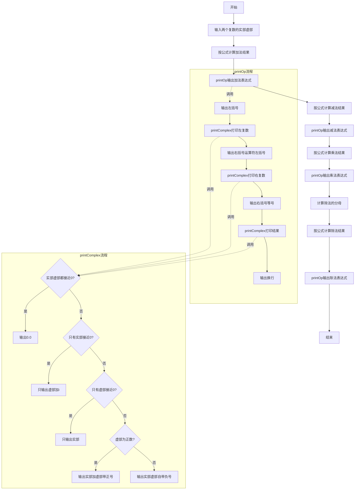
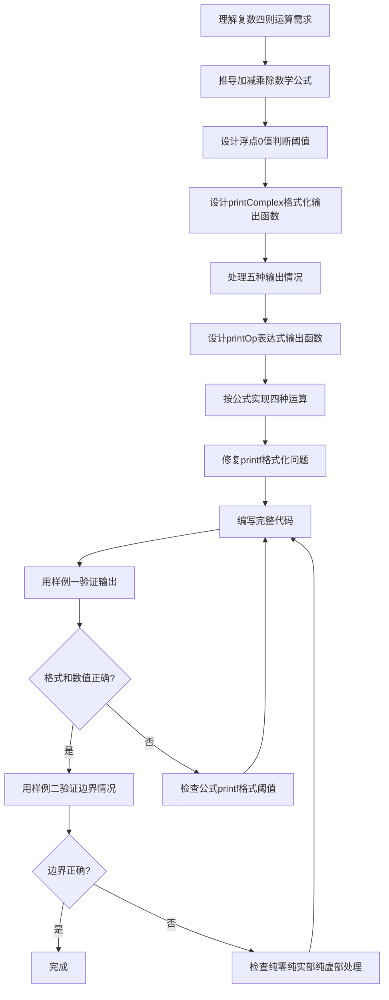

# 7-36 复数四则运算（Python3语言实现）

## 前言

本题（7-36 复数四则运算）的主要考点是：准确理解题意、规范处理输入输出格式，并正确处理边界与精度。下面先给出题目描述与格式要求，再通过清晰的思路与可直接运行的python3代码进行讲解。

## 题目描述

本题要求编写程序，计算2个复数的和、差、积、商。

## 输入格式

输入在一行中按照a1 b1 a2 b2的格式给出2个复数C1=a1+b1i和C2=a2+b2i的实部和虚部。题目保证C2不为0。

## 输出格式

分别在4行中按照(a1+b1i) 运算符 (a2+b2i) = 结果的格式顺序输出2个复数的和、差、积、商，数字精确到小数点后1位。如果结果的实部或者虚部为0，则不输出。如果结果为0，则输出0.0。

## 输入样例1

```in
2 3.08 -2.04 5.06
```

## 输入样例2

```in
1 1 -1 -1.01
```

## 输出样例1

```out
(2.0+3.1i) + (-2.0+5.1i) = 8.1i
(2.0+3.1i) - (-2.0+5.1i) = 4.0-2.0i
(2.0+3.1i) * (-2.0+5.1i) = -19.7+3.8i
(2.0+3.1i) / (-2.0+5.1i) = 0.4-0.6i
```

## 输出样例2

```out
(1.0+1.0i) + (-1.0-1.0i) = 0.0
(1.0+1.0i) - (-1.0-1.0i) = 2.0+2.0i
(1.0+1.0i) * (-1.0-1.0i) = -2.0i
(1.0+1.0i) / (-1.0-1.0i) = -1.0
```

## 解题思路

### 核心问题分析
本题需要解决的核心问题：
1. **复数四则运算公式**：正确实现加减乘除的数学运算
2. **浮点数比较**：由于需要判断实部/虚部是否为0，需考虑浮点精度，用阈值0.05判断
3. **格式化输出**：精确到小数点后1位，实部虚部为0时不输出，注意符号处理
4. **特殊情况**：结果为0时输出"0.0"

### 算法原理说明
设 C1 = a1 + b1i，C2 = a2 + b2i

- **加法**：`C1 + C2 = (a1+a2) + (b1+b2)i`
- **减法**：`C1 - C2 = (a1-a2) + (b1-b2)i`
- **乘法**：`C1 * C2 = (a1*a2 - b1*b2) + (a1*b2 + a2*b1)i`
- **除法**：`C1 / C2 = [(a1*a2 + b1*b2) + (b1*a2 - a1*b2)i] / (a2² + b2²)`

### 格式化输出规则
- 实部和虚部都接近0（绝对值<0.05）：输出"0.0"
- 只有实部接近0：只输出虚部+"i"（注意虚部的正负号）
- 只有虚部接近0：只输出实部
- 都不为0：虚部为正时输出"a+bi"，虚部为负时输出"a-bi"（负号自带）

### 具体计算步骤
1. 输入a1, b1, a2, b2
2. 按公式分别计算和、差、积、商的实部和虚部
3. 每次计算后调用printOp输出完整表达式
4. printComplex根据规则格式化输出单个复数

## 完整代码

```python
# 7-36 复数四则运算
# 计算两个复数的加减乘除并格式化输出

import math

def print_complex(a, b):
    if abs(a) < 0.05 and abs(b) < 0.05:
        print("0.0", end='')
    elif abs(a) < 0.05:
        print(f"{b:.1f}i", end='')
    elif abs(b) < 0.05:
        print(f"{a:.1f}", end='')
    elif b > 0:
        print(f"{a:.1f}+{b:.1f}i", end='')
    else:
        print(f"{a:.1f}{b:.1f}i", end='')

def print_op(a1, b1, op, a2, b2, a, b):
    print("(", end='')
    print_complex(a1, b1)
    print(f") {op} (", end='')
    print_complex(a2, b2)
    print(") = ", end='')
    print_complex(a, b)
    print()

a1, b1, a2, b2 = map(float, input().split())

a = a1 + a2
b = b1 + b2
print_op(a1, b1, '+', a2, b2, a, b)

a = a1 - a2
b = b1 - b2
print_op(a1, b1, '-', a2, b2, a, b)

a = a1 * a2 - b1 * b2
b = a1 * b2 + a2 * b1
print_op(a1, b1, '*', a2, b2, a, b)

denom = a2 * a2 + b2 * b2
a = (a1 * a2 + b1 * b2) / denom
b = (b1 * a2 - a1 * b2) / denom
print_op(a1, b1, '/', a2, b2, a, b)
```

## 代码流程说明

### 1. print_complex函数
- 使用`def`定义函数，输入复数的实部a、虚部b
- 使用`abs()`判断实部虚部是否接近0（阈值0.05）
- 使用f-string格式化到1位小数进行输出
- 四种输出情况：都为0输出"0.0"、仅实部为0输出虚部+i、仅虚部为0输出实部、都不为0按正负号连接

### 2. print_op函数
- 使用`def`定义函数，输出完整运算表达式
- 使用`print(..., end='')`实现不换行输出，组合完整表达式
- 格式：(C1) 运算符 (C2) = 结果

### 3. 主程序
- 使用`map(float, input().split())`读取四个浮点数
- 按公式分别计算加法、减法、乘法、除法的实部和虚部
- 每次运算后调用print_op输出完整表达式

## 代码流程图



## 解题流程图



## 代码解析

```python
# 7-36 复数四则运算
# 计算两个复数的加减乘除并格式化输出

import math

def print_complex(a, b):
    if abs(a) < 0.05 and abs(b) < 0.05:
        print("0.0", end='')
    elif abs(a) < 0.05:
        print(f"{b:.1f}i", end='')
    elif abs(b) < 0.05:
        print(f"{a:.1f}", end='')
    elif b > 0:
        print(f"{a:.1f}+{b:.1f}i", end='')
    else:
        print(f"{a:.1f}{b:.1f}i", end='')

def print_op(a1, b1, op, a2, b2, a, b):
    print("(", end='')
    print_complex(a1, b1)
    print(f") {op} (", end='')
    print_complex(a2, b2)
    print(") = ", end='')
    print_complex(a, b)
    print()

a1, b1, a2, b2 = map(float, input().split())

a = a1 + a2
b = b1 + b2
print_op(a1, b1, '+', a2, b2, a, b)

a = a1 - a2
b = b1 - b2
print_op(a1, b1, '-', a2, b2, a, b)

a = a1 * a2 - b1 * b2
b = a1 * b2 + a2 * b1
print_op(a1, b1, '*', a2, b2, a, b)

denom = a2 * a2 + b2 * b2
a = (a1 * a2 + b1 * b2) / denom
b = (b1 * a2 - a1 * b2) / denom
print_op(a1, b1, '/', a2, b2, a, b)
```

print_complex函数

## 复杂度分析

题目只处理两个复数并固定执行四种运算，每种运算和格式化都为常数次操作，因此时间复杂度为 O(1)，额外空间复杂度为 O(1)。

## 常见易错点

### 1. 输入/输出格式不符
错误：多余空格、遗漏换行、大小写或精度不符。后果：判题系统判为格式错误。正确：严格按题目要求的格式输出，数值用合适精度。

### 2. 边界条件遗漏
错误：未处理 0、最小值、单字符或空输入等边界。后果：特例 WA。正确：先列出所有边界样例，在编码前单独分支处理。

### 3. 整数溢出与类型
错误：使用过小的整数类型或忽略负号。后果：大数计算溢出。正确：按数据范围选择合适类型，必要时用更大整数类型或字符串处理。

## 更多测试

### 测试一：实部和虚部均非零

**输入：**

```text
1 1 1 -1
```

**输出：**

```text
(1.0+1.0i) + (1.0-1.0i) = 2.0
(1.0+1.0i) - (1.0-1.0i) = 2.0i
(1.0+1.0i) * (1.0-1.0i) = 2.0
(1.0+1.0i) / (1.0-1.0i) = 1.0i
```

该用例覆盖结果只含实部、只含虚部和混合运算的格式化输出。

### 测试二：全为实数

**输入：**

```text
2 0 1 0
```

**输出：**

```text
(2.0) + (1.0) = 3.0
(2.0) - (1.0) = 1.0
(2.0) * (1.0) = 2.0
(2.0) / (1.0) = 2.0
```
## 总结

本题的核心在于理清「复数四则运算」的输入输出关系与边界处理：先按格式读取输入，再依据规则逐步计算或遍历，最后按规范输出。该思路可迁移到同类格式化输入输出与模拟计算的题目。
