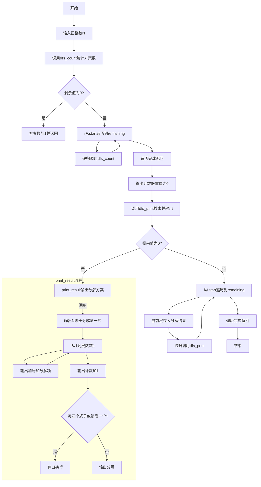
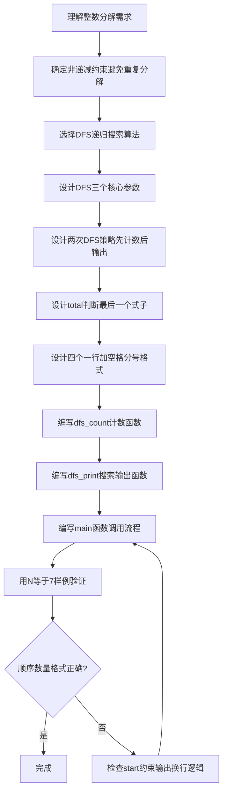

# 7-37 整数分解为若干项之和（Python3语言实现）

## 前言

本题（7-37 整数分解为若干项之和）的主要考点是：准确理解题意、规范处理输入输出格式，并正确处理边界与精度。下面先给出题目描述与格式要求，再通过清晰的思路与可直接运行的python3代码进行讲解。

## 题目描述

将一个正整数 N 分解成几个正整数相加，可以有多种分解方法，例如 7=6+1，7=5+2，7=5+1+1，…。编程求出正整数 N 的所有整数分解式子。

## 输入格式

每个输入包含一个测试用例，即正整数 N (0<N≤30)。

## 输出格式

按递增顺序输出 N 的所有整数分解式子。递增顺序是指：对于两个分解序列 N₁={n₁,n₂,⋯} 和 N₂={m₁,m₂,⋯}，若存在 i 使得 n₁=m₁,⋯,nᵢ=mᵢ，但是 nᵢ₊₁<mᵢ₊₁，则 N₁序列必定在 N₂序列之前输出。每个式子由小到大相加，式子间用分号隔开，且每输出 4 个式子后换行。

## 输入样例

```in
7
```

## 输出样例

```out
7=1+1+1+1+1+1+1;7=1+1+1+1+1+2;7=1+1+1+1+3;7=1+1+1+2+2
7=1+1+1+4;7=1+1+2+3;7=1+1+5;7=1+2+2+2
7=1+2+4;7=1+3+3;7=1+6;7=2+2+3
7=2+5;7=3+4;7=7
```

## 解题思路

### 核心问题分析
本题需要解决的核心问题：
1. **生成所有分解方案**：找出正整数N的所有正整数和分解（整数分拆）
2. **递增顺序**：分解序列必须非递减排列（如1+1+5，而非1+5+1），避免重复
3. **输出格式**：每4个式子一行，用分号分隔，最后一个式子后换行

### 算法原理说明
- **深度优先搜索(DFS)**：递归地构建分解序列。关键参数：
  - `start`：当前可选的最小数（保证序列非递减，避免重复）
  - `remaining`：剩余需要分解的值
  - `depth`：当前分解的层数（已选择的数的个数）
- **两次DFS策略**：
  - 第一遍`dfs_count`：只计数，不输出，得到方案总数total
  - 第二遍`dfs_print`：实际输出，利用total判断是否是最后一个式子（决定输出换行还是分号）
- **非递减约束**：循环从`start`开始，下一层递归起点仍为`i`，保证后续数≥当前数

### 具体计算步骤
1. 输入正整数N
2. 第一遍DFS（dfs_count）：从start=1开始，遍历所有分解方式，统计总方案数total
3. 重置计数器count=0
4. 第二遍DFS（dfs_print）：同样的搜索顺序，每找到一个完整方案就调用print_result输出
5. print_result中：输出"N=n1+n2+..."格式，根据count%4和count==total判断输出换行还是分号

## 完整代码

```python
# 7-37 整数分解为若干项之和
# 使用DFS生成所有整数分解方案

n = int(input())
result = [0] * 35
count = 0
total = 0

def dfs_count(start, remaining):
    global total
    if remaining == 0:
        total += 1
        return
    for i in range(start, remaining + 1):
        dfs_count(i, remaining - i)

def print_result(depth):
    global count
    print(f"{n}={result[0]}", end='')
    for i in range(1, depth):
        print(f"+{result[i]}", end='')
    count += 1
    if count % 4 == 0 or count == total:
        print()
    else:
        print(";", end='')

def dfs_print(start, remaining, depth):
    if remaining == 0:
        print_result(depth)
        return
    for i in range(start, remaining + 1):
        result[depth] = i
        dfs_print(i, remaining - i, depth + 1)

dfs_count(1, n)
count = 0
dfs_print(1, n, 0)
```

## 代码流程说明

### 1. 全局变量
- `n`：待分解的正整数
- `result`：列表存储当前分解方案的各项
- `count`：已输出的方案计数，用于判断换行
- `total`：方案总数，用于判断最后一个方案

### 2. dfs_count函数
- 使用`def`定义递归函数，输入start（起始数）和remaining（剩余值）
- 统计所有分解方案总数
- 使用`global total`声明全局变量

### 3. print_result函数
- 输入depth（当前分解层数），输出一种分解方案
- 使用f-string格式化输出"N=n1+n2+..."
- 根据count%4==0或count==total判断输出换行或分号

### 4. dfs_print函数
- 使用`def`定义递归函数，输入start、remaining、depth
- DFS搜索并输出所有分解方案
- 使用`range(start, remaining + 1)`遍历可选数

### 5. 主程序
- 使用`int(input())`读取N
- 先调用dfs_count统计总数，再重置count=0
- 调用dfs_print输出所有方案

## 代码流程图



## 解题流程图



## 代码解析

```python
# 7-37 整数分解为若干项之和
# 使用DFS生成所有整数分解方案

n = int(input())
result = [0] * 35
count = 0
total = 0

def dfs_count(start, remaining):
    global total
    if remaining == 0:
        total += 1
        return
    for i in range(start, remaining + 1):
        dfs_count(i, remaining - i)

def print_result(depth):
    global count
    print(f"{n}={result[0]}", end='')
    for i in range(1, depth):
        print(f"+{result[i]}", end='')
    count += 1
    if count % 4 == 0 or count == total:
        print()
    else:
        print(";", end='')

def dfs_print(start, remaining, depth):
    if remaining == 0:
        print_result(depth)
        return
    for i in range(start, remaining + 1):
        result[depth] = i
        dfs_print(i, remaining - i, depth + 1)

dfs_count(1, n)
count = 0
dfs_print(1, n, 0)
```

使用全局结果数组保存当前分解序列，并用`total`和`count`记录总方案数与已输出数量；先计数再输出，便于判断最后一个式子及控制换行。

## 复杂度分析

设 N 的整数分解方案数为 p(N)。计数和输出都要遍历递归搜索树，时间复杂度可记为 O(N·p(N))；递归栈和当前分解结果最多深度为 N，空间复杂度为 O(N)。

## 常见易错点

### 1. 输入/输出格式不符
错误：多余空格、遗漏换行、大小写或精度不符。后果：判题系统判为格式错误。正确：严格按题目要求的格式输出，数值用合适精度。

### 2. 边界条件遗漏
错误：未处理 0、最小值、单字符或空输入等边界。后果：特例 WA。正确：先列出所有边界样例，在编码前单独分支处理。

### 3. 整数溢出与类型
错误：使用过小的整数类型或忽略负号。后果：大数计算溢出。正确：按数据范围选择合适类型，必要时用更大整数类型或字符串处理。

## 更多测试

### 测试一：最小正整数

**输入：**

```text
1
```

**输出：**

```text
1=1
```

只有一种分解方式，且最后一个式子后直接换行。

### 测试二：较小的多种分解

**输入：**

```text
4
```

**输出：**

```text
4=1+1+1+1;4=1+1+2;4=1+3;4=2+2
4=4
```

每4个式子换行，式子之间用分号分隔。
## 总结

本题的核心在于理清「整数分解为若干项之和」的输入输出关系与边界处理：先按格式读取输入，再依据规则逐步计算或遍历，最后按规范输出。该思路可迁移到同类格式化输入输出与模拟计算的题目。
