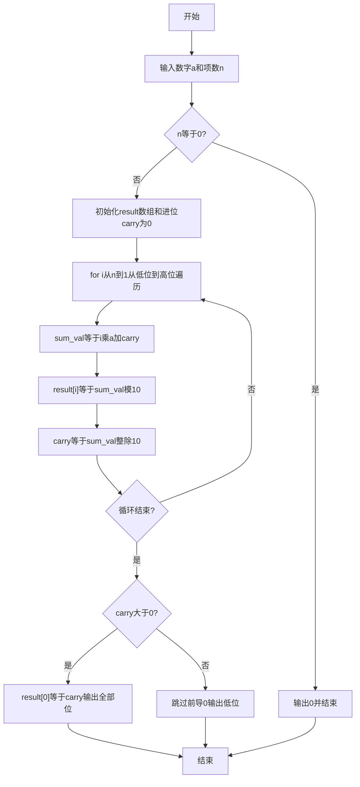
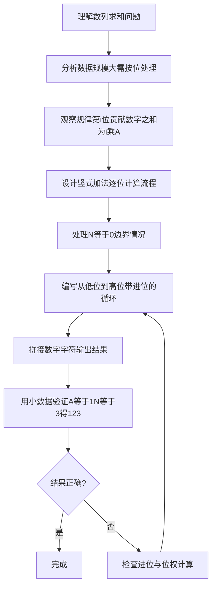

# 7-38 数列求和-加强版（Python3语言实现）

## 前言

本题（7-38 数列求和-加强版）的主要考点是：准确理解题意、规范处理输入输出格式，并正确处理边界与精度。下面先给出题目描述与格式要求，再通过清晰的思路与可直接运行的python3代码进行讲解。

## 题目描述

给定某数字A（1≤A≤9）以及非负整数N（0≤N≤100000），求数列之和S=A+AA+AAA+⋯+AA⋯A（N个A）。例如A=1, N=3时，S=1+11+111=123。

## 输入格式

输入数字A与非负整数N。

## 输出格式

输出其N项数列之和S的值。

## 输入样例

```in
1 3
```

## 输出样例

```out
123
```

## 解题思路

### 核心问题分析
本题需要解决的核心问题：
1. **数据规模大**：N最大为100000，结果可达10万位以上，需使用数组按位存储结果
2. **竖式加法思想**：从个位到高位逐位模拟累加，每一位只处理本位和与进位
3. **按位统计规律**：从低位起第i位（1基）上所有项贡献的数字之和为 i × A

### 算法原理说明
观察数列结构：
      A      = A
     AA      = A * 10 + A
    AAA      = AA * 10 + A
   ...
+ AA...A(N个) = 前一项 * 10 + A
每一项都是前一项乘以10再加A，但由于N可达100000，结果位数巨大，不能直接用普通整数累加，程序采用竖式加法逐位计算：从个位到高位模拟累加。观察规律，从低位起第 i 位（1 基）上所有项贡献的数字之和为 i × A（第 i 位上有 i 个 A 参与相加），因此从低位向高位遍历 i = n..1，每位计算 sum_val = i*a + carry，当前位存 sum_val % 10，进位存 sum_val // 10。

### 具体计算步骤
1. 处理边界：n=0时直接输出0
2. 初始化结果数组 result=[0]*(n+1)，进位 carry=0
3. 从低位向高位遍历 i 从 n 到 1：sum_val = i*a + carry
4. result[i] = sum_val % 10 存当前位数字，carry = sum_val // 10 更新进位
5. 循环结束后若 carry > 0：result[0] = carry，输出 result[:n+1]
6. 否则输出 result[1:n+1]（跳过数组前导的0），最后将所有数字字符拼接输出

## 完整代码

```python
# 7-38 数列求和-加强版
# 求数列 S=A+AA+AAA+...+AA...A(N个A) 的和
# 采用竖式加法逐位计算，从低位到高位处理进位

a, n = map(int, input().split())

if n == 0:
    print(0)
else:
    result = [0] * (n + 1)
    carry = 0
    for i in range(n, 0, -1):
        sum_val = i * a + carry
        result[i] = sum_val % 10
        carry = sum_val // 10
    if carry > 0:
        result[0] = carry
        print(''.join(map(str, result[:n + 1])))
    else:
        print(''.join(map(str, result[1:n + 1])))
```

## 代码流程说明

### 1. 输入与边界处理
- 使用`map(int, input().split())`读取数字a和项数n
- n==0时直接输出0

### 2. 初始化结果数组与进位
- result=[0]*(n+1) 存储各位数字，carry=0 存储进位
- 数组下标 i 对应从低位起的第 i 位（1基）

### 3. 逐位竖式累加
- for i 从 n 到 1（从个位向高位）：sum_val = i*a + carry 计算当前位的和
- result[i] = sum_val % 10 存当前位数字，carry = sum_val // 10 更新进位

### 4. 输出结果
- 循环结束后若 carry > 0：result[0] = carry 作为最高位，输出 result[:n+1]
- 否则跳过前导0输出 result[1:n+1]
- 使用`''.join(map(str, ...))`拼接数字字符后输出

## 代码流程图



## 解题流程图



## 代码解析

```python
# 7-38 数列求和-加强版
# 求数列 S=A+AA+AAA+...+AA...A(N个A) 的和
# 采用竖式加法逐位计算，从低位到高位处理进位

a, n = map(int, input().split())

if n == 0:
    print(0)
else:
    result = [0] * (n + 1)
    carry = 0
    for i in range(n, 0, -1):
        sum_val = i * a + carry
        result[i] = sum_val % 10
        carry = sum_val // 10
    if carry > 0:
        result[0] = carry
        print(''.join(map(str, result[:n + 1])))
    else:
        print(''.join(map(str, result[1:n + 1])))
```

读取A和N后先处理N=0的边界；其余情况建立按位结果数组，从最低位向高位计算`i*A+carry`，保存当前数字并传递进位。

## 复杂度分析

设需要计算的项数为 N。逐位处理每一项的贡献和进位，循环执行 N 次，时间复杂度为 O(N)；结果数组需要 O(N) 空间。

## 常见易错点

### 1. 输入/输出格式不符
错误：多余空格、遗漏换行、大小写或精度不符。后果：判题系统判为格式错误。正确：严格按题目要求的格式输出，数值用合适精度。

### 2. 边界条件遗漏
错误：未处理 0、最小值、单字符或空输入等边界。后果：特例 WA。正确：先列出所有边界样例，在编码前单独分支处理。

### 3. 整数溢出与类型
错误：使用过小的整数类型或忽略负号。后果：大数计算溢出。正确：按数据范围选择合适类型，必要时用更大整数类型或字符串处理。

## 更多测试

### 测试一：零项

**输入：**

```text
9 0
```

**输出：**

```text
0
```

N为0时没有需要累加的项，程序直接输出0。

### 测试二：单项

**输入：**

```text
7 1
```

**输出：**

```text
7
```

N为1时结果就是A本身。
## 总结

本题的核心在于理清「数列求和-加强版」的输入输出关系与边界处理：先按格式读取输入，再依据规则逐步计算或遍历，最后按规范输出。该思路可迁移到同类格式化输入输出与模拟计算的题目。
