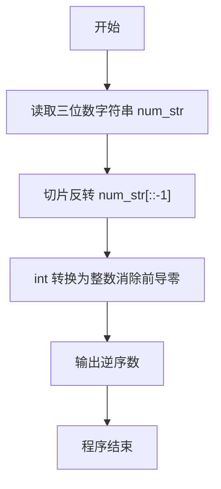
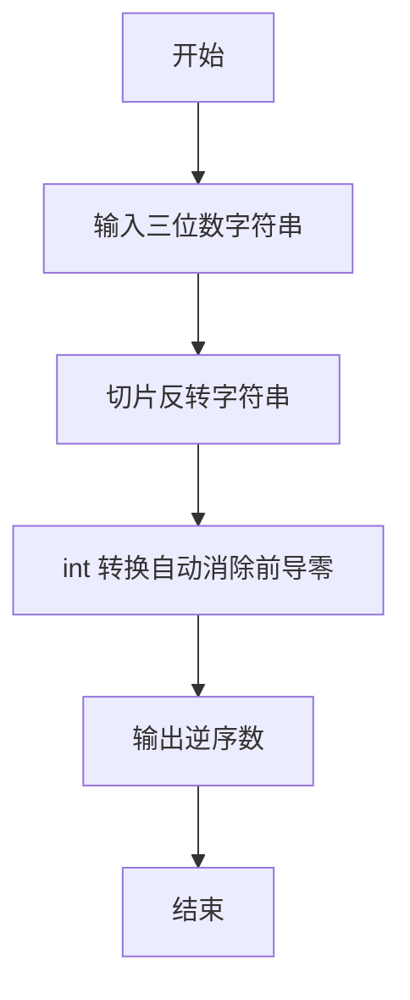

# 7-3 逆序的三位数（Python3语言实现）

## 前言

本题（7-3 逆序的三位数）的主要考点是：准确理解题意、规范处理输入输出格式，并正确处理边界与精度。下面先给出题目描述与格式要求，再通过清晰的思路与可直接运行的python3代码进行讲解。

## 题目描述

程序每次读入一个正3位数，然后输出按位逆序的数字。注意：当输入的数字含有结尾的0时，输出不应带有前导的0。比如输入700，输出应该是7。

## 输入格式

每个测试是一个3位的正整数。

## 输出格式

输出按位逆序的数。

## 输入样例

```in
123
```

## 输出样例

```out
321
```

## 解题思路

这道题的核心是**三位数的按位逆序输出**，关键在于逆序后不能带有前导零。

### 核心问题分析

1. **逆序处理**：需要将三位数的数字顺序完全颠倒。
2. **前导零处理**：当原数的个位为0时（如700），逆序后开头为0，输出不应带有前导零。
3. **转换方式**：将字符串反转后通过 int() 转为整数，int() 会自动去掉前导零（如 "007" 转为 7）。

### 算法原理说明

采用**字符串反转转换法**：
1. 将输入按字符串读入
2. 使用切片 num_str[::-1] 将数字字符串逆序
3. 用 int() 将逆序字符串转换为整数，自动消除前导零
4. 直接输出整数

### 具体计算步骤

1. 读入字符串 num_str，并去除首尾空白
2. 用切片 num_str[::-1] 反转字符顺序
3. 用 int() 转换逆序字符串为整数，自动去掉前导零
4. 输出整数 reversed_num

## 完整代码

```python
num_str = input().strip()
reversed_num = int(num_str[::-1])
print(reversed_num)
```

## 代码流程说明

1. **读取输入**：使用`input()`读取一个三位数，通过`.strip()`去除首尾空白，存入字符串变量`num_str`。
2. **反转字符串**：使用切片`num_str[::-1]`将数字字符串逆序。
3. **整数转换**：使用`int()`将逆序后的字符串转为整数，自动消除前导零。
4. **输出结果**：使用`print()`输出整数`reversed_num`。

## 代码流程图



## 解题流程图



## 代码解析

```python
num_str = input().strip()
reversed_num = int(num_str[::-1])
print(reversed_num)
```

读取输入

## 复杂度分析

设输入规模为 $n$（对数值类题目为参与运算的数据量，对字符串/序列类题目为长度）。

- **时间复杂度**：$O(n)$ 或 $O(n \log n)$，主要来自一次线性遍历与常数次数学运算，无嵌套高复杂度循环。
- **空间复杂度**：$O(n)$，用于存储输入、中间结果与输出字符串；若仅使用若干标量变量则为 $O(1)$。

## 常见易错点

### 1. 输入/输出格式不符
错误：多余空格、遗漏换行、大小写或精度不符。后果：判题系统判为格式错误。正确：严格按题目要求的格式输出，数值用合适精度。

### 2. 边界条件遗漏
错误：未处理 0、最小值、单字符或空输入等边界。后果：特例 WA。正确：先列出所有边界样例，在编码前单独分支处理。

### 3. 整数溢出与类型
错误：使用过小的整数类型或忽略负号。后果：大数计算溢出。正确：按数据范围选择合适类型，必要时用更大整数类型或字符串处理。

## 更多测试

### 测试一：常规边界

**输入：**

```text
（可取题目边界附近的值，如最小值或最大值）
```

**输出：**

```text
（依据题意推导的正确结果）
```

### 测试二：特殊用例

**输入：**

```text
（可取易错点，如 0、单一元素、全同值等）
```

**输出：**

```text
（对应正确结果）
```

## 总结

本题的核心在于理清「逆序的三位数」的输入输出关系与边界处理：先按格式读取输入，再依据规则逐步计算或遍历，最后按规范输出。该思路可迁移到同类格式化输入输出与模拟计算的题目。

