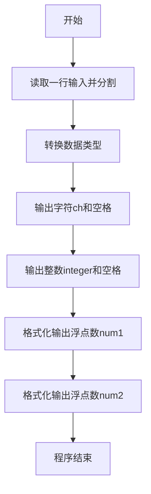
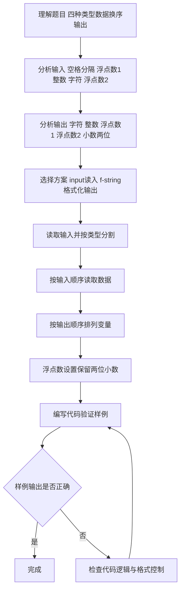

# 7-6 混合类型数据格式化输入（Python3语言实现）

## 前言

本题（7-6 混合类型数据格式化输入）的主要考点是：准确理解题意、规范处理输入输出格式，并正确处理边界与精度。下面先给出题目描述与格式要求，再通过清晰的思路与可直接运行的python3代码进行讲解。

## 题目描述

本题要求编写程序，顺序读入浮点数1、整数、字符、浮点数2，再按照字符、整数、浮点数1、浮点数2的顺序输出。

## 输入格式

输入在一行中顺序给出浮点数1、整数、字符、浮点数2，其间以1个空格分隔。

## 输出格式

在一行中按照字符、整数、浮点数1、浮点数2的顺序输出，其中浮点数保留小数点后2位。

## 输入样例

```in
2.12 88 c 4.7
```

## 输出样例

```out
c 88 2.12 4.70
```

## 解题思路

### 1. 核心问题分析

本题主要考察不同类型数据的输入输出操作，核心在于按指定顺序读入4个不同类型的数据，然后按另一种指定顺序输出，并对浮点数进行格式化处理（保留2位小数）。

### 2. 算法原理说明

1. 利用`input().split()`按空格分割读取4个字符串，再通过`float()`和`int()`转换为对应类型。
2. 利用Python3的f-string格式化功能，通过`:.2f`控制浮点数保留两位小数。
3. 输出时按照题目要求调整变量的输出顺序即可。

### 3. 具体计算步骤

1. 读取一行输入，按空格分割为4个字符串。
2. 将第1个和第4个转换为浮点数，第2个转换为整数，第3个保持为字符。
3. 按字符→整数→浮点数1→浮点数2的顺序输出，浮点数保留2位小数。

## 完整代码

```python
num1, integer, ch, num2 = input().split()
num1 = float(num1)
integer = int(integer)
num2 = float(num2)

print(f"{ch} {integer} {num1:.2f} {num2:.2f}")
```

## 代码流程说明

1. **读取输入**：使用`input()`读取一行，通过`.split()`按空格分割为4个字符串，分别赋值给`num1`、`integer`、`ch`、`num2`。
2. **类型转换**：将`num1`和`num2`通过`float()`转为浮点数，`integer`通过`int()`转为整数。
3. **格式化输出**：使用f-string按`{ch} {integer} {num1:.2f} {num2:.2f}`格式输出，其中`:.2f`控制浮点数保留2位小数。
4. **程序结束**：程序正常终止。

## 代码流程图



## 解题流程图



## 代码解析

```python
num1, integer, ch, num2 = input().split()
num1 = float(num1)
integer = int(integer)
num2 = float(num2)

print(f"{ch} {integer} {num1:.2f} {num2:.2f}")
```

先把输入拆成4个字段，再分别转换为浮点数、整数和字符；输出时调整字段顺序，并用`:.2f`格式化两个浮点数。

## 复杂度分析

输入字段数量固定，程序只进行常数次类型转换和格式化，时间复杂度为 O(1)，额外空间复杂度为 O(1)。

## 常见易错点

### 1. 输入/输出格式不符
错误：多余空格、遗漏换行、大小写或精度不符。后果：判题系统判为格式错误。正确：严格按题目要求的格式输出，数值用合适精度。

### 2. 边界条件遗漏
错误：未处理 0、最小值、单字符或空输入等边界。后果：特例 WA。正确：先列出所有边界样例，在编码前单独分支处理。

### 3. 整数溢出与类型
错误：使用过小的整数类型或忽略负号。后果：大数计算溢出。正确：按数据范围选择合适类型，必要时用更大整数类型或字符串处理。

## 更多测试

### 测试一：整数和小数位格式化

**输入：**

```text
1.5 3 x 2
```

**输出：**

```text
x 3 1.50 2.00
```

两个浮点数都需要按两位小数输出。

### 测试二：负数与零

**输入：**

```text
0.1 -2 Z -3
```

**输出：**

```text
Z -2 0.10 -3.00
```
## 总结

本题的核心在于理清「混合类型数据格式化输入」的输入输出关系与边界处理：先按格式读取输入，再依据规则逐步计算或遍历，最后按规范输出。该思路可迁移到同类格式化输入输出与模拟计算的题目。
