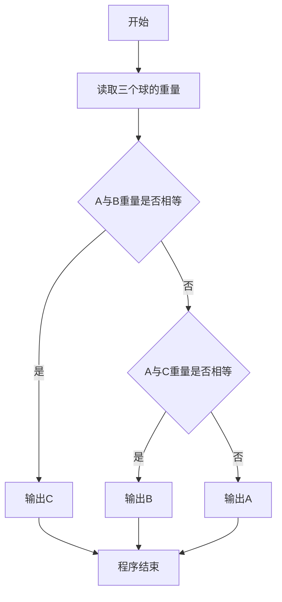
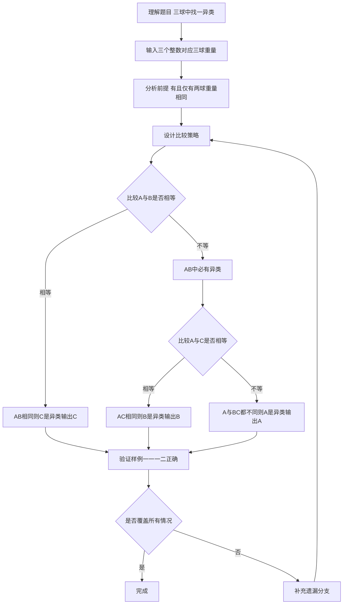

# 7-9 用天平找小球（Python3语言实现）

## 前言

本题（7-9 用天平找小球）的主要考点是：准确理解题意、规范处理输入输出格式，并正确处理边界与精度。下面先给出题目描述与格式要求，再通过清晰的思路与可直接运行的python3代码进行讲解。

## 题目描述

三个球A、B、C，大小形状相同且其中有一个球与其他球重量不同。要求找出这个不一样的球。

## 输入格式

输入在一行中给出3个正整数，顺序对应球A、B、C的重量。

## 输出格式

在一行中输出唯一的那个不一样的球。

## 输入样例

```in
1 1 2
```

## 输出样例

```out
C
```

## 解题思路

### 1. 核心问题分析

题目给定三个球（A、B、C），已知恰好有一个球重量与另外两个不同（另外两个重量相同）。核心在于利用"只有一个异类，另外两个相同"这一前提，通过最多两次两两相等比较即可确定异类球的编号。

### 2. 算法原理说明

由于三个球中必有且仅有两个重量相等，我们只需依次进行相等性判断：
1. 若A与B重量相等（a == b），说明A和B都是正常的，异类必然是C。
2. 若A与B不相等，则A和B中必有一个是异类，此时再比较A和C：
   - 若A与C相等（a == c），说明A和C正常，异类是B；
   - 若A与C也不相等，说明A与B、C都不同，异类就是A本身。
（逻辑上无需再比较B和C，因为以上分支已覆盖所有三种可能）

### 3. 具体计算步骤

1. 读取三个整数a、b、c，分别对应A、B、C三球重量。
2. 判断a == b？→ 相等则输出C。
3. 否则判断a == c？→ 相等则输出B，否则输出A。

## 完整代码

```python3
a, b, c = map(int, input().split())

if a == b:
    print("C")
elif a == c:
    print("B")
else:
    print("A")
```

## 代码流程说明

1. **读取输入**：使用`input()`读取一行，通过`map(int, ...)`将三个字符串转为整数，分别赋值给`a`、`b`、`c`。
2. **逻辑判断（最多两次比较）**：
   - 第一层：若`a == b`为真 → A与B同重 → C是异类 → 输出"C"
   - 否则进入第二层：若`a == c`为真 → A与C同重 → B是异类 → 输出"B"
   - 否则（A既不等于B也不等于C）→ A是异类 → 输出"A"
3. **程序结束**：程序正常终止。

## 代码流程图



## 解题流程图



## 代码解析

```python3
a, b, c = map(int, input().split())

if a == b:
    print("C")
elif a == c:
    print("B")
else:
    print("A")
```

读入A、B、C三个重量，先比较A与B；若不相等，再比较A与C，即可根据相等的两个球确定异类球。

## 复杂度分析

只需比较三种固定的称量结果，判断次数和存储量均为常数，因此时间复杂度为 O(1)，额外空间复杂度为 O(1)。

## 常见易错点

### 1. 输入/输出格式不符
错误：多余空格、遗漏换行、大小写或精度不符。后果：判题系统判为格式错误。正确：严格按题目要求的格式输出，数值用合适精度。

### 2. 边界条件遗漏
错误：未处理 0、最小值、单字符或空输入等边界。后果：特例 WA。正确：先列出所有边界样例，在编码前单独分支处理。

### 3. 整数溢出与类型
错误：使用过小的整数类型或忽略负号。后果：大数计算溢出。正确：按数据范围选择合适类型，必要时用更大整数类型或字符串处理。

## 更多测试

### 测试一：A与C相等

**输入：**

```text
2 3 2
```

**输出：**

```text
B
```

A、C重量相同，因此B是唯一的异类球。

### 测试二：A与B相等

**输入：**

```text
4 4 9
```

**输出：**

```text
C
```
## 总结

本题的核心在于理清「用天平找小球」的输入输出关系与边界处理：先按格式读取输入，再依据规则逐步计算或遍历，最后按规范输出。该思路可迁移到同类格式化输入输出与模拟计算的题目。
